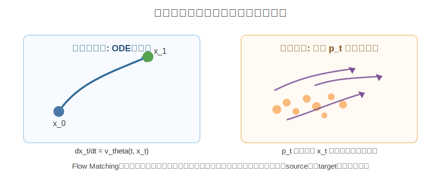
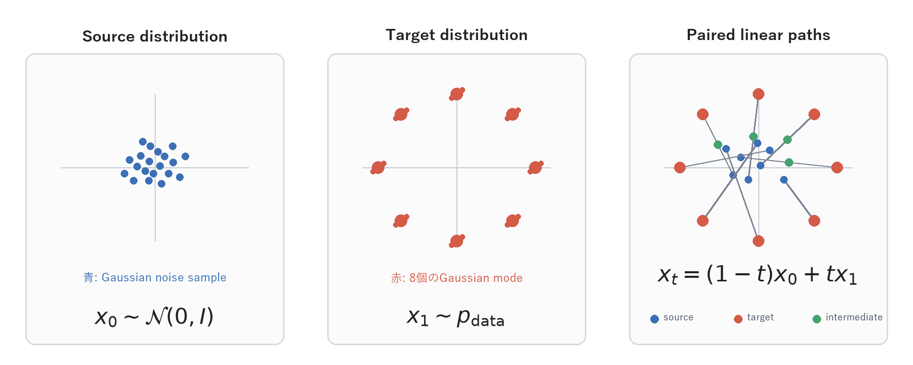
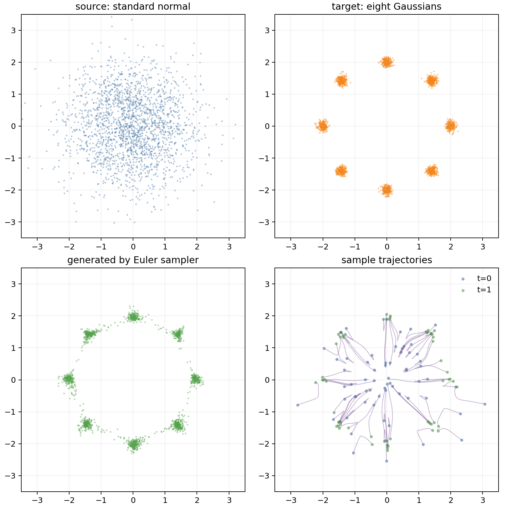
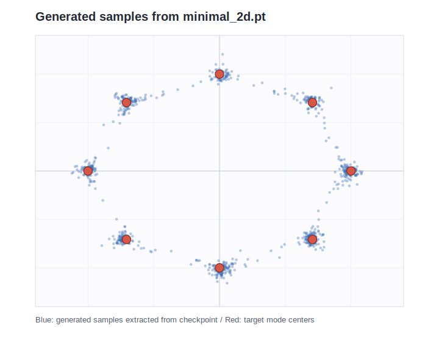
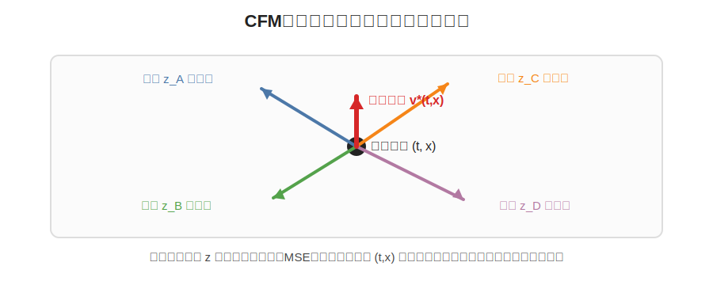
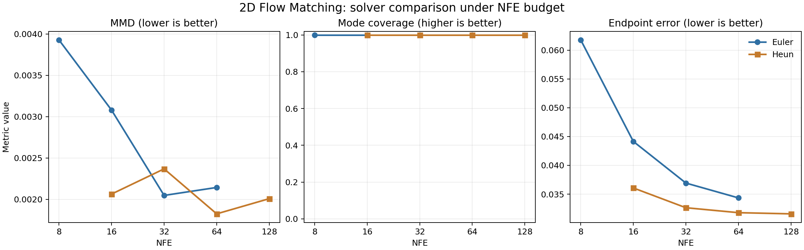
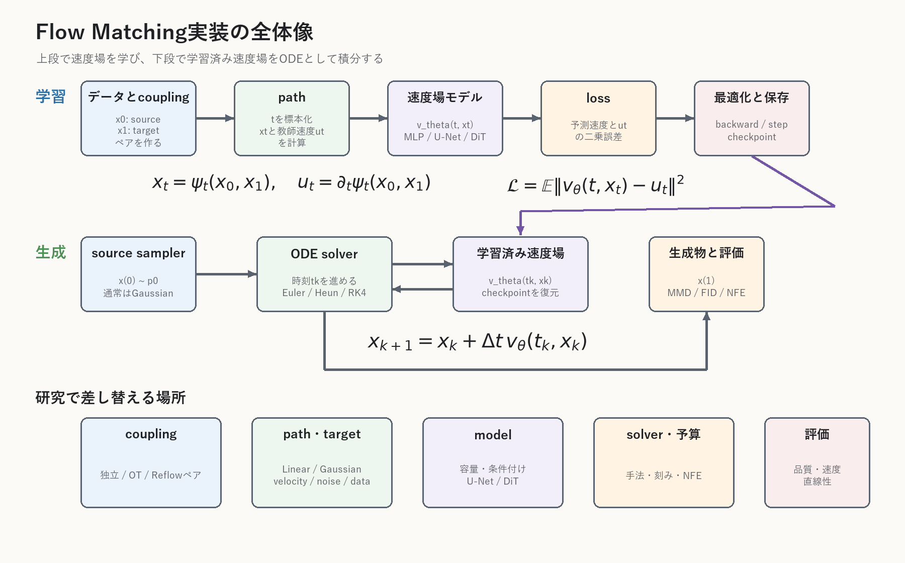

# Flow Matching研究者向け教材

作成日: 2026-06-14
最終更新: 2026-06-20

この教材は、Flow Matchingを「直感」「数式」「PyTorchコード」の対応で理解し、実際にモデルを組めるようになるための日本語教材である。AI、ニューラルネット、PyTorchの基礎は前提とするが、生成モデルやDiffusionモデルを使った経験は前提としない。

第1部では、最初にFlow Matchingの中心部だけを小さく作る。そこから、Conditional Flow Matching（CFM）の理論、Diffusionとの対応、source点とtarget点のペアリングを変えるOptimal Transport CFM（OT-CFM）、軌道の直線化を扱うRectified Flow、サンプリング、実モデル、評価設計へ進む。目標は、読者が次の4点を自分の言葉とコードで説明できるようになることである。

- Flow Matchingは何を生成モデルとして学習しているのか。
- $x_t = (1 - t) x_0 + t x_1$ は何を表すのか。
- $u_t = x_1 - x_0$ はなぜ教師信号になるのか。
- 生成時に $x_{t+\Delta t} = x_t + \Delta t v_\theta(t, x_t)$ を繰り返すと何が起きるのか。

読み始めでは、OT-CFM、Rectified Flow、Diffusionとの詳細対応を急がない。まず、最も小さい直線経路版のCFMを、式とPyTorchコードで完全に対応づける。そのうえで後半の部で、同じ部品がどのように拡張されるかを見る。

## 生成モデル未経験者のための入口

### 識別モデルとの違い

画像分類モデルなら、入力画像 $x$ を受け取り、クラス `y` を予測する。学習後も、利用時には入力画像が必要である。

```text
識別モデル: 画像 x -> クラス y
```

生成モデルは、学習データと似た新しいデータを作ることを目標にする。生成時には正解画像を入力せず、乱数から始める。

```text
生成モデル: 乱数 z -> 新しいデータ x_generated
```

ここで「似たデータ」とは、訓練画像をそのまま返すことではない。訓練データに現れる形、色、配置などの統計的な規則を学び、その規則に従う新しい標本を作ることを意味する。

### データ分布とは何か

手元にあるdatasetは、未知のデータ生成規則から得られた有限個の観測だと考える。この背後の規則を **データ分布** $p_{\mathrm{data}}$ と呼ぶ。実際には $p_{\mathrm{data}}$ の式を知っているわけではなく、datasetからサンプルを取り出せるだけである。

たとえば猫画像datasetなら、1枚の猫画像が1サンプルである。2D toyなら、平面上の点1個が1サンプルである。Flow Matchingは画像でも点でも同じ考え方を使うため、最初は可視化しやすい2D点で学ぶ。

```text
未知のデータ分布 p_data
        -> datasetとして有限個のサンプルを観測
        -> モデルが分布の規則を学ぶ
        -> 新しいサンプルを生成
```

### なぜ乱数から始めるのか

毎回同じ入力から始めれば、決定論的なモデルは毎回同じ出力を返す。異なる画像や点を生成するには、生成ごとに異なる種が必要である。その種として、簡単に何個でもサンプルできる標準正規分布の乱数を使う。

Flow Matchingでは、この単純な乱数分布をsource分布 $p_0$、作りたいデータ分布をtarget分布 $p_1$ と呼ぶ。学習するのは、$p_0$ の乱数を $p_1$ らしいデータへ変形する規則である。

### Flow Matchingの全体像を先に言葉でつかむ

まず、数式を使わずに学習から生成までを一周する。

最初に、平面上へランダムな点を大量に散らした「ノイズの雲」を想像する。一方、学習データ側には、猫画像や8個の山を持つ2D点群のような「データの集まり」がある。Flow Matchingの目的は、ノイズの雲をデータの集まりへ少しずつ変形することである。

学習時には、ノイズ点とデータ点を一つずつ組にする。その2点の間にいくつかの途中地点を置き、各途中地点で「データ側へ進むには、どちら向きにどれくらい動けばよいか」という矢印を作る。この矢印が学習用の正解である。

ニューラルネットには、途中地点と現在時刻を見せ、その場所の正解矢印を予測させる。同じような場所へ異なる組から矢印が集まる場合、モデルはそれらをまとめた進行方向を学ぶ。こうして、空間のどこにいても次の進行方向を答える「矢印の地図」ができる。

生成時には、学習時に使ったデータ点を渡さない。新しいノイズ点だけを置き、学習済みの矢印の地図へ現在地を問い合わせ、少し動き、もう一度問い合わせる。この操作を繰り返すと、ノイズ点の集まりがデータらしい集まりへ変わる。

```text
学習:
noise点 + data点
  -> 途中地点と正解の矢印を作る
  -> modelが「時刻と場所から矢印を返す」ように学ぶ

生成:
新しいnoise点
  -> modelの矢印に沿って少しずつ移動する
  -> dataらしい新しいサンプルになる
```

ここで学ぶのは、特定のノイズ点を特定の画像へ送る対応表ではない。生成時には行き先の正解データがないため、「今の時刻と場所なら、分布全体としてどちらへ進むべきか」を答える規則を学ぶ必要がある。これが後でConditional Flow Matchingを考える理由になる。

### ベクトルとベクトル場の最小補講

#### ベクトルは1本の矢印である

2次元のベクトル `(3, -1)` は、「横へ3、縦へ-1だけ進む」という1本の矢印として読める。向きだけでなく長さも持つため、進む方向と速さを同時に表せる。

```text
位置 x = (2, 4)
速度 v = (3, -1)
少し進んだ位置 = x + dt * v
```

ここで $x$ は点の現在位置、$v$ はその点が今持つ速度である。1個の $v$ は、1個の場所における1本の速度ベクトルにすぎない。

#### ベクトル場は場所ごとに矢印を返す関数である

ベクトル場は、場所 $x$ を入力すると、その場所に対応するベクトルを返す関数である。

```text
場所 x                 -> ベクトル場 v(x) -> その場所の矢印
(0, 0)                 -> (1, 0)
(1, 0)                 -> (0, 1)
別の場所               -> 別の矢印
```

「矢印を空間中にびっしり描いた地図」と考えるとよい。ただし実装では全地点の矢印を保存するわけではない。ニューラルネットが、問い合わせられた場所に対してその都度ベクトルを計算する。

#### Flow Matchingでは時刻によって地図も変わる

Flow Matchingの速度場は場所だけでなく時刻 $t$ も入力に取る。

```text
v_theta(t, x)
```

同じ場所 $x$ でも、生成の序盤と終盤では進むべき方向が違うことがある。そのため $v_\theta(x)$ ではなく、時刻依存ベクトル場 $v_\theta(t,x)$ を使う。下付きの $\theta$ は、ニューラルネットの学習可能なパラメータをまとめて表す。

2D toyのミニバッチでは、入出力shapeは次のようになる。

```python
t = torch.rand(batch, 1)       # [B, 1]: 各点の時刻
x = torch.randn(batch, 2)      # [B, 2]: 各点の現在位置
v = model(t, x)                # [B, 2]: 各点の速度ベクトル
```

入力 $x$ と出力 $v$ のshapeが同じなのは、2次元の点を動かすには2次元の速度が必要だからである。画像なら位置 $x$ は画像tensorであり、速度も画像と同じshapeのtensorになる。

#### ベクトル場と軌道は別である

ベクトル場は「各場所でどちらへ進むかを答える規則」である。軌道は、1個の初期点がその規則に従って実際に通った道筋である。同じベクトル場でも初期点が違えば軌道は違う。

```text
ベクトル場: 空間全体の矢印の規則
軌道:       1個の点が矢印を順にたどった結果
分布:       多数の点を動かしたときの集まり
```

時刻 $t$ の位置を $x_t$ と書けば、「現在位置の矢印を速度として動く」という規則が常微分方程式（Ordinary Differential Equation、ODE）である。

$$
\frac{d x_t}{d t} = v_\theta(t,x_t).
$$

左辺は位置が時間に対してどれくらい変わるか、右辺はモデルが現在の時刻と場所で返した速度である。Flow Matchingではニューラルネットが右辺を学び、生成時にこの規則を少しずつたどる。

### 学習時と生成時を分ける

生成モデルでは、学習時にだけ利用できる情報と、生成時に利用できる情報を分ける必要がある。

| 段階 | 手元にあるもの | 目的 |
|---|---|---|
| 学習 | dataset、乱数、モデル | データへ向かう規則を学ぶ |
| 生成 | 新しい乱数、学習済みモデル | datasetにない新しいサンプルを作る |

Flow Matchingの学習時には、ノイズ点 $x_0$ とデータ点 $x_1$ の両方を使って教師速度を作れる。しかし生成時には $x_1$ は存在しない。生成時に使えるのは、現在位置、時刻、学習済み速度場だけである。この非対称性が、CFMを理解する中心になる。

### 最初に覚える記号

| 記号 | 最初の意味 | PyTorchでの例 |
|---|---|---|
| $p_0$ | source分布。通常は簡単なnoise分布 | `torch.randn(...)` |
| $p_1$ | targetとなるデータ分布 | dataset / data loader |
| $p_t$ | 時刻 $t$ における途中の分布 | batchの $x_t$ が従う分布 |
| $x_0$ | $p_0$ から取った1サンプル | noise tensor |
| $x_1$ | $p_1$ から取った1サンプル | data tensor |
| $t$ | sourceからtargetまでの進行度 | `[B,1]` の時刻tensor |
| $x_t$ | 時刻 $t$ の途中状態 | modelへの入力 |
| $u_t$ | 学習用に計算した教師速度 | regression target |
| $v_\theta(t,x_t)$ | ニューラルネットが予測する速度 | model output |

最初からすべての用語を暗記する必要はない。第1部では、上の8記号がコードのどのtensorに対応するかだけを追えばよい。

### 初読の進み方

生成モデルが初めてなら、次の順で読む。各部末の「公式実装ではどこを見るか」は、最初の一周では飛ばしてよい。

1. **入口と第1部**: 乱数をデータへ変形する、という全体像と最小コードをつかむ。
2. **第2部と第3部**: CFMが成立する理由を理解し、自分でmodel、loss、学習、生成を接続する。
3. **第4部と第5部**: Diffusionを初めて学び、noise predictionとvelocity predictionを比較する。
4. **第6部から第8部**: coupling、Rectified Flow、solverを研究上の設計変数として学ぶ。
5. **第9部と第10部**: 画像モデルへ広げ、評価とablationを組む。
6. **第11部**: 全部品の接続を一枚の設計図で復習する。
7. **第12部（必要になってから読む）**: 公開済みモデルのfine-tuning、重みの再利用、互換性、ライセンスを扱う。最小モデルを自作するだけなら初読では飛ばしてよい。

数式で止まったときは、その式を完全に証明してから進む必要はない。まず「どのtensorを作る式か」「学習時と生成時のどちらで使うか」を確認し、コードを動かしてから理論節へ戻る。

## 先に押さえる用語

Flow Matchingの資料では、短い単語がたくさん出てくる。ここで先に、この教材での意味を固定しておく。この節は暗記項目ではなく辞書である。初読ではsource、target、path、速度場までを読み、知らない語が本文に出たときに戻ればよい。

**サンプルまたは標本**:
確率分布やdatasetから取り出したデータ1個。画像なら画像1枚、2D toyなら平面上の点1個がサンプルである。「サンプリング」は、そのようなデータを取り出す処理を指す。

**データ分布**:
観測データがどのような頻度・多様性で現れるかを表す確率的な規則。通常は分布の数式を直接知らず、datasetという有限個のサンプルを通して観測する。

**生成モデル**:
学習データの分布を近似し、その分布らしい新しいサンプルを作るモデル。Flow Matchingでは、簡単な乱数分布をデータ分布へ運ぶ速度場として生成規則を学ぶ。

**ノイズと標準正規分布**:
この教材でノイズとは、主に各成分を独立な標準正規分布 $N(0,1)$ から取った乱数tensorを指す。平均0、分散1の扱いやすい分布で、`torch.randn` から作れる。

**Gaussian mixtureまたはGaussian混合分布**:
複数のGaussian分布から、まずどれか1つを選び、そのGaussianから値を取る分布。8 Gaussiansでは円周上の8中心から1つを選び、その中心へ小さなGaussian noiseを足して2D点を作る。

**補間**:
2つの端点の間に途中状態を作ること。Linear Pathの線形補間では、$t=0$ で $x_0$、$t=1$ で $x_1$ になり、その間を比率 $t$ で混ぜる。

**確率経路またはprobability path**:
時刻 $t$ ごとに分布 $p_t$ を並べたもの。source分布 $p_0$ から始まりtarget分布 $p_1$ へ至る「分布全体の通り道」であり、個々の点の軌道 $x_t$ とは区別する。

**周辺分布と周辺化**:
複数の変数を含む同時分布から、一部の変数を平均して消したときに残る分布。CFMでは端点ペア $z$ を固定した条件付き経路を多数混ぜ、$z$ を見ない時刻 $t$ の分布 $p_t$ を周辺分布と呼ぶ。

**同時分布またはjoint distribution**:
複数の確率変数を組として扱う分布。couplingは $(x_0,x_1)$ の同時分布であり、各変数だけを見た周辺分布がそれぞれ $p_0$, $p_1$ になるように作る。

**期待値**:
確率的に変わる量を何度も観測したときの平均。学習コードでは厳密な全平均を計算せず、ランダムに取ったミニバッチの平均で近似する。

**source分布**:
生成の出発点になる簡単な分布。多くの場合は標準正規分布を使う。この教材では、sourceからサンプルした点を $x_0$ と書く。

**target分布**:
最終的に作りたいデータ分布。画像、音声、分子構造、2D toyデータなどがtargetになる。この教材では、targetからサンプルした点を $x_1$ と書く。

**pathまたは経路**:
sourceからtargetへ向かう途中点 $x_t$ の作り方。たとえばLinear pathなら $x_t = (1-t)x_0 + t x_1$ である。pathを変えると、学習時に見せる途中点と教師速度が変わる。

**速度場**:
時刻 $t$ と場所 $x$ を受け取り、その場所の点が次に進むべき方向を返す関数。この教材ではニューラルネットで近似する速度場を $v_\theta(t, x)$ と書く。

**条件付き速度**:
source点 $x_0$ とtarget点 $x_1$ のペアを固定したときの正解速度。Linear pathでは $x_1 - x_0$ である。

**周辺速度場**:
ペアを固定せず、時刻 $t$ と場所 $x$ だけを見たときの平均的な速度。生成時に使いたいのはこちらである。

**スケジュール**:
時間 $t$ に応じて、データ成分やノイズ成分をどのくらい混ぜるかを決める関数。Gaussian pathでは $\alpha(t)$ と $\sigma(t)$ がスケジュールである。たとえば $\alpha(t)$ はデータ成分の強さ、$\sigma(t)$ はノイズ成分の強さを表す。

**timestep**:
連続時間 $t$ を実装上の離散的な番号として扱ったもの。Diffusion実装では $t=0,1,\ldots,T-1$ のような整数indexを使うことが多い。この教材では、数学では連続値の $t$、実装補講では離散indexの `timestep` と呼び分ける。

**scheduler**:
Diffusion実装で、各timestepのノイズ量、係数、生成時の更新式を管理する部品。ライブラリによっては「noise scheduler」と「sampling scheduler」をまとめてschedulerと呼ぶ。Flow Matching側の「スケジュール」は主に $\alpha(t), \sigma(t)$ のような係数関数を指すので、混同しないようにする。

**samplerまたはサンプラー**:
学習済みの速度場を使って、sourceの点をtarget側へ動かす手順。Euler samplerなら $x_{k+1} = x_k + \Delta t v_\theta(t_k, x_k)$ を繰り返す。

**NFE**:
Number of Function Evaluationsの略。生成時にニューラルネット `v_theta` を何回呼ぶかを表す。Euler samplerで64ステップ進めるなら、だいたいNFEは64である。NFEが小さいほど速いが、軌道が曲がっていると誤差が出やすい。

**ODE**:
Ordinary Differential Equation、常微分方程式の略。Flow Matchingでは、$\frac{dX_t}{dt}=v_\theta(t,X_t)$ のように、速度場に沿って点が連続時間で動く規則を表す。

**SDE**:
Stochastic Differential Equation、確率微分方程式の略。Diffusionや一部のFlow Matching拡張では、決定論的なODEだけでなく、ノイズを含む時間発展として生成過程を見ることがある。

**U-Net**:
画像生成でよく使われる畳み込みネットワーク構造。解像度を下げて広い文脈を見たあと、skip connectionで細部を戻す。Flow Matchingでは画像速度場 $v_\theta(t, x_t)$ を表すモデルとして使える。

**DiT**:
Diffusion Transformerの略。画像をpatch列として扱い、Transformerで生成モデルを組む方法。Flow Matchingでも、patch列から画像shapeのvelocityへ戻せば速度場モデルとして使える。

**MMD**:
Maximum Mean Discrepancyの略。2つの分布が近いかをkernel平均の差で測る指標。教材コードが返す値はbiased estimatorによる $MMD^2$ であり、CSV列名だけを短く `mmd` としている。

**FID**:
Fréchet Inception Distanceの略。画像生成でよく使われる評価指標で、実画像と生成画像の特徴分布の差を見る。サンプル数、前処理、評価実装に依存するため、値だけを単独で読まない。

**lossまたは損失関数**:
モデルの予測が正解からどれくらい外れているかを測る関数。Flow Matchingでは、予測速度 $v_\theta(t, x_t)$ と正解速度 $u_t$ の二乗誤差を使うのが基本である。

**予測ターゲット**:
ニューラルネットに何を出力させるかという意味。Flow Matchingでは速度を予測させるが、Diffusion系ではノイズ、データ、velocityなどを予測させる場合がある。

**denoising**:
ノイズを含んだ中間状態から、ノイズを減らした状態や元データに関する情報を推定すること。Diffusionモデルでは、モデルが直接きれいな画像を一発で出すのではなく、ノイズ除去に必要な情報を各timestepで予測する。

**前向き過程と逆過程**:
Diffusionモデルで、データにノイズを加えて壊す方向を前向き過程、ノイズからデータへ戻す方向を逆過程と呼ぶ。学習時には前向き過程で作った中間状態を使い、生成時には逆過程を近似する。

**時刻埋め込み**:
スカラーの時刻 $t$ を、ニューラルネットが扱いやすいベクトルに変換したもの。$t$ をそのまま1個の数として渡すより、sin/cosなどで複数次元に広げると、時間ごとの違いを学びやすい。

**mode**:
分布の山、つまりサンプルが集まりやすい領域。8 Gaussiansのtoyデータなら、円周上にある8個の小さな点群がmodeである。

**coverage**:
target分布の複数のmodeをどれだけ漏れなく生成できているか。8個のmodeがあるのに3個にしかサンプルが出ないなら、coverageが悪い。

**coupling**:
どのsourceサンプル $x_0$ とどのtargetサンプル $x_1$ をペアにするかの決め方。第1部ではランダムにペアにするが、後のOT-CFMでは、このペアリングを工夫して軌道をより素直にする。

**モデル容量**:
ニューラルネットがどれくらい複雑な関数を表せるかを表す言い方。層が浅すぎる、隠れ次元が小さすぎる、時間情報をうまく使えない、といった場合はモデル容量が足りず、正しい速度場を表せないことがある。

**distillationまたは蒸留**:
計算量の大きいteacherモデルの挙動を、少ないstepで動くstudentモデルへ移す追加学習。Rectified FlowやReflowそのものの定義ではないが、少NFE生成を目指す実装で併用されることがある。

# 第1部 最小Flow Matchingを動かす

## 1. 分布を運ぶ生成モデルとしてのFlow Matching

> **この章で扱う概念**: Flow Matchingは、source分布からtarget分布へサンプルを運ぶ時間依存の速度場を、ニューラルネットで学習する生成モデルである。完成データを直接出力するのではなく、各時刻・各位置で「次にどちらへ進むか」を表すベクトルを予測し、その速度場をODEとして積分して生成する。

### 1.1 直感の地図

生成モデルを、ひとまず「乱数をデータらしい点へ変形する装置」と見る。

標準正規分布からサンプルした点 $x_0$ は、最初はただのノイズである。目標は、それをデータ分布から出てきたような点 $x_1$ へ動かすことだ。Flow Matchingでは、この変形を一回の写像として直接当てるのではなく、時刻 $t$ ごとの小さな移動として表す。

たとえば2次元なら、各点に小さな矢印を割り当てると考える。

- 場所 $x$ にいる。
- 時刻は $t$ である。
- その点は次にどちらへ動けばよいか。

この「次に進むべき方向」を返す関数が速度場である。ニューラルネットは

```text
v_theta(t, x)
```

を学習する。ここで $v_\theta(t, x)$ は、時刻 $t$、場所 $x$ にいる点が進むべき速度ベクトルである。

### 1.2 生成をODEとして見る

Flow Matchingの生成は、次の常微分方程式を解くこととして書ける。

$$
\frac{d x_t}{d t} = v_\theta(t, x_t), \quad x_0 \sim p_0.
$$

ここで $p_0$ は簡単なsource分布である。典型的には標準正規分布を使う。ODEを $t=0$ から $t=1$ まで解くと、最終点 $x_1$ が得られる。この $x_1$ がデータ分布らしくなっていれば、生成モデルとして成功である。

直感的には、ODEは「速度場という地図を見ながら点を少しずつ歩かせる規則」である。1ステップだけなら

$$
x_{t+\Delta t} \approx x_t + \Delta t\, v_\theta(t, x_t)
$$

となる。これがEuler法である。

対応するコードは [solvers.py](src/fm_minimal/solvers.py) の `euler_solve` である。

```python
t = torch.full((x.shape[0], 1), t0 + i * dt, device=x.device, dtype=x.dtype)
x = x + dt * velocity(t, x)
```

この2行は、上の数式そのものになっている。`velocity(t, x)` が $v_\theta(t, x_t)$、`dt` が $\Delta t$、更新後の $x$ が $x_{t+\Delta t}$ に対応する。

ここで、点の軌道 $x_t$ と分布 $p_t$ を分けて考える。ODEで直接動くのは1つ1つの点である。一方、分布 $p_t$ は、大量の点を同じ速度場で動かしたときの集まりとして変形する。



この区別は、Flow Matchingでかなり大切である。$x_t$ は1個のサンプルの位置、$p_t$ は時刻 $t$ におけるサンプル全体の分布である。学習ではミニバッチの点を使うが、理論で言う「分布が動く」とは、すべての点を同じ速度場で動かしたときに密度の形が変わることを指す。

#### 初読では飛ばしてよい数学的補足: 連続の式とpushforward

ここからflow mapとpushforwardまでの段落は、分布の変形を数学的に厳密化する補足である。最初に実装の流れをつかみたい場合は、いったん第1.3節へ進んでよい。後で「点を動かすODEが、なぜ分布を動かす話になるのか」を確認するときに戻る。

より数学的には、速度場 $v_t(x)$ が分布 $p_t(x)$ を動かすとき、両者は連続の式で結ばれる。

$$
\frac{\partial p_t(x)}{\partial t}
+
\nabla \cdot \left(p_t(x) v_t(x)\right)
= 0.
$$

この式は、確率質量の保存則である。$p_t(x)v_t(x)$ は「その場所をどれくらいの確率質量が、どちら向きに流れているか」を表す流量で、発散 $\nabla \cdot$ は、その場所から流量が出ていくか入ってくるかを測る。Flow Matchingでは、この保存則を満たすような速度場を、ニューラルネットで近似していると見られる。

ODEを解いて、初期点 $x_0$ を時刻 $t$ の点へ送る写像をflow mapと呼ぶことがある。

$$
\phi_t(x_0) = x_t.
$$

初期分布 $p_0$ からサンプルした点をすべて $\phi_t$ で動かすと、時刻 $t$ の分布 $p_t$ が得られる。この「点を動かす写像によって分布全体を押し出す」見方をpushforwardという。生成時にやっていることは、source分布 $p_0$ を学習済みflow mapでpushforwardし、target分布に近いサンプルを作ることだと読める。

### 1.3 学習では何を教師信号にするか

生成時には $v_\theta(t, x)$ を使って点を動かす。では学習時には、正解の速度をどう作るのか。

最も単純な考え方は、ノイズ点 $x_0$ とデータ点 $x_1$ をペアにして、その間を直線で結ぶことである。点が直線上を等速で動くなら、時刻 $t$ の位置と速度は簡単に書ける。

$$
x_t = (1 - t)x_0 + t x_1,
$$

$$
u_t = \frac{d x_t}{d t} = x_1 - x_0.
$$

この $u_t$ を教師信号として、ニューラルネットの出力 $v_\theta(t, x_t)$ を近づける。

ここで大切なのは、$x_t$ は「ノイズ点とデータ点の間の途中地点」であり、$u_t$ は「その途中地点で進むべき直線方向」だということだ。

対応するコードは [paths.py](src/fm_minimal/paths.py) の `LinearPath` である。

```python
def sample(self, t, x0, x1):
    return (1.0 - t) * x0 + t * x1

def velocity(self, t, x0, x1):
    return x1 - x0
```

この時点で、Flow Matchingの最小ストーリーは次のようになる。

1. ノイズ点 $x_0$ とデータ点 $x_1$ を用意する。
2. ランダムな時刻 $t$ を選ぶ。
3. 途中地点 $x_t$ を作る。
4. 直線速度 $u_t$ を作る。
5. $v_\theta(t, x_t)$ が $u_t$ に近くなるように学習する。
6. 生成時は `v_theta` を使ってノイズをODEで動かす。

## 2. Linear Pathの数式とPyTorch実装

> **この章で扱う概念**: Linear Pathは、source点 $x_0$ とtarget点 $x_1$ を線分で結び、時刻 $t$ に応じた途中点を線形補間で決める条件付き経路である。分布全体を一本の線にするのではなく、サンプルの各ペアに対して一本ずつ直線経路を定める。

### 2.1 直感の地図

Linear pathは、2点をまっすぐ結ぶ最も簡単な道である。

時刻 $t=0$ ではsource点 $x_0$ にいる。時刻 $t=1$ ではtarget点 $x_1$ にいる。途中の $t=0.25$ なら4分の1だけ進んだ場所、$t=0.5$ なら中点、$t=0.75$ なら4分の3だけ進んだ場所にいる。

この直感をそのまま式にすると、

$$
x_t = (1 - t)x_0 + t x_1
$$

である。

### 2.2 小さな数値例

1次元で考える。$x_0 = -2$, $x_1 = 6$ とする。

```text
t = 0.00 -> x_t = -2
t = 0.25 -> x_t = 0
t = 0.50 -> x_t = 2
t = 0.75 -> x_t = 4
t = 1.00 -> x_t = 6
```

速度は常に

$$
u_t = x_1 - x_0 = 8
$$

である。つまり、この点は単位時間で8だけ進む等速運動をしている。

2次元でも同じで、$x_0$, $x_1$, $x_t$, $u_t$ がスカラーではなくベクトルになるだけである。

### 2.3 テンソルshape

ミニバッチで実装すると、典型的なshapeは次のようになる。

| 数式 | コード変数 | shape | 意味 |
|---|---|---:|---|
| $x_0$ | `x0` | `[B, D]` | source分布からの点 |
| $x_1$ | `x1` | `[B, D]` | データ分布からの点 |
| $t$ | $t$ | `[B, 1]` | 各サンプルの時刻 |
| $x_t$ | $x_t$ | `[B, D]` | 途中地点 |
| $u_t$ | $u_t$ | `[B, D]` | 正解速度 |

$t$ を `[B]` ではなく `[B, 1]` にするのは、各サンプルに時刻を一つずつ対応させるためである。2Dの `[B,D]` にはこのままbroadcastできる。画像の `[B,C,H,W]` では、path内部で `[B,1,1,1]` へ拡張する必要があり、教材コードはデータの次元数に合わせてこの拡張を自動で行う。

### 2.4 コード対応

[losses.py](src/fm_minimal/losses.py) の中核は次である。

```python
batch = x0.shape[0]
t = time_sampler(batch, x0.device, x0.dtype)
x_t = path.sample(t, x0, x1)
u_t = path.velocity(t, x0, x1)
pred = model(t, x_t)
return ((pred - u_t) ** 2).flatten(1).sum(dim=1).mean()
```

数式との対応は次の通り。

| コード | 数式 | 説明 |
|---|---|---|
| `time_sampler(batch, ...)` | $t \sim p_{\mathrm{time}}$ | 指定した時刻分布から選ぶ |
| `path.sample(t, x0, x1)` | $x_t = (1-t)x_0 + tx_1$ | 途中地点を作る |
| `path.velocity(t, x0, x1)` | $u_t = x_1 - x_0$ | 正解速度を作る |
| `model(t, x_t)` | $v_\theta(t, x_t)$ | ニューラルネットの予測 |
| `((pred - u_t) ** 2).flatten(1).sum(dim=1).mean()` | $\mathbb{E}[\lVert v_\theta-u_t\rVert^2]$ | batch以外を1本のベクトルとみなした速度の二乗誤差 |

この対応を崩さずに読めることが、Flow Matching実装を読む第一歩である。

### 2.5 time sampler: どの時刻を学ぶか

> **time sampler** は、学習用の時刻 $t$ をどの確率分布から選ぶかを担当する部品である。生成時にODEを進めるsamplerとは別物であり、学習時にだけ使う。

CFM lossには時刻に関する期待値が含まれる。

$$
\mathcal{L}_{\mathrm{CFM}}
=
\mathbb{E}_{t,x_0,x_1}
\left[
\lVert v_\theta(t,x_t)-u_t\rVert^2
\right].
$$

実装では連続するすべての時刻でlossを計算できないため、各サンプルに一つずつ $t$ を割り当てて期待値を近似する。$t$ のshapeを `[B,1]` にする理由は2.3節で説明したbroadcastである。

[time_samplers.py](src/fm_minimal/time_samplers.py) には、比較用に三つの分布がある。

| 名前 | 分布 | 多く選ばれる場所 | 用途 |
|---|---|---|---|
| `uniform` | 一様分布 | 全区間を同じ頻度 | 最初に使うbaseline |
| `center` | 対称なBeta(2,2)分布 | $t=0.5$付近 | 中間状態を重点的に学ぶ比較 |
| `endpoint` | 対称なBeta(0.5,0.5)分布 | $t=0$ と $t=1$付近 | 両端を重点的に学ぶ比較 |

#### Beta分布の形を読む

Beta分布は $[0,1]$ 上だけで定義されるため、Flow Matchingの時刻を選ぶ分布として使いやすい。二つの正の値 $\alpha,\beta$ によって、確率密度の形が決まる。

$$
p(t)
=
\frac{1}{B(\alpha,\beta)}
t^{\alpha-1}(1-t)^{\beta-1},
\qquad 0<t<1.
$$

$B(\alpha,\beta)$ は、密度全体の面積を1にするための正規化定数（ベータ関数）である。time samplerを理解する段階では、この定数を自分で計算する必要はない。重要なのは、$t$ と `1-t` の指数が分布の形を変えることである。

ここでの $\alpha,\beta$ はBeta分布の形を決める値であり、第15章以降で使うpath係数 $\alpha(t),\sigma(t)$ とは別物である。

この教材コードでは $\alpha=\beta$ とした左右対称のBeta分布を使う。

- $\alpha=\beta=1$: 式の $t$ に依存する部分が1になり、一様分布になる。
- $\alpha=\beta>1$: $t=0$ と $t=1$ 付近の密度が小さく、中央が山になる。値を大きくするほど $t=0.5$ 付近へ集中する。
- $0<\alpha=\beta<1$: 中央の密度が小さく、両端が高いU字型になる。値を0へ近づけるほど端点付近へ強く集中する。

したがって、$\mathrm{Beta}(2,2)$ は中央重視、$\mathrm{Beta}(0.5,0.5)$ は両端重視になる。もし $\alpha$ と $\beta$ を異なる値にすれば、source側とtarget側のどちらか一方へ偏らせることもできるが、最初の教材コードでは比較を単純にするため左右対称だけを扱う。

#### time samplerを変えると何が変わるか

同じbatch sizeと学習step数なら、計算できるlossの個数は変わらない。time samplerを変える操作は、その限られた学習回数を時間区間のどこへ多く配るかを変える操作である。

たとえば `center` を使うと、モデルはsourceとtargetが強く混ざった中央付近の状態を何度も見る。その区間の速度予測は改善しやすい一方、端点付近を見る回数は減る。`endpoint` では逆に、sourceから動き始める区間とtargetへ到着する区間を多く学ぶが、中央付近の学習回数は減る。

数式上も、time samplerを $q(t)$ に変えると、近似する目的関数は

$$
\mathcal{L}_{q}
=
\mathbb{E}_{t\sim q(t),x_0,x_1}
\left[
\lVert v_\theta(t,x_t)-u_t\rVert^2
\right]
$$

となる。つまり、単に乱数の生成方法を変えるだけでなく、時刻ごとの誤差の重み付けを変えている。多く選ばれる時刻の誤差はoptimizerへ何度も渡されるため、モデルはその区間へ容量を多く使うようになる。

この変更には次の効果と副作用がある。

| sampler | 期待する効果 | 起こり得る副作用 |
|---|---|---|
| `uniform` | 全区間を偏りなく学ぶ | 特に難しい区間へ十分な更新を割けないことがある |
| `center` | 中央付近の複雑な速度場を重点的に学ぶ | source直後・target直前の誤差が残ることがある |
| `endpoint` | 軌道の出発・到着付近を重点的に学ぶ | 中央付近の速度場が粗くなることがある |

どの区間が難しいかは、path、coupling、data分布、モデルによって変わる。したがって、`center` や `endpoint` が常に `uniform` より優れているわけではない。時刻をいくつかの区間に分けてlossを記録し、誤差が集中している場所と、生成軌道が崩れる場所を確認して選ぶ。

また、time samplerは**学習時にどの時刻を見るか**を変える部品である。生成時のODE step数、solver、評価時刻の並べ方は変えない。学習用time samplerと生成用scheduleを混同しないことが重要である。

```python
from fm_minimal import get_time_sampler

time_sampler = get_time_sampler("uniform")
t = time_sampler(batch_size, x0.device, x0.dtype)  # [B, 1]
```

loss関数はtime samplerを引数として受け取る。

```python
loss = conditional_flow_matching_loss(
    model,
    path,
    x0,
    x1,
    time_sampler=time_sampler,
)
```

最初の学習では `uniform` を使う。time samplerを変える実験では、data、coupling、path、model、optimizerを同じに保ち、変更点を時刻分布だけにする。また、学習lossだけで優劣を決めず、同じNFEで生成品質も比較する。時刻分布が違うと「どの時刻の誤差を重く見たlossか」も変わるため、loss値の単純比較だけでは判断できない。

## 3. Conditional Flow Matchingのloss導出

> **この章で扱う概念**: Conditional Flow Matching（CFM）は、端点ペアなどの条件を固定すれば計算できる条件付き速度を教師信号として回帰し、生成時に使える周辺速度場を学ぶ方法である。モデルには条件そのものを渡さず $(t,x_t)$ だけを渡すため、多数の条件付き速度を適切に平均した速度場が学ばれる。

### 3.1 直感の地図

本当は、時刻 $t$ の各場所 $x$ に対して「データ分布全体を正しく動かす平均的な速度」を知りたい。これを周辺速度場と呼ぶ。

しかし、データ分布全体の正しい速度場を直接計算するのは難しい。そこで、もっと簡単な問題に分解する。

1. まず、source点 $x_0$ とtarget点 $x_1$ のペアを作る。
2. そのペアだけを見れば、直線経路と速度はすぐにわかる。
3. たくさんのペアでこれを繰り返す。
4. ニューラルネットは、同じような場所・時刻に来る多くの教師速度を平均するように学ぶ。

これがConditional Flow Matchingの基本的な気持ちである。

### 3.2 条件付き経路

ペア $z = (x_0, x_1)$ を固定したときの経路を考える。

一般に、ペアを固定した条件付き経路を $\psi_t(x_0,x_1)$ と書くと、途中点と条件付き速度は

$$
x_t = \psi_t(x_0,x_1)
$$

$$
u_t(x_t \mid z)
=
\frac{\partial}{\partial t}\psi_t(x_0,x_1)
$$

である。第2式は、第1式で決めた途中点が時間 $t$ に対してどれだけ変化するか、つまり経路の接線方向を表す。`path.sample` が第1式、`path.velocity` が第2式を担当する。

Linear pathでは、経路関数を次のように選ぶ。

$$
x_t = \psi_t(x_0, x_1) = (1 - t)x_0 + t x_1.
$$

これを $t$ で微分すると、条件付き速度は

$$
u_t(x_t \mid z) = x_1 - x_0
$$

である。

条件付き経路は、ペアを固定すれば簡単だ。しかし、生成時にはペア $z$ は見えない。生成時に使えるのは、時刻 $t$ と現在位置 $x_t$ だけである。そこでニューラルネットは

$$
v_\theta(t, x_t)
$$

として、$z$ を直接受け取らない形で学習する。

### 3.3 CFM loss

Conditional Flow Matchingの最小形は次である。

$$
\mathcal{L}_{\mathrm{CFM}}(\theta)
=
\mathbb{E}_{t, x_0, x_1}
\left[
\left\|
v_\theta(t, x_t) - (x_1 - x_0)
\right\|^2
\right],
$$

ただし

$$
x_t = (1 - t)x_0 + t x_1.
$$

この式は、単なる教師あり回帰である。入力は $(t, x_t)$、教師ラベルは $(x_1 - x_0)$ である。

記号 $\mathbb{E}$ は期待値、つまりすべての時刻とサンプルについての平均を表す。実装では無限個の組を平均できないので、各stepでランダムな $t,x_0,x_1$ をミニバッチとして取り、そのbatch平均で期待値を近似する。したがって、上の数式の期待値はコード中の `.mean()` に対応する。

実装では [losses.py](src/fm_minimal/losses.py) の `conditional_flow_matching_loss` がそのまま対応する。

### 3.4 なぜこれで周辺速度場を学べるのか

同じ時刻 $t$、同じ場所 $x$ に到達するペアは複数ありうる。それぞれのペアは別々の速度 $x_1-x_0$ を持つ。ニューラルネットは $z$ を見ずに $(t,x)$ だけから予測するため、その場所で観測される条件付き速度の平均を学ぶ。

二乗誤差の最適解は条件付き期待値である。したがって十分な容量とデータがあれば、

$$
v_\theta(t, x)
\approx
\mathbb{E}[u_t(x \mid z) \mid x_t = x]
$$

となる。条件付き経路と密度が十分正則で、条件付き速度が各経路の連続の式を満たすとき、この右辺が周辺分布を動かす速度場になる。二乗誤差が条件付き平均を返すことと、その平均が有効な周辺速度場になることは別の段階であり、後者にはこの正則性が必要である。

直感的には、CFMは「ペアごとの簡単な矢印」を大量に集め、同じ場所に来る矢印を平均して、分布全体を動かす矢印の地図を作っている。

## 4. Euler samplerで生成する

> **この章で扱う概念**: Euler samplerは、学習済み速度場が返す瞬間的な速度を使い、有限の時間刻みで状態を順次更新する生成手順である。Flow Matchingのモデルそのものではなく、モデルが定義するODEを近似的に解く数値計算法である。

### 4.1 直感の地図

学習が終わると、$v_\theta(t, x)$ は「時刻 $t$ に場所 $x$ にいる点が次に進むべき方向」を返す。生成では、標準正規分布から点を取り、$t=0$ から $t=1$ まで少しずつ進める。

これは、速度場の上を歩く処理である。

```text
現在地を見る -> 速度を聞く -> 少し進む -> 時刻を進める -> 繰り返す
```

### 4.2 Euler法

ODE

$$
\frac{d x_t}{d t} = v_\theta(t, x_t)
$$

を、$N$ ステップで近似する。$\Delta t=1/N$ とすると、

$$
x_{k+1}
=
x_k + \Delta t\, v_\theta(t_k, x_k),
\quad
t_k = \frac{k}{N}.
$$

対応する実装は [solvers.py](src/fm_minimal/solvers.py) の `euler_solve` である。

### 4.3 学習から生成までの最小スクリプト

[train_minimal_2d.py](src/train_minimal_2d.py) は、2D toy分布で次を行う。

1. sourceとして標準正規分布から `x0` をサンプルする。
2. targetとして8成分のGaussian mixtureから `x1` をサンプルする。これは円周上の8中心から1つを選び、その近くへ小さなnoiseを足した点である。
3. Linear pathで $x_t$ と $u_t$ を作る。
4. `MLPVelocity` をCFM lossで学習する。
5. 学習後、標準正規ノイズをEuler samplerで動かす。

実行例を示す。以降のコマンドは、`flow_matching` フォルダを含む作業フォルダのルートから実行する。Pythonの起動コマンドは環境によって `python`、`python3`、`py` のいずれかになるため、本教材では `python` と表記する。例はPowerShell形式である。Bashやzshでは、パス区切りの `\` を `/` に、行末のバッククォートを `\` に置き換えるか、コマンドを1行で入力する。

```powershell
python .\flow_matching\research_material\src\train_minimal_2d.py `
  --steps 2000 --batch 512 --device cpu
```

保存される `minimal_2d.pt` には、学習済み重み、モデル構成、path・coupling・time sampler・seed、確認用の生成サンプルが入る。

### 4.4 この章で戻るべき対応

| 直感 | 数式 | コード |
|---|---|---|
| 点を途中地点へ置く | $x_t = (1-t)x_0 + tx_1$ | `path.sample(t, x0, x1)` |
| 直線方向を教師にする | $u_t = x_1 - x_0$ | `path.velocity(t, x0, x1)` |
| 速度場を学ぶ | $v_\theta(t, x_t)$ | `model(t, x_t)` |
| 速度の二乗誤差 | $\mathbb{E}[\lVert v_\theta-u_t\rVert^2]$ | `conditional_flow_matching_loss` |
| 生成時に少しずつ進む | $x_{k+1}=x_k+\Delta t v_\theta(t_k,x_k)$ | `euler_solve` |

ここまでで、Flow Matchingの1回の学習ステップと1回の生成ステップは、式とコードの両方で読めるようになる。

## 5. 2D toy実験で何を見るか

> **この章で扱う概念**: 2D toy実験は、低次元の既知分布を使って、経路、速度場、生成軌道、mode coverageを直接観察する検証環境である。高品質な最終モデルを作るためではなく、数式と実装の対応や失敗原因を目で確認するために使う。

### 5.1 直感の地図

最小実装を動かしたら、最初に見るべきものはlossだけではない。Flow Matchingは「速度場を学ぶ」方法なので、次の3つを同時に見る。

- source分布から出た点が、生成後にtarget分布へ近づいているか。
- 粒子の軌道が、途中で大きく曲がりすぎたり発散したりしていないか。
- 学習した速度場が、直線経路の教師信号と矛盾しない向きを向いているか。

2D toy実験では、targetを8個の小さなGaussian mixtureにする。これは画像生成よりずっと小さいが、Flow Matchingが「ノイズの雲をデータの形へ運ぶ」様子を見るには十分である。

概念図として、source、target、ペアごとの直線pathは次のように対応する。



この図は学習済みモデルの出力ではなく、学習で使う教師信号の作り方を表している。青い点がsourceサンプル $x_0$、赤い点がtargetサンプル $x_1$、灰色の線がペアごとのlinear path、緑の点が途中時刻の $x_t$ である。実際の学習済みモデルが作る軌道は、この教師pathの平均的な速度場をODEとして積分したものになる。

### 5.2 学習スクリプト

[train_minimal_2d.py](src/train_minimal_2d.py) は、次の処理を行う。

```text
source x0 ~ N(0, I)
target x1 ~ eight Gaussians
t ~ Uniform(0, 1)
x_t = (1 - t) x0 + t x1
u_t = x1 - x0
loss = ||v_theta(t, x_t) - u_t||^2
```

上の処理は既定値の `linear` path、`independent` coupling、`uniform` time samplerの場合である。このスクリプトは、学習後に以下を保存する。

- `model`: 学習済み `MLPVelocity` の重み。
- `model_config`: MLPの幅、深さ、時刻埋め込み、活性化関数。
- `samples`: Euler samplerで生成した点。
- `path`, `coupling`, `time_sampler`, `seed`: 実験条件。

実行例:

```powershell
python .\flow_matching\research_material\src\train_minimal_2d.py --steps 2000 --batch 512 --device cpu
```

### 5.3 可視化スクリプト

[plot_minimal_2d.py](src/plot_minimal_2d.py) は、保存済みモデルを読み込み、source、target、generated samples、trajectoryを1枚の図にする。

PyTorch環境で学習と可視化を実行すると、次の完全な確認図が得られる。



左上はsource分布、右上はtarget分布、左下はEuler samplerで生成したサンプル、右下は一部の粒子軌道である。この図では、生成サンプルがtargetの8 mode付近に分かれており、軌道もsourceからtarget modeへ向かっていることを確認する。軌道が完全な直線でない点も重要で、学習済みの周辺速度場をODEとして積分しているため、ペアごとの教師pathそのものとは一致しない。

次の図は、保存済みcheckpoint `minimal_2d.pt` 内の `samples` を描画した生成サンプルである。学習過程や軌道を表す図ではなく、checkpointに保存された生成終点だけを確認するための図である。



青い点が保存済みモデルから生成されたサンプル、赤い点がtargetの8 mode中心である。これは簡易確認用であり、上の完全な確認図の左下パネルを単独で見ているものに近い。この図だけでは軌道の曲がり方やNFE依存性はわからない。

図では次を見る。

- 左: source分布。最初は標準正規の丸い雲である。
- 中央: target分布。8個のモードが円周上に並ぶ。
- 右: 生成結果。Euler samplerで運ばれた点がtargetの8モードへ近づくかを見る。
- 軌道図: いくつかの粒子が、$t=0$ から $t=1$ までどのように動くかを見る。

この図は、lossの数字だけでは見えない失敗を見つけるために重要である。たとえば、lossが下がっていても、軌道が大きく蛇行していれば少ないNFEでの生成は難しくなる。

実行例:

```powershell
python .\flow_matching\research_material\src\plot_minimal_2d.py `
  --checkpoint .\flow_matching\research_material\_outputs\minimal_2d.pt `
  --out .\flow_matching\research_material\figures\minimal_2d_result.png
```

### 5.4 この実験で戻るべき対応

| 観察するもの | Flow Matchingでの意味 | 次に疑う点 |
|---|---|---|
| generated samplesがtargetに乗らない | 速度場が分布を正しく運べていない | 学習不足、モデル容量不足、時刻埋め込み |
| 軌道が大きく曲がる | Euler少ステップで誤差が出やすい | path設計、coupling、solver |
| 一部のmodeにしか乗らない | target分布のcoverageが悪い | データサンプリング、モデル容量、学習時間 |
| sourceの形が残る | ODEで十分に運べていない | loss、学習率、ステップ数、NFE |

この時点では、完璧な生成品質は目標ではない。目標は、「Flow Matchingの式が、実際の点群の動きとして何を起こすのか」を目で確認することである。

### 5.5 公式実装ではどこを見るか

Meta `flow_matching` へ移るときは、まず2D continuous exampleを見る。教材との対応は次である。

具体的なURL:

- Meta `flow_matching`: [https://github.com/facebookresearch/flow_matching](https://github.com/facebookresearch/flow_matching)
- 2D continuous example: [https://github.com/facebookresearch/flow_matching/tree/main/examples](https://github.com/facebookresearch/flow_matching/tree/main/examples)

| 教材で見たもの | 公式実装で見る場所 | 読み方 |
|---|---|---|
| `LinearPath` | `flow_matching/path` | $x_t$ と教師速度を作る部品 |
| `conditional_flow_matching_loss` | `flow_matching/loss` またはexample内のloss計算 | モデル出力と教師信号の比較 |
| `euler_solve` | `flow_matching/solver` | 学習済み速度場で点を動かす |
| 2D toy可視化 | `examples/2d_flow_matching.ipynb` | path、loss、solverを小さく確認する入口 |

公式コードを読むときも、最初はモデル構造ではなく `path -> loss -> solver` の順に探す。

# 第2部 Conditional Flow Matchingをきちんと理解する

## 6. 理想的なFlow Matchingはなぜそのまま使いにくいか

> **この章で扱う概念**: 理想的なFlow Matching目的関数は、時刻ごとの周辺分布を正しく運ぶ周辺速度場を直接回帰する考え方である。しかしその正解速度場は通常データから直接得られないため、計算可能な条件付き問題へ置き換える必要がある。

### 6.1 直感の地図

第1部では、ノイズ点 $x_0$ とデータ点 $x_1$ をペアにして、直線経路

$$
x_t = (1 - t)x_0 + t x_1
$$

を作った。そして、その速度

$$
u_t = x_1 - x_0
$$

を教師信号にした。

この説明だけを見ると、「ペアごとの速度を学べば終わり」に見える。しかし生成時には、ペア $x_0, x_1$ は手元にない。生成時にあるのは、現在の点 $x_t$ と時刻 $t$ だけである。

ここが重要である。学習時には $x_0$ と $x_1$ を知っているが、生成時には知らない。したがって、最終的に欲しい速度場は

```text
ペアを知っているときの速度
```

ではなく、

```text
時刻t・場所xだけを見たときの平均的な速度
```

でなければならない。

### 6.2 周辺速度場という目標

時刻 $t$ における分布を $p_t$ とする。この分布を正しく動かす速度場を $u_t(x)$ と書く。これは、場所 $x$ にいる確率質量をどちらへ運べば、分布全体が正しく時間発展するかを表す。

理想的には、ニューラルネット $v_\theta(t, x)$ をこの $u_t(x)$ に近づけたい。

$$
\mathcal{L}_{\mathrm{FM}}(\theta)
=
\mathbb{E}_{t, x \sim p_t}
\left[
\left\|
v_\theta(t, x) - u_t(x)
\right\|^2
\right].
$$

この式は美しいが、実装では困る。理由は $u_t(x)$ が直接わからないからである。

ペア $x_0, x_1$ を固定すれば、直線速度 $x_1 - x_0$ はすぐに計算できる。しかし、ある場所 $x$ における周辺速度 $u_t(x)$ は、その場所に来うる全ペアの寄与を平均したものである。データ分布全体を知っていないと、直接は書きにくい。

直感的には、道路上のある交差点 $x$ を考える。そこには、いろいろな出発地と目的地を持つ人が通る。同じ交差点にいても、それぞれ行きたい方向は違う。交差点だけを見て決める速度場は、その場所を通る人たちの進行方向を平均したようなものになる。

### 6.3 何が難しいのか

理想的なFM lossをそのまま使うには、各 $t$ と $x$ について正解速度 $u_t(x)$ が必要である。だが実際に持っているのは、データサンプルとノイズサンプルだけである。

| 欲しいもの | 実際に作りやすいもの |
|---|---|
| 周辺速度 $u_t(x)$ | ペアごとの条件付き速度 $u_t(x\mid x_0,x_1)$ |
| $x \sim p_t$ からの汎用サンプル | ペアから作った $x_t = (1-t)x_0 + tx_1$ |
| 分布全体の時間発展 | サンプルペアごとの直線運動 |

Conditional Flow Matchingは、このギャップを埋めるための方法である。

## 7. CFMは何を条件付きにしているのか

> **この章で扱う概念**: CFMにおける「条件付き」とは、端点ペアやtargetサンプルなどの潜在的な条件 $z$ を固定したときの経路と速度を考えることを指す。これはクラスラベルをモデルへ入力する意味での条件付き生成とは別であり、教師速度を計算可能にするための条件付けである。

### 7.1 直感の地図

Conditional Flow Matchingの考え方は、かなり実装寄りに言えばこうである。

```text
難しい「分布全体の速度」を直接作らない。
代わりに、サンプルペアごとの簡単な速度を大量に作る。
ニューラルネットにはペア情報を渡さず、時刻と場所だけから速度を予測させる。
すると、同じ場所に来る複数のペアの速度が平均される。
```

この「ペアごとの簡単な世界」が、条件付き経路である。

### 7.2 条件変数 $z$

ペアをまとめて

$$
z = (x_0, x_1)
$$

と書く。この $z$ を固定すると、直線経路は

$$
x_t = \psi_t(z) = (1 - t)x_0 + t x_1
$$

であり、条件付き速度は

$$
u_t(x_t \mid z) = x_1 - x_0
$$

である。

ここで「条件付き」と言っているのは、$z$ を固定した世界では経路と速度が簡単に決まる、という意味である。

### 7.3 CFM loss

CFM lossは次のように書ける。

$$
\mathcal{L}_{\mathrm{CFM}}(\theta)
=
\mathbb{E}_{t, z}
\left[
\left\|
v_\theta(t, x_t) - u_t(x_t \mid z)
\right\|^2
\right],
\quad
x_t = \psi_t(z).
$$

直線経路の場合は、これが

$$
\mathcal{L}_{\mathrm{CFM}}(\theta)
=
\mathbb{E}_{t, x_0, x_1}
\left[
\left\|
v_\theta(t, (1-t)x_0 + tx_1) - (x_1 - x_0)
\right\|^2
\right]
$$

になる。

この式は、第1部で扱った `conditional_flow_matching_loss` に対応する。

対応するコード:

```python
t = time_sampler(batch, x0.device, x0.dtype)
x_t = path.sample(t, x0, x1)
u_t = path.velocity(t, x0, x1)
pred = model(t, x_t)
loss = ((pred - u_t) ** 2).flatten(1).sum(dim=1).mean()
```

このコードで、モデルは `x0` や `x1` を直接受け取らない。入力は $t$ と $x_t$ だけである。この制約が重要である。もしモデルに `x0` と `x1` を渡してしまうと、モデルはペアごとの速度を暗記できてしまい、生成時に使いたい「場所だけから決まる速度場」にならない。

### 7.4 二乗誤差は平均を学ぶ

CFMがうまくいく理由の中心は、二乗誤差の最適解が条件付き期待値になることである。

一般に、入力を `a`、教師を `b` とし、

$$
\mathbb{E}\left[\|f(a) - b\|^2\right]
$$

を最小化すると、最適な `f(a)` は

$$
f^\*(a) = \mathbb{E}[b \mid a]
$$

になる。

CFMでは、入力 `a` が $(t, x_t)$、教師 `b` が条件付き速度 $u_t(x_t \mid z)$ である。したがって、最適な速度場は

$$
v^\*(t, x)
=
\mathbb{E}
\left[
u_t(x \mid z)
\mid
x_t = x
\right].
$$

これは、同じ時刻・同じ場所に来るペアたちの速度を平均したものである。条件付き経路と密度が十分正則であるというCFMの仮定の下で、この平均速度が周辺分布 $p_t$ を動かす速度場になる。

直感的には、CFMは「たくさんのペアの矢印を見せる」が、モデルには「今いる場所」しか見せない。そのため、モデルはその場所で観測される矢印の平均を返すようになる。



図の黒点は同じ入力 $(t,x)$ を表す。色のついた矢印は、異なる条件 $z$ から来た教師速度である。モデルに $z$ を渡さない場合、モデルはどの矢印だけを選べばよいかを区別できない。そのため、二乗誤差の最適解は赤い矢印、つまり条件付き平均になる。

ここでの平均は、単純な算術平均とは限らない。時刻 $t$ に場所 $x$ へ到達した可能性が高い条件ほど重く効く。したがって、CFMが学ぶ速度場は「ペアごとの直線速度を雑に平均したもの」ではなく、「その場所に来る条件付き経路の確率で重みづけされた平均速度」である。

### 7.5 小さな1次元例

1次元で、時刻 $t=0.5$、場所 $x=0$ に同じように到達する2つのペアを考える。

```text
pair A: x0 = -1, x1 = 1  -> x_t = 0, velocity = 2
pair B: x0 =  1, x1 = -1 -> x_t = 0, velocity = -2
```

このとき、同じ $(t,x)=(0.5,0)$ に対して教師速度は $2$ と $-2$ の両方が現れる。モデルはペア情報を見ないので、二乗誤差を最小にする予測は平均の $0$ になる。

この一点だけの回帰問題では、平均0が二乗誤差の最適解である。ただし、この離散例は $t=0.5$ で二つの質量が同一点へ完全に潰れ、その後に再び左右へ分岐する特異な経路である。通常の一意な決定論的ODEは、同じ時刻・同じ位置から二方向へ分岐できないため、この例をそのまま有効な生成ODEだと考えてはいけない。これは「MSEが競合する教師速度を平均する」ことだけを示す局所例であり、CFMの周辺速度場の主張には前節の正則性が必要である。

この例は、CFMの重要な性質を示している。

- 条件付き速度は、ペアごとには簡単で鋭い。
- 周辺速度は、同じ場所に来る条件付き速度の平均になる。
- モデルに何を入力として渡すかが、学習される速度場を決める。

### 7.6 コード上の注意

CFM lossの実装で特に間違えやすいのは次の点である。

| 注意点 | 理由 |
|---|---|
| $t$ は `[B, 1]` にする | 各サンプルへ時刻を一つ対応させ、path側でデータ次元へ安全に拡張するため |
| モデル入力は $t, x_t$ にする | 生成時にも使える速度場にするため |
| $u_t$ と $x_t$ の端点 convention をそろえる | $t=0$ がsourceかtargetかで符号が逆になるため |
| lossは次元方向をsumしてbatch平均する | 各サンプルのベクトル誤差を測るため |

第1部の実装では、$t=0$ がsource、$t=1$ がtargetである。したがって、

$$
u_t = x_1 - x_0
$$

である。別の実装や論文では $t=0$ をデータ側、$t=1$ をノイズ側に置くことがある。その場合、同じ形の式に見えても、生成方向や速度の符号が変わる。

## 8. CFMを実装単位で読む

> **この章で扱う概念**: CFM実装は、時刻を選ぶ、経路上の点を作る、教師速度を作る、モデルで予測する、二乗誤差を取る、という交換可能な部品から成る。実装単位で読むとは、数式上の選択がどのクラスや関数に閉じ込められているかを確認することである。

### 8.1 直感の地図

CFMの実装は、モデル本体よりも「訓練データをどう作るか」が重要である。モデルがMLPでもU-NetでもDiTでも、最小の訓練ステップは次の形になる。

```text
sourceを取る
targetを取る
tを取る
x_tを作る
u_tを作る
v_theta(t, x_t)を出す
MSEを取る
```

この順番で読めば、Flow Matching系の多くのコードはかなり見通しがよくなる。

### 8.2 最小実装の役割分担

この教材の最小実装では、役割を次のように分けている。

| ファイル | 役割 | 対応する概念 |
|---|---|---|
| [paths.py](src/fm_minimal/paths.py) | $x_t$ と $u_t$ を作る | 条件付き経路 |
| [losses.py](src/fm_minimal/losses.py) | CFM lossを計算する | 速度場の教師あり回帰 |
| [models.py](src/fm_minimal/models.py) | $v_\theta(t, x)$ を定義する | ニューラル速度場 |
| [solvers.py](src/fm_minimal/solvers.py) | ODEを数値的に解く | 生成サンプラー |
| [data.py](src/fm_minimal/data.py) | source/targetサンプルを作る | $p_0$, $p_1$ |

研究コードを読むときも、この分解を探すとよい。ファイル名は違っても、だいたい同じ役割が存在する。

### 8.3 `LinearPath`を差し替えると何が変わるか

今の `LinearPath` は

$$
x_t = (1-t)x_0 + tx_1,
\quad
u_t = x_1 - x_0
$$

だけを実装している。

もしGaussian pathやvariance preserving pathに変えるなら、変わるのは主に [paths.py](src/fm_minimal/paths.py) の `sample` と `velocity` である。lossの外形は大きく変わらない。

```python
x_t = path.sample(t, x0, x1)
u_t = path.velocity(t, x0, x1)
pred = model(t, x_t)
loss = ((pred - u_t) ** 2).flatten(1).sum(dim=1).mean()
```

この構造が見えていると、「Flow Matchingの変種」は完全に別物ではなく、どの部品を差し替えたものかとして読める。

### 8.3.1 公式ライブラリで見かけるCFM variants

TorchCFMや解説ブログを読むと、`ConditionalFlowMatcher`、`ExactOptimalTransportConditionalFlowMatcher`、`TargetConditionalFlowMatcher` のような名前が並ぶ。初見では別々の手法に見えるが、まずは「何を条件 $z$ とし、どのcouplingとpathを使うか」の違いとして読むとよい。

| 名前 | 条件 $z$ / coupling | 何が変わるか | 本文で戻る場所 |
|---|---|---|---|
| `ConditionalFlowMatcher` | $z=(x_0,x_1)$, independent coupling | sourceとtargetを独立にペアにする基本CFM | 第2部、第3部 |
| `TargetConditionalFlowMatcher` | $z=x_1$ | target点ごとの条件付きGaussian pathを使う | 第5部 |
| `ExactOptimalTransportConditionalFlowMatcher` | $z=(x_0,x_1)$, OT coupling | ペアリングをOT計画に変える | 第6部 |
| `SchrodingerBridgeConditionalFlowMatcher` | entropic OT coupling | 確率的bridgeやscoreとの接続が入る | 発展補足 |
| `VariancePreservingConditionalFlowMatcher` | independent coupling + VP/Gaussian path | pathを分散保存的なGaussian pathに変える | 第5部 |

この表の読み方は単純である。lossの外形は多くの場合、

```python
pred = model(t, x_t)
loss = ((pred - u_t) ** 2).mean()
```

のままである。差分は、その手前で $x_t$ と $u_t$ をどう作るかに入る。研究実装を読むときは、モデル本体より先に、FlowMatcherが返している $t, x_t, u_t$ の意味を追う。

注意したいのは、名前に `OptimalTransport` が入っていても、必ずしも最終的な周辺flow全体が厳密なOTになるとは限らないことである。ミニバッチ近似、条件付きpathの設計、モデル容量、solver誤差が入るため、実験では軌道の短さ、mode coverage、NFE別品質を別々に確認する。

表中のSchrödinger Bridgeは、source分布とtarget分布を確率過程で結ぶ問題で、entropic OTはエントロピー正則化を加えた輸送、scoreは密度の対数勾配 $\nabla_x\log p_t(x)$ である。本教材の中心実装では使わないため、初読ではこの行を飛ばしてよい。

### 8.4 第2部の確認

第2部で押さえるべき対応は次である。

- 分布全体の平均的な速度が欲しい。
  - 数式: $u_t(x)$
  - コード: 直接は実装しない。

- ペアごとの簡単な速度を作る。
  - 数式: $u_t(x_t \mid z)$
  - コード: `path.velocity(t, x0, x1)`

- ペアごとの途中地点を作る。
  - 数式: $x_t=\psi_t(z)$
  - コード: `path.sample(t, x0, x1)`

- 場所だけから速度を予測する。
  - 数式: $v_\theta(t, x_t)$
  - コード: `model(t, x_t)`

- 二乗誤差で平均速度を学ぶ。
  - 数式: $\mathbb{E}[\lVert v_\theta-u_t\rVert^2]$
  - コード: `conditional_flow_matching_loss`

ここまで理解できると、CFMは「魔法のloss」ではなく、条件付きに作れる教師速度を使って、周辺速度場を回帰で得る方法として読める。

### 8.5 公式実装ではどこを見るか

TorchCFMでは、CFMの種類がFlowMatcherクラスとして分かれている。第2部を読んだ直後は、次の順で見る。

具体的なURL:

- TorchCFM: [https://github.com/atong01/conditional-flow-matching](https://github.com/atong01/conditional-flow-matching)

| 教材での概念 | TorchCFMで見るもの | 何を確認するか |
|---|---|---|
| 基本CFM | `ConditionalFlowMatcher` | $x_t$ と $u_t$ をどう返すか |
| 条件付き速度 | `sample_location_and_conditional_flow` | 中間点と教師速度のshape |
| $z=(x_0,x_1)$ | FlowMatcherの入力ペア | 何を条件変数としているか |
| 二乗誤差（MSE）loss | training loop側 | model出力と条件付き速度を比較しているか |

ここでは、モデル本体よりもFlowMatcherが作る教師信号を見る。CFMの本体は、どの $x_t$ と $u_t$ をモデルへ渡すかにある。

# 第3部 自分でモデルを組んで学習する

## 9. 速度場モデルを自分で定義する

> **この章で扱う概念**: 速度場モデルは、時刻 $t$ と現在状態 $x_t$ を受け取り、同じデータ空間上の速度ベクトル $v_\theta(t,x_t)$ を返すニューラルネットである。画像そのものを一度に予測するモデルではなく、ODEの右辺を表現する関数である。

### 9.1 直感の地図

Flow Matchingで自分が作るモデルは、「画像を直接出すモデル」ではなく、「時刻 $t$ と中間点 $x_t$ から速度を出すモデル」である。

最小の2D toyなら、入力と出力は次のようになる。

```text
入力:
  t   : [B, 1]
  x_t : [B, 2]

出力:
  v_theta(t, x_t): [B, 2]
```

出力次元が2なのは、2D平面上の点を動かす速度ベクトルだからである。画像なら $x_t$ は `[B, C, H, W]` になり、出力も同じshapeの速度場になる。つまり、モデルは「現在のデータと同じ形の更新方向」を出す。

データ1個を `d` 次元ベクトルとして書けば、速度場モデルの型は

$$
v_\theta : [0,1] \times \mathbb{R}^{d} \to \mathbb{R}^{d}
$$

である。左側の $[0,1]$ は時刻 $t$、$\mathbb{R}^{d}$ は現在位置 $x_t$、右側の $\mathbb{R}^{d}$ は予測速度を表す。入力位置と出力速度の次元が同じなので、ODE更新 $x+\Delta t\,v_\theta(t,x)$ を計算できる。画像では $d=C\times H\times W$ と平坦化して考えてもよいが、実装上は `[C,H,W]` の構造を保つ。

### 9.2 時刻をどう入れるか

$x_t$ だけを見ても、その点が生成の序盤にいるのか終盤にいるのかがわからない。同じ場所に見えても、時刻によって進むべき方向は変わる。だからモデルには時刻 $t$ も入力する。

ただし、$t$ はただの1つの数である。ニューラルネットが時間の違いを使いやすくするために、$t$ を複数次元のベクトルへ変換する。この変換が時刻埋め込みである。

[models.py](src/fm_minimal/models.py) では、`SinusoidalTimeEmbedding` を使っている。

```python
emb = self.time_embedding(t)
return self.net(torch.cat([x, emb], dim=1))
```

このコードでは、点 $x$ と時刻埋め込み `emb` を結合して、MLPへ渡している。

### 9.3 MLPVelocityの読み方

教材の `MLPVelocity` は、2D toy用の小さな速度場モデルである。

```python
model = MLPVelocity(data_dim=2, time_dim=32, hidden_dim=128, depth=3)
```

各引数の意味は次の通り。

| 引数 | 意味 | 変えると何が起きるか |
|---|---|---|
| `data_dim` | 点の次元 | 2D toyなら2。画像ならこのMLPでは足りない |
| `time_dim` | 時刻埋め込みの次元 | 小さすぎると時刻の違いを使いにくい |
| `hidden_dim` | 隠れ層の幅 | 大きいほど表現力は増えるが重くなる |
| `depth` | 隠れ層の数 | 深いほど複雑な速度場を表せるが学習は難しくなる |
| `activation` | 隠れ層の活性化関数 | `silu`, `relu`, `tanh`で滑らかさや勾配の伝わり方が変わる |

この章の目標は、高性能なモデルを作ることではない。$v_\theta(t, x)$ という関数を自分で定義し、lossとsamplerに接続できるようになることである。

モデル変更実験では、一度に一要素だけを変える。たとえば活性化関数だけを比較するなら、幅、深さ、時刻埋め込み、path、coupling、time sampler、seedを固定する。

```powershell
python .\flow_matching\research_material\src\train_minimal_2d.py `
  --hidden-dim 128 --depth 3 --time-dim 32 `
  --activation silu --seed 0 `
  --out .\flow_matching\research_material\_outputs\model_silu

python .\flow_matching\research_material\src\train_minimal_2d.py `
  --hidden-dim 128 --depth 3 --time-dim 32 `
  --activation relu --seed 0 `
  --out .\flow_matching\research_material\_outputs\model_relu
```

checkpointには `model_config` として幅、深さ、時刻埋め込み、活性化関数を保存する。可視化・評価時はこの設定から同じモデルを復元する。モデル構造を変えたのに既定のMLPへ重みを読み込むと、weight shapeや層名が一致しない。

## 10. 学習ループを自分で書く

> **この章で扱う概念**: 学習ループは、データ標本化からloss計算、勾配計算、パラメータ更新、ログ・保存までを反復する制御部分である。pathやmodelの数式を決める部品とは分離し、それらを一つの学習stepとして接続する。

### 10.1 直感の地図

Flow Matchingの学習ループは、次の繰り返しである。

```text
source x0を作る
target x1を作る
tを作る
x_tとu_tを作る
model(t, x_t)を出す
lossを計算する
backwardする
optimizerで更新する
```

この流れが書ければ、最小Flow Matchingモデルは自作できる。

### 10.2 1 stepの中身

[train_minimal_2d.py](src/train_minimal_2d.py) の1 stepは、数式に戻すと次である。

$$
x_0 \sim p_0,\quad x_1 \sim p_1,\quad t \sim U(0,1)
$$

$$
x_t = (1-t)x_0 + t x_1,
\quad
u_t = x_1 - x_0
$$

$$
\mathcal{L}(\theta)
=
\frac{1}{B}
\sum_{i=1}^{B}
\left\|
v_\theta(t_i, x_{t_i}) - u_{t_i}
\right\|^2.
$$

コードではこうなる。

```python
x0 = sample_standard_normal(batch, device=device)
x1 = sample_eight_gaussians(batch, device=device)
x0, x1, _ = coupling(x0, x1)
loss = conditional_flow_matching_loss(
    model, path, x0, x1, time_sampler=time_sampler
)
opt.zero_grad(set_to_none=True)
loss.backward()
opt.step()
```

ここで、couplingはpathより前にペアを決める。`conditional_flow_matching_loss` の中には、time samplerによる $t$ と、pathによる $x_t,u_t$ の作成が入っている。既定値はindependent coupling、uniform time sampler、Linear pathであり、CLIから一部品ずつ変更できる。

### 10.3 checkpointとログ

学習が進んでいるかを見るには、まずlossを出す。

```python
if step == 1 or step % 200 == 0:
    print(f"step={step:05d} loss={loss.item():.4f}")
```

ただし、Flow Matchingではlossだけを信用しすぎない。生成サンプルと軌道を見る必要がある。そこで学習後に、モデル重み、復元に必要な設定、生成サンプルを保存する。

```python
torch.save(
    {
        "model": model.state_dict(),
        "model_config": model_config,
        "samples": samples.cpu(),
        "path": args.path,
        "coupling": args.coupling,
        "time_sampler": args.time_sampler,
        "seed": args.seed,
    },
    out / "minimal_2d.pt",
)
```

checkpointには最低限、次を保存するとよい。

| 保存するもの | 理由 |
|---|---|
| $model.state_dict()$ | 後でサンプリングや再開に使う |
| optimizer state | 長い学習を再開したい場合に必要 |
| step数 | どこまで学習したかを記録する |
| 設定値 | hidden dim、depth、lr、pathなどを再現するため |
| 生成サンプル | その時点の品質をすぐ確認するため |

教材コードは推論と比較に必要な設定値を保存する。optimizer stateと現在stepは保存していないため、途中再開を行う場合は追加する。

## 11. サンプリングと可視化までを自分で行う

> **この章で扱う概念**: サンプリングは、source分布から得た初期値を学習済み速度場に沿って運び、target分布の標本へ変換する処理である。可視化は最終点だけでなく途中軌道も描き、分布がどの経路で変形されたかを診断する手段である。

### 11.1 直感の地図

学習しただけでは、生成モデルとして動いているかはわからない。sourceから点をサンプルし、学習済み速度場で動かし、target分布に近づくかを見る。

生成時の最小コードは次である。

```python
x0 = sample_standard_normal(2048, device=device)
samples = euler_solve(model, x0, steps=64)
```

これは、次の式を64回繰り返している。

$$
x_{k+1} = x_k + \Delta t\, v_\theta(t_k, x_k).
$$

### 11.2 可視化で見るもの

[plot_minimal_2d.py](src/plot_minimal_2d.py) では、次を1枚にまとめる。

- source: 生成の出発点。
- target: 学習したい分布。
- generated: 学習済みモデルで生成した点。
- trajectory: いくつかの粒子の移動経路。

見るべき順番は次である。

1. generatedがtargetの近くに集まっているか。
2. すべてのmodeにサンプルが出ているか。
3. trajectoryが発散していないか。
4. 少ないstepsでも破綻しないか。

この確認までできて初めて、「モデルを組んで学習した」と言える。

### 11.3 pathを差し替える実験

自分でモデルを組めるようになるための最初の改造は、pathの差し替えである。

Linear pathでは、

```python
path = LinearPath()
```

を使った。

Gaussian pathにしたければ、

```python
path = TrigGaussianPath()
```

へ変える。ただし、教師速度の意味も変わる。Linear pathでは $u_t = x_1 - x_0$ だったが、Gaussian pathでは

$$
u_t = \dot{\alpha}(t)x_1 + \dot{\sigma}(t)x_0
$$

になる。コード上は `path.velocity(t, x0, x1)` がこの違いを吸収する。

このように、pathをクラスとして分けておくと、学習ループを大きく変えずに実験できる。

## 12. 失敗したときの切り分け

> **この章で扱う概念**: 切り分けとは、生成結果の崩れをdata、path、model、optimization、solverなどの独立した責務へ分解し、最小の確認で原因候補を狭めることである。lossの値だけで全体を判断せず、端点、shape、符号、勾配、軌道を別々に検査する。

### 12.1 直感の地図

Flow Matchingの実装は、少しの符号ミスやshapeミスで見た目が大きく崩れる。失敗したときは、モデルを大きくする前に、次の順番で疑う。

### 12.2 よくある失敗

| 症状 | 疑う場所 | 確認方法 |
|---|---|---|
| lossが下がらない | $t$, $x_t$, $u_t$, optimizer | 1 batchでlossが下がるかを見る |
| サンプルが発散する | sampler, 速度のスケール, steps | stepsを増やす、生成軌道を見る |
| targetと逆方向へ動く | 時間の向き、速度の符号 | $t=0$ と $t=1$ の定義を確認する |
| modeが一部欠ける | 学習不足、モデル容量、データサンプリング | targetとgeneratedを並べる |
| shape errorが出る | $t$ のshape | $t$ が `[B,1]` か確認する |
| lossは下がるが生成が悪い | sampler, path, NFE | lossだけでなく軌道を見る |

### 12.3 最初に行う sanity check

本格的な実験の前に、次を確認する。

1. `x0.shape`, `x1.shape`, `x_t.shape`, `u_t.shape`, `pred.shape` がすべて期待通りか。
2. $t=0$ で $x_t$ がsourceになっているか。
3. $t=1$ で $x_t$ がtargetになっているか。
4. Linear pathで $u_t = x_1 - x_0$ になっているか。
5. 1 batchに過学習できるか。
6. Euler stepsを増やすと生成が改善するか。

この6つを通してから、モデル構造や高度なpathを試す。

### 12.4 この部の確認

自分でモデルを組むときの最小単位は次である。

- `model`: $v_\theta(t, x)$ を出す。
- `path`: $x_t$ と $u_t$ を作る。
- `loss`: `model(t, x_t)` と $u_t$ を比較する。
- `optimizer`: lossを下げるようにパラメータを更新する。
- `solver`: 学習済みモデルでsourceをtargetへ動かす。
- `plot`: 生成結果と軌道を確認する。

この6つを自分で接続できれば、Flow Matchingモデルを最小構成で学習できる。

### 12.5 公式実装ではどこを見るか

公式実装のtraining scriptを読むときは、次の6点を探す。

具体的なURL:

- Meta `flow_matching` examples: [https://github.com/facebookresearch/flow_matching/tree/main/examples](https://github.com/facebookresearch/flow_matching/tree/main/examples)
- TorchCFM examples: [https://github.com/atong01/conditional-flow-matching](https://github.com/atong01/conditional-flow-matching)

| 自作実装の部品 | 公式実装で探す場所 | 確認すること |
|---|---|---|
| `model` | model factory, U-Net, DiT定義 | `model(t, x_t)` が何を返すか |
| `path` | path/scheduler/FlowMatcher | $x_t$ と教師信号をどこで作るか |
| `loss` | train step | 何と何をMSEしているか |
| `optimizer` | train loop/config | 学習率、EMA（重みの指数移動平均）、勾配clip |
| `solver` | eval/sample script | 生成時の時間向きとNFE |
| `plot/eval` | logging/evaluation | loss以外に何を記録しているか |

大規模コードでは、これらが別ファイルに分かれていることが多い。まず1 training stepを追い、次に1 sampling loopを追う。

# 第4部 Diffusion実装の最小補講

## 13. Diffusion実装では何をしているか

> **この章で扱う概念**: Diffusionモデルは、データを段階的にノイズ化する前向き過程を定め、その中間状態から逆向きの生成に必要な情報をニューラルネットで予測する生成モデルである。Flow Matchingと似た時刻条件付きモデルを使うが、学習targetと生成更新式はschedulerの定義に依存する。

### 13.1 直感の地図

Diffusionモデルを初めて学ぶ場合でも、まず「きれいなデータに既知のノイズを混ぜ、そのノイズをモデルに当てさせる回帰問題」と捉えればよい。`scheduler`、`timestep`、`epsilon prediction` は、その回帰問題を時刻ごとに組み立てる部品名である。

まず、Diffusion実装の最小形だけを見る。Diffusionモデルは、学習時には「データにノイズを混ぜた中間状態」を作り、モデルに「混ぜたノイズ」を当てさせることが多い。

学習時の最小ストーリーは次である。

```text
データ x_data を取る
ノイズ epsilon を取る
timestep t を取る
x_t = alpha_t x_data + sigma_t epsilon を作る
model(t, x_t) に epsilon を予測させる
予測と本物の epsilon のMSEを取る
```

つまり、Diffusionの実装も、最小形ではかなり素直な教師あり回帰である。

### 13.2 前向き過程: データをノイズ化する

Diffusionの学習では、データ `x_data` にノイズ $\epsilon$ を混ぜて中間状態 $x_t$ を作る。

$$
x_t = \alpha_t x_{\mathrm{data}} + \sigma_t \epsilon,
\quad
\epsilon \sim \mathcal{N}(0, I).
$$

ここで $\alpha_t$ はデータをどれくらい残すか、$\sigma_t$ はノイズをどれくらい混ぜるかを表す。初期のtimestepでは $\alpha_t$ が大きく、$\sigma_t$ が小さい。後半のtimestepでは $\alpha_t$ が小さく、$\sigma_t$ が大きい。

実装では、この $\alpha_t$ と $\sigma_t$ をtimestepごとに配列として持つことが多い。この配列を管理する部品がnoise schedulerである。

### 13.3 noise prediction

代表的なDDPM系の実装では、モデルは中間状態 $x_t$ とtimestep $t$ を入力として、混ぜたノイズ $\epsilon$ を予測する。

$$
\hat{\epsilon}_\theta = \epsilon_\theta(x_t, t).
$$

損失は単純な二乗誤差である。

$$
\mathcal{L}_{\mathrm{diffusion}}
=
\mathbb{E}
\left[
\left\|
\epsilon_\theta(x_t,t) - \epsilon
\right\|^2
\right].
$$

Flow Matchingのlossと比べると、形はかなり似ている。

```text
Diffusion:      model(t, x_t) が noise epsilon を予測する
Flow Matching:  model(t, x_t) が velocity u_t を予測する
```

違いは、何を教師信号にするかである。

### 13.4 生成時: ノイズから少しずつ戻す

学習時には、正解データ `x_data` とノイズ $\epsilon$ から $x_t$ を作れる。しかし生成時には、正解データはない。生成時には、ランダムノイズから始め、学習済みモデルの予測を使って少しずつノイズを減らす。

この「少しずつ戻す更新」を担当するのがsampling schedulerまたはsamplerである。本教材で使うDDIM（Denoising Diffusion Implicit Models）型更新は、現在のnoise予測からclean dataを推定し、次の低noise時刻へ決定論的に移る方法である。ここでは多数のDiffusion sampler名を覚える必要はない。

noise predictionが役立つのは、現在の $x_t$ のうち「どの成分が今回混ぜたノイズらしいか」を推定できれば、schedulerの係数を使って、よりデータ側の状態を計算できるからである。この更新を複数時刻で反復すると、最初のほぼ純粋なノイズが徐々に構造を持つ。学習中は正解noiseを知っているが、生成中はモデルの予測だけを使う点に注意する。

この教材では、学習したnoise prediction modelを実際の生成へ接続するため、三角関数scheduleに対応する決定論的なDDIM型samplerを最小実装する。多数のDiffusion samplerを網羅するのではなく、「予測noiseからdataを推定し、次の低noise時刻へ移る」という一本の生成loopを明示する。

- 学習時: $x_t$ を作り、モデルに予測ターゲットを当てさせる。
- 生成時: 学習済みモデルの出力を使い、現在の点を少しずつ更新する。
- scheduler/samplerは、時刻ごとの係数や更新式を管理する。

## 14. Diffusionの最小PyTorch対応

> **この章で扱う概念**: Diffusionの最小実装は、timestepの標本化、ノイズ付加、中間状態の作成、ノイズ予測lossという四つの処理をPyTorchへ対応づけたものである。この章ではライブラリのscheduler内部に隠れやすい係数計算を、tensor単位で明示する。

### 14.1 直感の地図

Flow Matchingを理解するために必要なDiffusion実装は、まず次の3行で十分である。

```python
noise = torch.randn_like(x_data)
x_t = alpha_t * x_data + sigma_t * noise
loss = ((model(t, x_t) - noise) ** 2).mean()
```

ここでモデルの入力は $(t, x_t)$、教師は `noise` である。

Flow Matchingの最小実装では、教師が `noise` ではなく $u_t$ だった。

```python
x_t = path.sample(t, x0, x1)
u_t = path.velocity(t, x0, x1)
loss = ((model(t, x_t) - u_t) ** 2).mean()
```

この比較を見ると、DiffusionとFlow Matchingは、どちらも「中間状態と時刻を入力し、何かを予測する」訓練になっている。

### 14.2 コード対応

Diffusionの最小部品は [diffusion_basics.py](src/fm_minimal/diffusion_basics.py) に置く。

`q_sample` は、前向き過程で中間状態を作る関数である。

```python
x_t = alpha_t * x_data + sigma_t * noise
```

`epsilon_prediction_loss` は、モデルにノイズ $\epsilon$ を予測させるlossである。

```python
pred_noise = model(t, x_t)
loss = ((pred_noise - noise) ** 2).sum(dim=1).mean()
```

この段階では、画像用U-Netや複雑なschedulerは不要である。まずは「何を入力し、何を教師にしているか」を見る。

### 14.2.1 Diffusionの学習コード例

`src/train_diffusion_toy.py` は、Diffusionの最小学習ループを実装している。2D toyデータをclean dataとして取り、ランダム時刻でノイズを足し、モデルにそのノイズを予測させる。

このスクリプトは **noise prediction modelの学習とcheckpoint保存** を担当する。生成は `sample_diffusion_toy.py`、数値評価は `evaluate_diffusion_toy.py` に分ける。学習・生成・評価を別スクリプトにすることで、学習step数と生成時のNFEを混同せずに変更できる。

```powershell
python .\flow_matching\research_material\src\train_diffusion_toy.py --steps 2000 --batch 512 --device cpu
```

中核は次である。

```python
x_data = sample_eight_gaussians(batch, device=device)
loss = epsilon_prediction_loss(model, x_data)
```

このlossの内部では、次を行っている。

```python
t = torch.rand(batch, 1, device=x_data.device)
x_t, noise = q_sample(x_data, t)
pred_noise = model(t, x_t)
loss = ((pred_noise - noise) ** 2).sum(dim=1).mean()
```

Flow Matchingの学習コードと比べると、違うのは教師信号である。Diffusionでは教師が `noise`、Flow Matchingでは教師が $u_t$ である。どちらも、モデル入力は $(t, x_t)$ という形になっている。

### 14.2.2 noise予測から生成する

[diffusion_basics.py](src/fm_minimal/diffusion_basics.py) の `ddim_sample` は、標準Gaussian noiseから開始し、時刻を $t\simeq1$ から $t=0$ へ戻す。

現在の状態 $x_t$ でモデルがnoise $\hat{\epsilon}_\theta$ を予測したとする。

$$
\hat{\epsilon}_\theta
=
\epsilon_\theta(t,x_t).
$$

前向き過程の式

$$
x_t=\alpha_t x_{\mathrm{data}}+\sigma_t\epsilon
$$

をdataについて解くと、clean dataの推定値は

$$
\hat{x}_{\mathrm{data}}
=
\frac{x_t-\sigma_t\hat{\epsilon}_\theta}{\alpha_t}
$$

となる。次の、よりnoiseが少ない時刻 `s<t` の状態を

$$
x_s
=
\alpha_s\hat{x}_{\mathrm{data}}
+
\sigma_s\hat{\epsilon}_\theta
$$

で作る。この更新を $t\simeq1$ から `0` まで繰り返す。各stepでモデルを1回呼ぶため、このsamplerでは $\mathrm{NFE}=\mathrm{steps}$ である。

```python
pred_noise = model(t, x)
pred_data = (x - sigma * pred_noise) / alpha
x = next_alpha * pred_data + next_sigma * pred_noise
```

生成点群と逆向き軌道を描くコマンド:

```powershell
python .\flow_matching\research_material\src\sample_diffusion_toy.py `
  --checkpoint .\flow_matching\research_material\_outputs\diffusion\diffusion_toy.pt `
  --steps 64 `
  --out .\flow_matching\research_material\figures\diffusion_toy_result.png
```

NFE別に評価するコマンド:

```powershell
python .\flow_matching\research_material\src\evaluate_diffusion_toy.py `
  --checkpoint .\flow_matching\research_material\_outputs\diffusion\diffusion_toy.pt `
  --steps 8 16 32 64 `
  --csv-out .\flow_matching\research_material\_outputs\diffusion\evaluation.csv `
  --plot-out .\flow_matching\research_material\figures\diffusion_toy_evaluation.png
```

評価指標はFlow Matching側と同じbiased MMD²、mode coverage、endpoint errorである。CSVにはmode counts、kernel bandwidth、coverage半径も保存する。同じ指標と同じ生成標本数・評価設定を使うことで、学習lossの尺度ではなく生成分布を比較できる。ただし、この教材は2D点群を生成するtoy実験であり、画像生成モデルのFIDや知覚品質を評価しているわけではない。

### 14.3 Flow Matchingとの横並び

| 観点 | Diffusion最小実装 | Flow Matching最小実装 |
|---|---|---|
| 中間点 | $x_t=\alpha_t x_{\mathrm{data}}+\sigma_t\epsilon$ | `x_t = path.sample(t, x0, x1)` |
| 入力 | $t, x_t$ | $t, x_t$ |
| 教師 | noise $\epsilon$ | velocity $u_t$ |
| loss | noiseのMSE | velocityのMSE |
| 生成 | `ddim_sample`でnoise予測からdataを復元する | ODE samplerでsourceを運ぶ |
| 2D評価 | MMD、mode coverage、endpoint error | MMD、mode coverage、endpoint error |

この横並びを先に理解しておくと、次のGaussian pathとの対応が読みやすくなる。

### 14.4 公式実装ではどこを見るか

Diffusion系コードとFlow Matching系コードを比べるときは、schedulerの名前だけで判断しない。

| Diffusion実装で見るもの | Flow Matchingでの対応 | 確認すること |
|---|---|---|
| noise scheduler | path/scheduler | $x_t$ をどう作るか |
| epsilon prediction | model target | noiseかvelocityか |
| denoising loop | solver/sampler | 生成時の更新式 |
| timestep indexing | time convention | $t=0$ がdataかnoiseか |

公式実装では、同じ `scheduler` という語が「学習時のノイズ混合」と「生成時の時刻列」の両方に関わることがある。役割に分けて読む。

具体的な参照先:

- DDPM実装例: [hojonathanho/diffusion](https://github.com/hojonathanho/diffusion)
- Hugging Face Diffusers: [huggingface/diffusers](https://github.com/huggingface/diffusers)
- Meta Flow Matching: [facebookresearch/flow_matching](https://github.com/facebookresearch/flow_matching)

# 第5部 Gaussian pathとDiffusion表記の対応

## 15. DiffusionをFlow Matchingの言葉で見る

> **この章で扱う概念**: DiffusionをFlow Matchingの言葉で見るとは、ノイズ量の時間変化を確率経路として捉え、その経路を運ぶ速度場との対応を調べることである。両者を同一視するのではなく、時間向き、経路、予測target、生成ダイナミクスを共通の座標で比較する。

### 15.1 直感の地図

前の部で見たDiffusionの中間状態は、次の式だった。

$$
x_t = \alpha_t x_{\mathrm{data}} + \sigma_t \epsilon.
$$

Flow Matching側では、同じ形の式を「ノイズからデータへ向かう確率経路」として読むことができる。違いは視点である。

- Diffusionの直感: データをノイズへ壊し、その逆を学ぶ。
- Flow Matchingの直感: ノイズ分布からデータ分布へ運ぶ速度場を学ぶ。

中間点の作り方が同じなら、両者は完全に無関係な別物ではない。同じ $x_t$ を見ながら、何を予測ターゲットにするか、どの時間向きで考えるかが変わる。

### 15.2 この教材の時間向き

この教材では、第1部から一貫して

```text
t = 0: source, noise
t = 1: target, data
```

とする。

したがって、Gaussian pathを

$$
x_t = \alpha(t)x_1 + \sigma(t)x_0
$$

と書く。ここで

- $x_0$ はsourceノイズ。
- $x_1$ はtargetデータ。
- $\alpha(0)=0$, $\alpha(1)=1$。
- $\sigma(0)=1$, $\sigma(1)=0$。

つまり $t=0$ では

$$
x_t = x_0
$$

となり、$t=1$ では

$$
x_t = x_1
$$

となる。

Diffusionの文献では、しばしば $t=0$ がデータ、$t=1$ がノイズである。この向きの違いが、符号や添字の混乱を生む。論文やコードを読むときは、最初に「時刻0はノイズかデータか」を確認する。

## 16. Gaussian pathの速度

> **この章で扱う概念**: Gaussian pathは、データ成分とGaussian noise成分を時刻依存係数 $\alpha(t)$, $\sigma(t)$ で混合して中間分布を作る確率経路である。その速度は混合係数を時間微分して得られ、Linear Pathとは途中分布と教師速度の両方が異なる。

### 16.1 直感の地図

Linear pathでは、途中点は

$$
x_t = (1-t)x_0 + t x_1
$$

であり、速度は一定だった。

Gaussian pathでは、ノイズとデータを混ぜる係数が $t$ によって非線形に変わる。

$$
x_t = \alpha(t)x_1 + \sigma(t)x_0.
$$

このとき速度は、係数を微分すればよい。

$$
u_t
=
\frac{d x_t}{dt}
=
\dot{\alpha}(t)x_1 + \dot{\sigma}(t)x_0.
$$

直感的には、$\alpha(t)$ はデータ成分の音量、$\sigma(t)$ はノイズ成分の音量である。時間が進むにつれてデータ成分の音量を上げ、ノイズ成分の音量を下げる。その変化率が速度になる。

### 16.2 三角関数スケジュール

この教材の最小コードでは、例として次のスケジュールを使う。

$$
\alpha(t) = \sin\left(\frac{\pi t}{2}\right),
\quad
\sigma(t) = \cos\left(\frac{\pi t}{2}\right).
$$

このとき

$$
\alpha(t)^2 + \sigma(t)^2 = 1
$$

なので、分散を保つ形のGaussian pathとして直感的に扱いやすい。

微分は

$$
\dot{\alpha}(t)
=
\frac{\pi}{2}\cos\left(\frac{\pi t}{2}\right),
\quad
\dot{\sigma}(t)
=
-\frac{\pi}{2}\sin\left(\frac{\pi t}{2}\right).
$$

したがって速度は

$$
u_t
=
\frac{\pi}{2}
\cos\left(\frac{\pi t}{2}\right)x_1
-
\frac{\pi}{2}
\sin\left(\frac{\pi t}{2}\right)x_0.
$$

対応するコードは [paths.py](src/fm_minimal/paths.py) の `TrigGaussianPath` である。

```python
def sample(self, t, x0, x1):
    return self.alpha(t) * x1 + self.sigma(t) * x0

def velocity(self, t, x0, x1):
    return self.alpha_dot(t) * x1 + self.sigma_dot(t) * x0
```

このように、pathを変えてもCFM lossの外側は変わらない。変わるのは、$x_t$ と $u_t$ の作り方である。

### 16.3 Linear pathとの比較

| 項目 | Linear path | Gaussian path |
|---|---|---|
| 中間点 | $(1-t)x_0+tx_1$ | $\alpha(t)x_1+\sigma(t)x_0$ |
| 速度 | `x1 - x0` | $\dot{\alpha}(t)x_1 + \dot{\sigma}(t)x_0$ |
| 係数の変化 | 一定 | スケジュール依存 |
| Diffusionとの対応 | 直感的な直線補間 | ノイズ混合式と対応しやすい |

Linear pathは、最初にFlow Matchingを理解するには一番よい。一方で、Diffusionモデルとの対応を見るにはGaussian pathが便利である。

### 16.4 Stochastic Interpolantsとして見る

Stochastic Interpolants系の資料では、Flow MatchingやDiffusionを「base分布とtarget分布の間を補間する確率的な道を設計し、その道を運ぶ速度場を学ぶ」枠組みとして見る。この見方を使うと、Gaussian pathは次のような設計レシピとして読める。

$$
x_t = \alpha(t)x_1 + \sigma(t)x_0 + \gamma(t)\epsilon.
$$

この教材の `TrigGaussianPath` は、理解を簡単にするために $\gamma(t)=0$ の形として扱っている。より一般には、途中時刻で追加のノイズを入れる設計もできる。重要なのは、$\alpha,\sigma,\gamma$ を決めると、どの時刻にデータ成分、source成分、追加ノイズをどれくらい混ぜるかが決まり、それに対応する速度やscoreの学習問題が決まることである。

研究者としては、ここを「固定の公式」と見ないほうがよい。pathを変えることは、教師信号、軌道の曲がりやすさ、サンプラーの必要NFE、Diffusionとの変換しやすさを同時に変える設計判断である。

## 17. 何を予測するか: noise, data, velocity

> **この章で扱う概念**: 予測parameterizationとは、同じ中間状態 $x_t$ を入力したモデルに、noise、元データ、速度のどれを出力させるかという設計選択である。適切な変換式があれば相互に読み替えられる場合があるが、lossの重み付けや数値条件は同じとは限らない。

### 17.1 直感の地図

Diffusion系の実装では、モデルが何を予測するかに複数の流儀がある。

- noise prediction: ノイズ $\epsilon$ を予測する。
- data prediction: 元データ $x_1$ を予測する。
- velocity prediction: データとノイズの組み合わせを予測する。
- Flow Matching velocity: 経路の時間微分 $u_t$ を予測する。

これらは別々の魔法ではない。多くの場合、同じ中間点 $x_t$ を見て、異なる座標で教師信号を書いている。

### 17.2 Gaussian pathからdata/noiseを解く

Gaussian path

$$
x_t = \alpha x_1 + \sigma x_0
$$

を考える。ここでは $\alpha = \alpha(t)$, $\sigma = \sigma(t)$ と略記する。

もしモデルがデータ $x_1$ を予測するなら、ノイズは

$$
x_0
=
\frac{x_t - \alpha x_1}{\sigma}
$$

で復元できる。ただし $\sigma$ が0に近い時刻では数値的に不安定になる。

もしモデルがノイズ $x_0$ を予測するなら、データは

$$
x_1
=
\frac{x_t - \sigma x_0}{\alpha}
$$

で復元できる。ただし $\alpha$ が0に近い時刻では不安定になる。

このように、出力パラメータ化は変換可能だが、端点付近の安定性が変わる。

### 17.3 Flow Matching velocityとの関係

Flow Matchingで直接予測する速度は

$$
u_t
=
\dot{\alpha}x_1 + \dot{\sigma}x_0.
$$

これは、data predictionやnoise predictionからも計算できる。たとえばモデルが $x_1$ を予測するなら、

$$
\hat{x}_0
=
\frac{x_t - \alpha \hat{x}_1}{\sigma},
$$

として

$$
\hat{u}_t
=
\dot{\alpha}\hat{x}_1
+
\dot{\sigma}\hat{x}_0
$$

を作れる。

逆に、モデルが速度 $u_t$ を予測する場合、$x_t$ と $u_t$ から $x_1$ や $x_0$ を復元できる場合もある。線形方程式として

$$
\begin{pmatrix}
x_t \\
u_t
\end{pmatrix}
=
\begin{pmatrix}
\alpha & \sigma \\
\dot{\alpha} & \dot{\sigma}
\end{pmatrix}
\begin{pmatrix}
x_1 \\
x_0
\end{pmatrix}
$$

を解けばよい。ただし、行列が悪条件になる時刻では数値的に注意が必要である。

### 17.4 実装上の読み替え

Flow Matching系のコードを読むときは、まず次を確認する。

| 確認点 | 見る理由 |
|---|---|
| $t=0$ はノイズかデータか | 生成方向と速度の符号が決まる |
| $x_t$ はどう作っているか | path設計が決まる |
| モデル出力は何か | noise/data/velocityのどれを学んでいるか |
| lossの教師信号は何か | 数式上の目的関数が決まる |
| samplerは何を使うか | 学習した出力をどうODE/SDE更新へ変換するか |

「DiffusionかFlow Matchingか」という名前だけでは、実装の中身は決まらない。中間点、予測ターゲット、時間向き、サンプラーをセットで読む必要がある。

### 17.5 Diffusion実装からFM実装へ移るときの翻訳表

Diffusion-to-Flow系の実装や講義ノートでは、既存のDiffusionモデルをFlow Matchingの言葉へ読み替えるとき、次の3点をそろえることが強調される。

```text
時刻の向きをそろえる
中間点 x_t の作り方をそろえる
モデル出力から velocity を復元できるようにする
```

Diffusionコードを見たときは、次の順に確認するとよい。

| Diffusion実装で見るもの | FMで対応するもの | 確認する質問 |
|---|---|---|
| noise schedule / scheduler | $\alpha(t), \sigma(t)$ | $x_t$ はどの補間式で作られるか |
| timestep index | 連続時刻 $t$ | $t=0$ と $t=1$ はどちらがnoise/dataか |
| $\epsilon_\theta(x_t,t)$ | noise prediction | 速度 $u_t$ に変換する式はあるか |
| `x0 prediction` | data prediction | $x_1$ を復元してvelocityを作る設計か |
| v-prediction | velocity-like parameterization | FMの $u_t$ と同じ向き・スケールか |
| DDIMなどの決定論的sampler | ODE solver | stochastic updateかdeterministic updateか |

たとえば、モデルがnoise $\epsilon$ を予測しているなら、それはそのままFMの速度ではない。まず

$$
x_t = \alpha(t)x_1 + \sigma(t)x_0
$$

の $x_0$ 側を推定していると見て、$x_1$ または $u_t$ に変換する必要がある。反対に、モデルがdata predictionをしているなら、$x_t$ と予測された $x_1$ からsource成分や速度を解く、という読み方になる。

この翻訳で最も多い失敗は、時間向きを取り違えることである。Diffusion文献では「データからノイズへ壊す向き」を前向き過程と呼ぶことが多い。一方、この教材では $t=0$ がsource noise、$t=1$ がtarget dataである。実装を移植するときは、速度の符号、schedulerの添字、samplerのループ向きを必ず同時に確認する。

## 18. DiffusionとFlow Matchingは同じなのか

> **この章で扱う概念**: DiffusionとFlow Matchingは、時間依存の中間分布と時刻条件付きニューラルネットを共有できるが、生成過程と学習目的を定める枠組みは同じではない。どの経路を選び、何を予測し、ODEとSDEのどちらで生成するかを指定して初めて具体的な対応が決まる。

### 18.1 直感の地図

結論から言うと、条件をそろえると深く対応するが、常に同じと言い切ると危ない。

同じと言いやすいのは、次の要素がそろっている場合である。

- Gaussian sourceを使う。
- 同じ $\alpha(t), \sigma(t)$ で中間点を作る。
- 出力パラメータ化を変換できる。
- samplerの更新式を同じ時間向きで比較する。

この場合、DiffusionモデルとGaussian Flow Matchingは、同じ中間サンプル $x_t$ を異なる言葉で見ている面が強い。

一方で、Flow MatchingはGaussian pathに限定されない。本教材で扱うLinear path、OT coupling、Rectified Flowのように、経路やcouplingを別に設計できる。したがって、Flow Matching全体をDiffusionと同一視すると、枠組みの広さを見失う。

### 18.2 読み分け

| 見方 | Diffusion | Flow Matching |
|---|---|---|
| 出発点 | データをノイズへ壊す前向き過程 | sourceからtargetへ運ぶ経路 |
| 学習対象 | score/noise/data/velocityなど | 経路の速度場 |
| 生成 | 逆過程または確率フローODE | ODE/SDEでsourceからtargetへ移動 |
| 経路 | 多くはGaussian noising path | Gaussian以外も自由に設計できる |

Diffusionを知っている読者にとって、Gaussian pathは橋である。橋を渡ると、Flow Matchingは「拡散モデルの別名」ではなく、「分布間の経路と速度場を設計する一般的な枠組み」として見えてくる。

### 18.3 第5部の確認

| 直感 | 数式 | コード |
|---|---|---|
| データ成分とノイズ成分を混ぜる | $x_t = \alpha(t)x_1 + \sigma(t)x_0$ | `TrigGaussianPath.sample` |
| 混合係数の変化が速度になる | $u_t = \dot{\alpha}(t)x_1 + \dot{\sigma}(t)x_0$ | `TrigGaussianPath.velocity` |
| Diffusion表記とFM表記は時間向きに注意する | $t=0:\text{source},\ t=1:\text{target}$ | path classのconvention |
| 出力ターゲットは変換可能なことがある | noise/data/velocity変換 | model headとlossの設計 |

ここまでで、Diffusionモデルの実装を細かく知らなかった読者も、Flow Matchingを「ノイズ除去の別表現」としてだけでなく、「経路と速度場の設計問題」として読めるようになる。

## 19. 公式実装へ移る前に

> **この章で扱う概念**: 公式実装への移行とは、最小コードで露出していたpath、target、model、solverを、ライブラリの抽象クラスや設定項目へ対応づける作業である。API名だけを覚えるのではなく、各オブジェクトがどの数式上の責務を持つかを追跡する。

### 19.1 直感の地図

ここまでの教材では、あえて小さなコードだけを使ってきた。公式実装に移る前に、何を対応づけて読めばよいかを整理する。

公式実装では、同じ概念が別の名前や別の階層に分かれていることが多い。たとえば、教材の `LinearPath` は、公式実装ではpath class、scheduler、FlowMatcher classの一部に分かれている場合がある。

読むときの基本は変わらない。

```text
x_tをどこで作るか
u_tまたは教師信号をどこで作るか
model(t, x_t)は何を予測するか
lossは何を比較するか
samplerはどの向きに何ステップ進むか
```

教材の最小実装と公式実装の対応は、[official_implementation_map.md](official_implementation_map.md) で横断的に確認できる。本文で概念を確認し、各部末の公式実装メモと対応表から実装上の名前を探す、という順で読むとよい。

### 19.2 最小実装から公式実装への対応

| 教材最小実装 | 公式実装で見る場所 | 役割 |
|---|---|---|
| `LinearPath`, `TrigGaussianPath` | path, scheduler, FlowMatcher | $x_t$ と教師信号の作り方 |
| `conditional_flow_matching_loss` | lossまたはFlowMatcherの出力 | モデル予測と教師速度の比較 |
| `MLPVelocity` | MLP, U-Net, DiTなど | 速度場または予測ターゲットを出すモデル |
| `euler_solve` | solver, sampler, eval loop | 生成時に点を動かす更新 |
| `q_sample`, `epsilon_prediction_loss` | diffusion scheduler, diffusion training loop | Diffusion比較用の前向き過程とノイズ予測 |

公式コードを読むときは、モデル構造から入るよりも、まずこの表の上から順に探すとよい。

# 第6部 Optimal Transport CFMとcoupling設計

## 20. couplingは何を決めているのか

> **この章で扱う概念**: couplingは、source分布とtarget分布の周辺分布を保ちながら、どの $x_0$ とどの $x_1$ を同じペアとして結ぶかを定める同時分布である。端点分布が同じでもcouplingが違えば、条件付き経路と学習する速度場の難しさが変わる。

### 20.1 直感の地図

Flow Matchingでは、sourceの点 $x_0$ とtargetの点 $x_1$ を結んで、その途中 $x_t$ と速度 $u_t$ を教師信号にする。

ここで見落としやすいのが、「どの $x_0$ とどの $x_1$ をペアにするか」である。このペアリングを **coupling** と呼ぶ。

直感的には、couplingは引っ越しの割り当て表に近い。荷物の出発地点と到着地点が同じでも、どの荷物をどの家へ運ぶかで、移動距離や道筋の複雑さは変わる。Flow Matchingでも同じで、分布 $p_0$ と $p_1$ が同じでも、サンプル同士の結び方が変わると、学習する速度場の難しさが変わる。

### 20.2 独立coupling

最初に使ってきた最小CFMでは、sourceから $x_0$、targetから $x_1$ をそれぞれ独立にサンプルしていた。これは次のjoint distributionからペアを取ることに対応する。

$$
q(x_0, x_1) = p_0(x_0)p_1(x_1).
$$

この式は「sourceとtargetの組み合わせに特別な対応関係を入れない」という意味である。実装では、同じbatch内の $x_0$ と $x_1$ をそのまま並べるか、$x_1$ をランダムに並べ替えればよい。

```python
from fm_minimal import random_coupling

x0 = sample_standard_normal(batch, dim=2, device=device)
x1 = sample_eight_gaussians(batch, device=device)
x0, x1, perm = random_coupling(x0, x1)
loss = conditional_flow_matching_loss(model, path, x0, x1)
```

ここで重要なのは、lossの形は変わっていないことである。変わったのは、lossへ渡す前のペアの作り方だけである。

## 21. Optimal Transport CFMの考え方

> **この章で扱う概念**: Optimal Transport CFM（OT-CFM）は、輸送コストが小さくなるようなcouplingを使ってCFMの端点ペアを作る方法である。CFM loss自体を別物へ変えるのではなく、教師経路を生むペアリングを変えて、より短く単純な輸送を学びやすくする。

### 21.1 直感の地図

独立couplingでは、遠く離れた点同士がたまたまペアになる。Linear pathなら、その点を直線で結ぶので、教師速度 $u_t = x_1 - x_0$ が大きくなりやすい。

大きくてばらばらな速度を学ぶと、モデルは同じような $x_t$ の近くで複数方向の速度を平均しなければならない。これは、速度場をぼんやりさせ、Euler samplerで少ないステップを使ったときの誤差も大きくしやすい。

Optimal Transport CFM、略して **OT-CFM** は、このペアリングをよりよく選ぼうとする。典型的には、次のような輸送コストを小さくするcouplingを考える。

$$
\min_{\pi} \mathbb{E}_{(x_0,x_1)\sim \pi}\left[\|x_1 - x_0\|^2\right],
$$

ただし $\pi$ は、周辺分布が $p_0$ と $p_1$ になるjoint distributionである。

この式を一言で言うと、「分布全体としてはsourceからtargetへ運びつつ、なるべく短い移動の組み合わせを選ぶ」という意味である。

### 21.2 何がうれしいのか

OT couplingを使うと、個々の線分が短くなりやすい。線分が短いと、速度の大きさが抑えられ、近い場所で矛盾する教師速度も減りやすい。

研究上は、これは単なる実装テクニックではない。couplingは、学習対象の速度場そのものを変える設計変数である。

```text
path設計: tごとの中間点の作り方を決める
coupling設計: どのsource sampleとtarget sampleを結ぶかを決める
model設計: その速度場をどの関数近似器で表すかを決める
sampler設計: 学習した速度場をどう積分するかを決める
```

Flow Matchingの改善研究では、この4つが絡む。たとえば、pathだけを変えたと思っていても、実はcouplingの違いが性能差を作っている場合がある。

### 21.3 ミニバッチOT近似

本当のOT couplingは、分布全体に対する最適化問題である。しかし教材や実験では、まずbatch内だけでペアリングを変えると理解しやすい。

batch内に $x_0^1, \ldots, x_0^B$ と $x_1^1, \ldots, x_1^B$ があるとする。各組み合わせの距離を

$$
C_{ij} = \|x_1^j - x_0^i\|^2
$$

と置き、合計コストが小さくなるようにtarget側の並び替えを選ぶ。

$$
\min_{\sigma} \sum_{i=1}^{B} C_{i,\sigma(i)}.
$$

ここで $\sigma$ はbatch内のインデックスの並び替えである。

厳密には、この問題は割当問題として解ける。ただし、この教材では外部依存を増やさず、概念の入口を作るために貪欲法の近似を使う。研究実装では、Sinkhorn法、Hungarian algorithm、専用のOTライブラリ、または公式実装のFlowMatcherを使うことが多い。

## 22. couplingをPyTorchで差し替える

> **この章で扱う概念**: couplingの差し替えは、pathへ渡す前の $x_0,x_1$ の組を並べ替え、同じlossとmodelで異なる輸送計画を学習する実装操作である。ミニバッチOTは母集団の厳密なOTではなく、バッチ内の有限標本に対する近似である。

### 22.1 コード対応

`src/fm_minimal/couplings.py` は、couplingに関する処理をまとめたモジュールである。

```python
def pairwise_squared_cost(x0, x1):
    return torch.cdist(x0, x1, p=2).pow(2)
```

この関数は、さきほどの `C_{ij}` を作る。shapeは次のようになる。

```text
x0:   (batch, dim)
x1:   (batch, dim)
cost: (batch, batch)
```

独立couplingを見るための関数は、target側をランダムに並べ替える。

```python
def random_coupling(x0, x1):
    perm = torch.randperm(x1.shape[0], device=x1.device)
    return x0, x1[perm], perm
```

貪欲なミニバッチcouplingでは、まだ使われていないtargetのうち、近いものを順に選ぶ。

```python
def greedy_minibatch_coupling(x0, x1):
    cost = pairwise_squared_cost(x0, x1)
    ...
    return x0, x1[perm], perm
```

ここで返す `perm` は「sourceのi番目にtargetの何番目を対応させたか」を表す。学習そのものには `x1[perm]` が入ればよいが、可視化やデバッグでは `perm` を見ると理解しやすい。

### 22.2 lossのどこに入るか

couplingを入れても、CFM lossは同じ形である。

```python
x0 = sample_standard_normal(batch, dim=2, device=device)
x1 = sample_eight_gaussians(batch, device=device)

x0, x1, perm = greedy_minibatch_coupling(x0, x1)
loss = conditional_flow_matching_loss(model, path, x0, x1)
```

数式で見ると、変わるのは期待値を取るjoint distributionである。

$$
\mathbb{E}_{t,(x_0,x_1)\sim q}\left[
  \|v_\theta(t, x_t) - u_t(x_t \mid x_0,x_1)\|^2
\right].
$$

独立couplingなら $q(x_0,x_1)=p_0(x_0)p_1(x_1)$ であり、OT-CFMなら $q$ をOTに近いcouplingへ変える。コード上は数行の違いだが、学習している速度場の意味は変わる。

### 22.3 何を観察するか

2D toyで比較するときは、lossだけで判断しない。少なくとも次を見る。

| 観察対象 | 見たいこと |
|---|---|
| ペアの線分 | 独立couplingより短くなっているか |
| 速度の大きさ | $\lVert x_1-x_0\rVert$ の分布が小さくなっているか |
| 生成サンプル | 少ないNFEでもtarget modeを覆うか |
| 軌道 | 不自然に大きく回り込んでいないか |
| 計算時間 | coupling計算が学習時間を支配していないか |

OT-CFMは常に無料で良くなる道具ではない。batch内OTはbatch sizeに依存し、高次元ではユークリッド距離が人間の直感とずれることもある。また、貪欲法は厳密なOTではない。したがって、この教材の `greedy_minibatch_coupling` は研究結論を出すための実装ではなく、「couplingを変えると何が変わるか」を見るための足場である。

実験では、同じ学習条件で `random_coupling` を使う `independent` と教材用貪欲法 `greedy` を切り替える。

```powershell
python .\flow_matching\research_material\src\train_minimal_2d.py `
  --coupling independent --seed 0 `
  --out .\flow_matching\research_material\_outputs\coupling_independent

python .\flow_matching\research_material\src\train_minimal_2d.py `
  --coupling greedy --seed 0 `
  --out .\flow_matching\research_material\_outputs\coupling_greedy
```

`independent` でもtargetをランダムに並べ替える関数を明示的に呼ぶ。これにより、両条件の差を「coupling関数をどこで交換したか」としてコード上で追跡できる。

### 22.4 第6部の確認

- couplingは、source sampleとtarget sampleのペアリングを決める。
- CFM lossの形は同じでも、couplingを変えると期待値を取るjoint distributionが変わる。
- OT-CFMは、輸送コストが小さくなるようなcouplingを使い、より学びやすい速度場を狙う。
- 実装では、$x_t$ を作る前に `x1` を並べ替えるだけで、最小例としてはcouplingの効果を観察できる。
- 教材の貪欲couplingは教育用近似であり、本格研究では正確なOTソルバや公式実装の設計を確認する。

### 22.5 公式実装ではどこを見るか

OT-CFMを読むときは、TorchCFMの `ExactOptimalTransportConditionalFlowMatcher` を見る。

具体的なURL:

- TorchCFM: [https://github.com/atong01/conditional-flow-matching](https://github.com/atong01/conditional-flow-matching)

| 教材での概念 | 公式実装で見るもの | 確認すること |
|---|---|---|
| independent coupling | `ConditionalFlowMatcher` | ペアをそのまま使う基本形 |
| OT coupling | `ExactOptimalTransportConditionalFlowMatcher` | batch内または厳密OTでペアを変える箇所 |
| `greedy_minibatch_coupling` | OT plan / permutation | $x_1$ 側をどう並べ替えるか |
| couplingの計算コスト | training step | OT計算がどこで走るか |

公式実装では、loss式よりも「ペアをどう作るか」が差分になる。FlowMatcherが返す $x_t$ と $u_t$ を追う。

# 第7部 Rectified FlowとReflow

## 23. Rectified Flowは何をまっすぐにしたいのか

> **この章で扱う概念**: Rectified Flowは、端点間の直線補間から速度場を回帰し、そのODEが作るcouplingを利用して輸送軌道をより直線的にしていく枠組みである。「直線pathを教師に使うこと」と「学習後の生成軌道が直線であること」は別であり、後者を改善する操作がReflowへつながる。

### 23.1 直感の地図

Rectified Flowは、Flow Matchingを「周辺分布を保ちながら、できるだけまっすぐで、少ないODEステップでも生成しやすい流れを学ぶ」方向へ押し出した見方である。

ここでいう「まっすぐ」は、単に訓練時の条件付きpathが直線である、というだけではない。学習済み速度場で実際に粒子を動かしたときの軌道が、遠回りせず、端点を素直につなぐことを意味する。

第1部で使ったLinear pathは、各ペア $(x_0, x_1)$ に対して

$$
x_t = (1-t)x_0 + tx_1,\quad u_t = x_1 - x_0
$$

を教師にした。これはRectified Flowの入口として自然である。違いは、Rectified Flowではこの直線pathを「一度学習して終わり」ではなく、学習済みflowが作った対応関係を使って、さらにまっすぐなflowへ作り直す操作まで重視する点にある。

### 23.2 1-Rectified Flow

最初のRectified Flowは、本教材の最小CFMとほぼ同じ形で書ける。

$$
\min_\theta
\mathbb{E}_{t,x_0,x_1}
\left[
  \|v_\theta(t, (1-t)x_0 + tx_1) - (x_1-x_0)\|^2
\right].
$$

この式で $x_0$ はsource、$x_1$ はtargetである。モデル $v_\theta(t,x)$ は、時刻 $t$ と位置 $x$ を受け取り、その場所で進むべき速度を返す。

コードでは、すでに見た `conditional_flow_matching_loss(model, LinearPath(), x0, x1)` がこの形に対応する。

```python
path = LinearPath()
loss = conditional_flow_matching_loss(model, path, x0, x1)
```

したがって、Rectified Flowを読むときにまず押さえるべきことは、「1回目の学習は、特別な新しいlossではなく、直線補間に対する速度回帰として読める」という点である。

### 23.2.1 Rectified Flowの学習コード例

`src/train_rectified_flow_2d.py` は、1-Rectified Flowを2D toyデータで学習するスクリプトである。

```powershell
python .\flow_matching\research_material\src\train_rectified_flow_2d.py --steps 2000 --batch 512 --device cpu
```

モデルは `RectifiedFlowMLP` である。

```python
model = RectifiedFlowMLP()
loss = rectified_flow_loss(model, x0, x1)
```

`RectifiedFlowMLP` は構造としては `MLPVelocity` と同じ小さなMLPである。名前を分けているのは、Rectified Flowではモデル構造よりも、直線補間で学習し、その後に軌道直線性やReflowを評価する実験プロトコルが重要だからである。

`rectified_flow_loss` の中身は、次の直線補間lossである。

```python
x_t = (1.0 - t) * x0 + t * x1
u_t = x1 - x0
loss = ((model(t, x_t) - u_t) ** 2).flatten(1).sum(dim=1).mean()
```

学習後には、Euler samplerで生成サンプルを作り、同時に `straightness_ratio` も保存する。これは、Rectified Flowが本当に「少ないNFEで扱いやすいまっすぐな軌道」に近づいているかを見るためである。

### 23.3 marginal preserving property

Rectified Flowの理論論文で重要なのは、**marginal preserving property**、つまり「各時刻の周辺分布を保つ」という見方である。

まず、任意のcouplingからペア $(X_0,X_1)$ を取り、直線補間

$$
X_t = (1-t)X_0 + tX_1
$$

を考える。このとき $X_t$ の分布を $p_t$ と書く。

Rectified Flowは、条件付き速度 $X_1-X_0$ をそのまま全点に貼るのではなく、同じ中間点 $x$ に来る可能性のあるペアの速度を平均して、周辺速度場を作る。

$$
v(t,x) = \mathbb{E}[X_1 - X_0 \mid X_t=x].
$$

この式は、本教材で何度も出てきた「二乗誤差は条件付き平均を学ぶ」という話と同じである。ニューラルネット $v_\theta(t,x)$ は、この $v(t,x)$ を回帰で近似している。

この速度場でODE

$$
\frac{dZ_t}{dt}=v(t,Z_t),\quad Z_0 \sim p_0
$$

を解くと、理想的には $Z_t$ の周辺分布が $p_t$ と一致する。特に $t=1$ では、$Z_1$ の分布はtarget分布 $p_1$ になる。

ここが重要である。Rectified Flowは、個々のサンプル軌道を元の直線補間と完全に同じにする方法ではない。多くの直線補間が作る時刻ごとの分布を保つように、平均速度場でODEを作る方法である。したがって、「訓練ペアごとの直線」と「学習済みODEの粒子軌道」は区別して読む必要がある。

### 23.4 なぜ少ないステップと関係するのか

Euler samplerは、短い直線の矢印をつないでODEを近似する。

$$
x_{k+1} = x_k + \Delta t\, v_\theta(t_k, x_k).
$$

本当の軌道が曲がっていると、少ないステップでは曲がり角を取り逃がす。逆に、軌道がほぼ直線なら、粗いステップでも端点へ近づきやすい。

Rectified Flowの「straight is fast」という考え方はここにある。速度場の軌道がまっすぐなら、NFEを減らしても生成品質が落ちにくい。研究上は、これはsampling高速化のための設計原理になる。

ただし、注意点がある。訓練時に直線pathを使っていても、学習された周辺速度場の軌道が完全な直線になるとは限らない。多くのペアから来る教師速度を平均するため、同じ場所の近くで複数方向の速度が混ざることがある。

この注意は、marginal preserving propertyと矛盾しない。周辺分布を正しく運ぶことと、各粒子の軌道が完全に直線であることは別の性質である。Rectified Flowの研究では、この2つを混同しないことが大切である。

## 24. Reflow: 学習済みflowでペアを作り直す

> **この章で扱う概念**: Reflowは、学習済みRectified Flowでsource標本を実際に輸送し、その始点と終点を新しい学習ペアとして次のRectified Flowを学ぶ反復操作である。モデル構造の名前ではなく、学習データとなるcouplingを更新する手続きである。

### 24.1 直感の地図

Reflowは、学習済みのflowを使って、新しい訓練ペアを作り直す操作である。

最初の学習では、sourceから $x_0$ を取り、targetから $x_1$ を取って、両者を結んだ。Reflowでは、まず学習済みモデルで $x_0$ を実際に流す。

$$
\frac{dX_t}{dt} = v_\theta(t, X_t),\quad X_0 = x_0.
$$

ODEを $t=0$ から $t=1$ まで解くと、終点 $Z_1$ が得られる。この $Z_1$ を、新しいtarget側の点として扱う。

$$
\tilde{x}_1 = Z_1.
$$

そして、新しいペア $(x_0, \tilde{x}_1)$ に対して、もう一度直線Flow Matchingを学習する。

直感的には、最初のモデルが「このsource点はだいたいこのあたりへ行く」と教えてくれる。その対応を使ってペアを結び直すことで、次の学習ではより素直な直線を教師にできる。

### 24.2 ReflowとOTの関係

Reflowは、学習済みODEが作る写像を使って、新しいcouplingを誘導する。

$$
Z_0 = X_0,\quad Z_1 = \mathrm{ODESolve}(v_\theta, X_0).
$$

このペア $(Z_0,Z_1)$ は、source側の周辺分布を保つ。理想的なRectified Flowなら、target側の周辺分布も保つ。つまり、Reflowは「target分布を捨ててモデルの出力だけを信じる」操作ではなく、分布を運ぶflowが誘導したcouplingを次の訓練に使う操作である。

Qiang Liuの "Rectified Flow: A Marginal Preserving Approach to Optimal Transport" で強調されるのは、この操作がOTと関係する点である。大まかには、Rectified Flowは任意の初期couplingから出発し、marginalを保ったまま、より輸送コストの小さい、より直線的なcouplingへ近づけることを狙う。

ただし、ここで「Rectified Flowは常に真のOT mapを学ぶ」と読んではいけない。有限データ、有限モデル、有限ステップのsolver、最適化誤差がある実装では、得られるのはOTに関係した近似的なcouplingである。本教材では、Reflowを次のように読む。

```text
理論上の役割: marginalを保つflowから、新しいcouplingを誘導する
実装上の役割: 学習済みモデルでsourceを流し、次の訓練ペアを作る
実験上の確認: NFE、生成品質、軌道直線性、計算コストを見る
```

この整理を入れると、OT-CFMとの違いもはっきりする。OT-CFMはサンプル間の距離コストからcouplingを選ぶ。Reflowは、学習済みflowが作った到達点からcouplingを作る。どちらもcoupling設計だが、使う情報が異なる。

### 24.3 最小コード

`src/fm_minimal/reflow.py` は、Reflowで使用する新しい始点・終点ペアを生成する。

```python
@torch.no_grad()
def make_reflow_pairs(model, x0, steps=64, solver=euler_solve):
    x1_hat = solver(lambda t, x: model(t, x), x0, steps=steps)
    return x0.detach(), x1_hat.detach()
```

この関数は学習済みモデルを使って `x0` を流し、到達点 `x1_hat` を返す。ここで `detach()` しているのは、Reflow用のペア作成を、次のモデル学習の計算グラフから切り離すためである。

使い方は次のようになる。

```python
from fm_minimal import LinearPath, make_reflow_pairs

path = LinearPath()

# model_1は、すでに1-Rectified Flowとして学習済みだとする。
x0 = sample_standard_normal(batch, dim=2, device=device)
z0, z1 = make_reflow_pairs(model_1, x0, steps=64)

# model_2を、新しいペアに対して学習する。
loss = conditional_flow_matching_loss(model_2, path, z0, z1)
```

このコードで重要なのは、Reflow後の学習でもlossの形が変わらないことである。変わるのは訓練ペアである。

```text
1回目: source sample と target sample を結ぶ
Reflow用ペア作成: source sample を model_1 で流す
2回目: source sample と model_1 の到達点を結ぶ
```

この意味で、Reflowは「モデル構造を変える方法」ではなく、「次の学習に使うcouplingを、学習済みflowから作る方法」と読むと見通しがよい。

一連の実験は、まず1-Rectified Flowを学習し、そのcheckpointを `train_reflow_2d.py` へ渡す。

```powershell
python .\flow_matching\research_material\src\train_rectified_flow_2d.py `
  --out .\flow_matching\research_material\_outputs\rectified_flow

python .\flow_matching\research_material\src\train_reflow_2d.py `
  --base-checkpoint .\flow_matching\research_material\_outputs\rectified_flow\rectified_flow_2d.pt `
  --pair-steps 64 `
  --out .\flow_matching\research_material\_outputs\reflow
```

`pair-steps` はbase modelを積分して新しい終点を作る精度を決める。新モデルの学習step数や評価時のNFEとは別である。新モデルはbase checkpointの `model_config` を引き継ぐため、Reflowとモデル構造変更を同時に行わず、まずcoupling更新だけの効果を比較できる。

### 24.3.1 Rectified FlowとReflowの違い

Rectified FlowとReflowは同じものではない。Rectified Flowは、分布を運ぶ速度場を直線的にしようとする学習枠組みである。Reflowは、その枠組みの中で、学習済みflowを使って新しい訓練ペアを作る操作である。

| 観点 | Rectified Flow | Reflow |
|---|---|---|
| 何を指すか | 速度場を学ぶ枠組み | 学習済みflowでペアを作り直す操作 |
| 入力ペア | 初期couplingの $(x_0, x_1)$ | $x_0$ と modelの到達点 $\tilde{x}_1$ |
| loss | 直線補間の速度回帰 | loss自体は同じ直線速度回帰 |
| 変わるもの | 学習される速度場 | 次の訓練に使うcoupling |
| 目的 | 周辺分布を運び、軌道を扱いやすくする | 次のflowをよりまっすぐにしやすいペアへ更新する |

短く言えば、Rectified Flowは「何を学ぶか」、Reflowは「次の学習データをどう作るか」である。1回目のRectified Flowを学習しただけでは、まだReflowをしたことにはならない。学習済みモデルでsourceを流し、その到達点を使って次のペアを作った段階でReflowになる。

### 24.4 直線性を測る

Rectified Flowを扱うとき、lossだけでは「軌道がまっすぐになったか」はわからない。そこで、生成軌道の長さと、始点から終点までの直線距離を比べる。

$$
\text{straightness ratio}
=
\frac{\text{trajectory length}}{\|X_1 - X_0\|}.
$$

完全に直線なら、この値は1に近い。曲がったり遠回りしたりすると、軌道長が増えるので1より大きくなる。

コードでは次のように計算する。

```python
trajectory = euler_solve(
    lambda t, x: model(t, x),
    x0,
    steps=64,
    return_trajectory=True,
)
ratio = straightness_ratio(trajectory)
```

ここで `trajectory` のshapeは `(time, batch, dim)` である。`straightness_ratio` は各サンプルごとの比を返すので、平均、分位点、外れ値を見るとよい。

```python
ratio.mean(), ratio.quantile(0.9), ratio.max()
```

平均だけを見ると、少数の大きく曲がったサンプルを見落とすことがある。研究用の診断では、生成サンプル、軌道図、straightness ratioの分布を合わせて見る。

### 24.5 Reflowは何回必要か

Reflowは理論上、繰り返すほどcouplingを更新できる。しかし、実装では回数を増やせば必ずよくなるわけではない。重要なのは、Reflow後に作られた直線path同士が、同じ時刻・同じ場所で異なる向きの教師速度を要求するかどうかである。

複数のpathが同じ途中点で交差すると、その場所では異なる教師速度が混ざる。MSEが学ぶのはそれらの条件付き平均なので、学習される速度は各ペアの直線方向からずれ、生成軌道が曲がり得る。これは第7.4節で説明した「二乗誤差は平均を学ぶ」という性質の、Reflowにおける現れである。

一方、学習済みflowが作ったペアの対応がほぼ一対一で、直線path同士の交差が少なければ、途中点 $x_t$ から元のペアをほぼ特定できる。このとき条件付き平均に混ざる速度が少なくなるため、1回のReflow後に学ぶflowでも軌道は直線に近づきやすい。

```text
pathが多く交差する
  -> 同じ途中点に複数の教師速度が来る
  -> MSEが方向を平均する
  -> 軌道が曲がりやすい

pathの交差が少ない
  -> 途中点と教師速度がほぼ一対一に対応する
  -> 平均による方向のずれが小さい
  -> 1回のReflowでも直線化しやすい
```

したがって、Reflow回数は固定の正解ではない。まず1回のReflow後にstraightness ratioとNFE別生成品質を測り、まだ軌道が曲がる場合に、追加Reflowと学習方法の改善を比較する。この考え方は “Improving the Training of Rectified Flows” で詳しく検討されているが、本教材では「Reflow回数より先に、pathの交差と学習誤差を診断する」という一般的な設計原理として扱う。

## 25. Rectified Flowを実験として読む

> **この章で扱う概念**: Rectified Flow実験は、1回目の学習、Reflowによる再ペアリング、生成時のNFE別評価を区別し、直線性と少NFE生成を測る検証である。蒸留を併用する実装もあるが、Rectified FlowやReflowの定義とは分けて読む。

### 25.1 公式実装の3つのモード

Rectified Flow公式実装は、概念としては次の3つに分けて読むとよい。

| 公式実装の見方 | 教材での対応 | 何を見るか |
|---|---|---|
| `train` | `conditional_flow_matching_loss` | 直線pathの速度回帰 |
| `eval` | `euler_solve` | NFEを変えた生成品質 |
| `reflow` | `make_reflow_pairs` | 学習済みflowで新しいペアを作る |

configやデータローダから読むと大きく見えるが、Flow Matchingとしての芯はこの3つである。

### 25.2 OT-CFMとの違い

OT-CFMとReflowは、どちらもcouplingをよくする方向の方法として見える。しかし、ペアの作り方が違う。

| 方法 | ペアの作り方 | 使う情報 |
|---|---|---|
| 独立CFM | sourceとtargetを独立に取る | 分布からのサンプル |
| OT-CFM | 距離コストが小さいペアを選ぶ | batch内または分布上の輸送コスト |
| Reflow | 学習済みflowの到達点を使う | すでに学習した速度場 |

OT-CFMは、データとノイズのペアリングを輸送問題としてよくする。Reflowは、学習済みflowが暗に作った対応関係を次の訓練データとして使う。

どちらも「lossのMSE式を派手に変える」のではなく、「どのペアに対して速度回帰するか」を変える。この視点を持つと、Flow Matchingの改善研究を、個別手法の名前ではなく設計変数として比較できる。

もう少し厳密に言うと、OT-CFMは静的な輸送計画を使って訓練ペアを決める。一方、Reflowは現在の速度場をODEとして積分し、そのflow mapが作るcouplingを使う。前者は「コストからペアを選ぶ」、後者は「学習済み動力学からペアを作る」と見るとよい。

### 25.3 Reflow後の学習で何を調整するか

Reflow後に軌道が十分まっすぐにならないとき、すぐにReflow回数だけを増やすのではなく、学習時刻とlossを点検する。これは特定の論文だけに依存しない、Flow Matching一般の実装上の判断である。

#### 25.3.1 時刻の標本化

time samplerの一般的な役割とコードは2.5節で説明した。Reflow後に重要なのは、couplingが変わると、学習しにくい時刻も変わり得ることである。

まず `uniform` をbaselineにし、時刻区間ごとのlossと生成品質を記録する。両端付近の誤差が大きい場合は `endpoint`、中央付近の誤差が大きい場合は `center` を候補にする。ただし、time samplerだけを変更し、Reflow回数やmodel容量を同時に変えない。これにより、改善が時刻分布によるものかを切り分けられる。

#### 25.3.2 lossを変更する前に確認すること

標準のCFMでMSEを使うのは、単に実装が簡単だからではない。第7.4節で説明したように、MSEは同じ途中点へ来る条件付き速度の平均を学ぶ。この性質によって、ペアごとの教師速度から周辺速度場を学べる。

Reflow後にpathの交差が少なく、途中点と教師速度がほぼ一対一なら、平均すべき複数の速度も少なくなる。この場合は、外れ値の影響を抑えるrobust lossや、画像の見た目の違いも測るperceptual lossを補助的に使える可能性がある。

ただし、一般のCFMでMSEを別のlossへ無条件に交換すると、条件付き平均とは異なる速度場を学ぶおそれがある。loss変更の前に、次を確認する。

1. 同じ $x_t$ に複数方向の教師速度が来ていないか。
2. 新しいlossが、予測と教師が一致したときに最小になるか。
3. 新しいlossが速度を比較するのか、復元画像を比較するのか。
4. MSEだけのbaselineと、同じNFEで比較しているか。

この論点が “Improving the Training of Rectified Flows” から得られる重要な学習事項である。個別のloss名やbenchmark値より、「MSEを変えてよい条件を、couplingと条件付き平均から判断する」ことがFlow Matchingの理解には重要である。

### 25.4 注意点

Reflowは強力な考え方だが、実験設計には注意がいる。

- 最初のモデルが悪いと、作り直したペアも悪くなる。
- Reflowペアを作るには、事前にODE samplingを回す必要があり、計算コストが増える。
- `steps` が少なすぎると、粗いsolverの誤差を次の訓練ペアに混ぜる。
- Reflow後のモデルを評価するときは、同じNFEで比較する。
- 1-step生成を主張するなら、1-step専用の評価と、通常NFEでの評価を分ける。

Rectified Flowの研究では、「まっすぐになった」という言葉を、図だけでなく、NFEごとの生成品質、軌道の直線性、計算コストで確認する必要がある。

### 25.5 第7部の確認

- Rectified Flowは、直線補間の速度回帰を、少ないODEステップで生成しやすいflowの設計として見る。
- 1-Rectified Flowのlossは、本教材のLinear path CFMと同じ形で読める。
- Rectified Flowの理論的な核は、直線補間が作る時刻ごとの周辺分布を、平均速度場のODEでも保つというmarginal preserving propertyである。
- Reflowは、学習済みflowでsourceを流し、その到達点を使って新しい訓練ペアを作る。
- Reflow後もlossの形は変わらず、変わるのはcouplingである。
- 軌道の直線性は、lossだけでなく、trajectory lengthとendpoint distanceの比で診断する。
- Reflowで軌道が直線に近づく可能性はあるが、1回で十分かどうかはcoupling、モデル容量、最適化誤差、ペア生成時のsolver誤差に依存する。
- Reflow後は時刻ごとのlossを調べ、必要ならtime samplerを変える。
- MSEを別のlossへ変更できるかは、途中点と教師速度がほぼ一対一かどうかを確認して判断する。

### 25.6 公式実装ではどこを見るか

RectifiedFlow公式実装は、`train`、`eval`、`reflow` の3つのモードに分けて読む。

具体的なURL:

- RectifiedFlow公式実装: [https://github.com/gnobitab/RectifiedFlow](https://github.com/gnobitab/RectifiedFlow)
- Reflow学習改善の参考実装: [https://github.com/sangyun884/rfpp](https://github.com/sangyun884/rfpp)

| 公式実装の要素 | 教材での対応 | 確認すること |
|---|---|---|
| `mode train` | 1-Rectified Flow学習 | Linear pathの速度回帰になっているか |
| `mode eval` | `euler_solve` と評価 | `sample_N` とNFE |
| `mode reflow` | `make_reflow_pairs` | 学習済みflowで新しいペアを作る流れ |
| distillation | 少NFE生成 | 1-step/k-step用の別学習か |
| 追加実装のtime sampler | 時刻分布の変更例 | どの時刻へ学習を集中させているか |
| 追加実装のloss | MSE以外のlossを使う例 | couplingがほぼ一対一という前提があるか |

config全体から読むより、まず各modeで「入力ペア」「教師信号」「sampler steps」がどう変わるかを見る。

# 第8部 サンプリング、ODEソルバ、NFE

## 26. samplerは何をしているのか

> **この章で扱う概念**: samplerは、学習済みモデルと初期乱数を使い、定められた時間区間を進めて生成標本を得るアルゴリズム全体である。ODE solverはその内部で微分方程式を離散化する数値計算法であり、scheduleは評価時刻や係数の配置を決めるため、三者は同義ではない。

### 26.1 直感の地図

学習が終わると、モデル $v_\theta(t,x)$ は「時刻 $t$、位置 $x$ にいる点を、どちら向きにどれくらい動かすか」を返す関数になる。生成時には、source分布から点を取り、この速度場に沿って $t=0$ から $t=1$ まで動かす。

この「速度場に沿って点を動かす手続き」が **sampler** である。

Flow Matchingでは、典型的には次のODEを数値的に解く。

$$
\frac{dX_t}{dt} = v_\theta(t, X_t),\quad X_0 \sim p_0.
$$

理想的には連続時間で解きたい。しかし実装では、時刻を有限個の点に区切り、少しずつ更新する。

```text
t=0.00 -> t=0.25 -> t=0.50 -> t=0.75 -> t=1.00
```

この時刻の刻み方を **time grid**、各区間でどう近似するかを **ODE solver** と呼ぶ。

### 26.2 sampler、solver、scheduleの違い

用語が混ざりやすいので、役割を分ける。

| 用語 | 役割 | 例 |
|---|---|---|
| sampler | 生成全体の手続き | sourceをサンプルし、ODEを解き、生成物を返す |
| ODE solver | 1ステップごとの数値積分方法 | Euler, Heun, RK4 |
| time grid | どの時刻で評価するか | 等間隔、端点付近を細かくする |
| NFE | モデルを何回呼んだか | Euler 32 stepsなら32 |

Diffusion実装では scheduler という語がよく出る。schedulerは、ノイズ量や時刻列、更新係数をまとめて管理する部品として使われることが多い。Flow Matchingでも「どの時刻を使うか」「係数 $\alpha(t), \sigma(t)$ をどう変えるか」をscheduleと呼ぶことがある。

この教材では、混乱を避けるために次のように読む。

```text
path/schedule: 学習時の中間点や係数を決める
solver: 生成時のODE更新式を決める
sampler: solverを使って実際に生成する手続き全体
```

## 27. Euler, Heun, RK4をコードで読む

> **この章で扱う概念**: Euler、Heun、RK4は、連続時間ODEの解を有限回の速度評価で近似する明示的数値積分法である。高次のsolverほど一step内で複数地点の速度を使うため、step数だけでなくモデル評価回数と誤差の両方を比較する必要がある。

### 27.1 Euler法

Euler法は、今いる場所の速度だけを見て、次の点を決める。

$$
x_{k+1} = x_k + \Delta t\, v_\theta(t_k, x_k).
$$

コードでは次に対応する。

```python
t = torch.full((x.shape[0], 1), t0 + i * dt, device=x.device, dtype=x.dtype)
x = x + dt * velocity(t, x)
```

Euler法のよさは、単純で速いことである。1 stepあたりモデルを1回だけ呼ぶ。悪さは、軌道が曲がっていると誤差が出やすいことである。

### 27.2 Heun法

Heun法は、まずEulerで仮に進み、その先の速度も見て、2つの速度を平均する。

$$
k_1 = v_\theta(t_k, x_k)
$$

$$
\hat{x}_{k+1} = x_k + \Delta t\, k_1
$$

$$
k_2 = v_\theta(t_{k+1}, \hat{x}_{k+1})
$$

$$
x_{k+1} = x_k + \frac{\Delta t}{2}(k_1+k_2).
$$

直感的には、「今の向きだけを信じず、少し進んだ先で向きを確認してから更新する」方法である。1 stepあたりモデルを2回呼ぶので、同じstep数ならEulerより重い。

### 27.3 RK4

RK4は、区間の中で4回速度を見て、より高精度に平均する。

$$
x_{k+1}
= x_k + \frac{\Delta t}{6}(k_1+2k_2+2k_3+k_4).
$$

`src/fm_minimal/solvers.py` の `rk4_solve` がこの更新を実装している。RK4は1 stepあたりモデルを4回呼ぶ。少ないstepでも精度が出やすい一方、1 stepの計算は重い。

研究実験では、「RK4 16 steps」と「Euler 16 steps」をそのまま比較すると不公平なことがある。前者はモデルを64回呼び、後者は16回しか呼ばないからである。

## 28. NFEで比較する

> **この章で扱う概念**: NFE（Number of Function Evaluations）は、1回の生成で速度場モデルを評価した回数であり、ニューラル生成の主要な計算コスト指標である。同じstep数でもsolverによってNFEが異なるため、品質と速度を公平に比べる共通予算として使う。

### 28.1 NFEとは何か

**NFE** は Number of Function Evaluations の略で、生成時に速度場モデルを何回評価したかを表す。

Flow Matchingの生成コストは、多くの場合、モデル呼び出し回数に強く支配される。画像生成でU-NetやDiTを使うと、1回の `model(t,x)` が重い。したがって、生成速度を議論するときは、step数だけでなくNFEを見る必要がある。

NFEは生成品質を直接測る指標ではない。

- **NFEが低い**: モデル呼び出しが少なく、通常は生成が速く計算量も小さい。ただし、時間積分が粗くなり、生成品質が落ちる可能性がある。
- **NFEが高い**: モデル呼び出しが多く、通常は生成が遅く計算量も大きい。ODEの離散化誤差は小さくなりやすいが、学習済み速度場そのものの誤差は直らない。

したがって目標は、単にNFEを最小にすることではない。「同じ品質をより低いNFEで達成する」または「同じNFEでより高い品質を得る」ことである。

`src/fm_minimal/solvers.py` の `solver_nfe` は、solver名とstep数からNFEの目安を返す。

```python
def nfe_per_step(solver_name):
    counts = {
        "euler": 1,
        "heun": 2,
        "rk4": 4,
    }
    return counts[solver_name.lower()]
```

合計NFEは次で計算できる。

```python
solver_nfe("euler", steps=32)  # 32
solver_nfe("heun", steps=32)   # 64
solver_nfe("rk4", steps=32)    # 128
```

### 28.2 同じNFE予算で比較する

solverを比較するときは、同じstep数ではなく、同じNFE予算で見るのが基本である。

```python
from fm_minimal import steps_from_nfe_budget

nfe_budget = 64
euler_steps = steps_from_nfe_budget("euler", nfe_budget)  # 64
heun_steps = steps_from_nfe_budget("heun", nfe_budget)    # 32
rk4_steps = steps_from_nfe_budget("rk4", nfe_budget)      # 16
```

この比較では、どのsolverもモデル呼び出し回数は最大64回である。そのうえで、生成サンプル、軌道、評価指標を見る。

```python
x_euler = euler_solve(lambda t, x: model(t, x), x0, steps=euler_steps)
x_heun = heun_solve(lambda t, x: model(t, x), x0, steps=heun_steps)
x_rk4 = rk4_solve(lambda t, x: model(t, x), x0, steps=rk4_steps)
```

実験表には、少なくとも次を入れる。

| 設定 | solver | steps | NFE | 観察 |
|---|---|---:|---:|---|
| A | Euler | 64 | 64 | 基準 |
| B | Heun | 32 | 64 | 同じNFEで精度が上がるか |
| C | RK4 | 16 | 64 | 高次solverが効くか |

NFEをそろえると、「高次solverが本当に得か」「単にモデルを多く呼んでいるだけか」を分けて見られる。

`evaluate_minimal_2d.py` では、同じNFE予算からsolverごとのstep数を自動計算できる。

```powershell
python .\flow_matching\research_material\src\evaluate_minimal_2d.py `
  --checkpoint .\flow_matching\research_material\_outputs\minimal_2d.pt `
  --solvers euler heun rk4 `
  --nfe-budgets 16 32 64 `
  --seed 0
```

`--steps` と `--nfe-budgets` は同時に指定しない。NFE予算が1 step当たりの呼び出し回数で割り切れない場合は、予算を超えない最大の整数step数を使う。

### 28.3 NFEとRectified Flow

Rectified FlowやReflowで軌道をまっすぐにしたい理由は、ここで効いてくる。

軌道がまっすぐなら、Eulerのような単純なsolverでも少ないNFEで十分に近似しやすい。逆に、軌道が曲がっているなら、高次solverや多いNFEが必要になりやすい。

したがって、Rectified Flowの実験では次の2つを分けて評価する。

```text
速度場そのものが良いか: 十分大きなNFEで生成品質を見る
少ないNFEに強いか: 1, 2, 4, 8 stepなどで生成品質を見る
```

1-step生成を主張するなら、Euler 1 stepで

$$
x_1 \approx x_0 + v_\theta(0,x_0)
$$

とする評価が重要になる。ただし、1-stepだけが良くても、多stepで挙動が不安定なら、速度場としては扱いにくい可能性がある。

### 28.4 第8部の確認

- samplerは、学習済み速度場でsourceからtargetへ点を動かす生成手続きである。
- solverは、ODEを有限stepで近似する更新式である。
- Euler, Heun, RK4は1 stepあたりのモデル呼び出し回数が違う。
- solver比較では、stepsだけでなくNFEをそろえる。
- Rectified Flowの「まっすぐさ」は、少ないNFEで生成しやすいかという実験に直結する。

### 28.5 公式実装ではどこを見るか

solverまわりは、公式実装で名前が変わりやすい。次を対応づける。

具体的なURL:

- Meta `flow_matching` solver: [https://github.com/facebookresearch/flow_matching](https://github.com/facebookresearch/flow_matching)
- RectifiedFlow sampling/eval: [https://github.com/gnobitab/RectifiedFlow](https://github.com/gnobitab/RectifiedFlow)

| 教材での概念 | 公式実装で見るもの | 確認すること |
|---|---|---|
| `euler_solve` | solver, sampler, eval loop | 1 stepで何回modelを呼ぶか |
| `steps` | `sample_N`, `num_steps`, `nfe` | step数とNFEが一致するか |
| time grid | scheduler/time discretization | `0 -> 1` か `1 -> 0` か |
| Heun/RK系 | higher-order solver | 同じNFEで比較しているか |

公式実装の評価表では、solver名、step数、NFEを同時に確認する。少NFEの主張では、ここが実験の中心になる。

# 第9部 画像速度場モデルへの橋渡し: U-NetとDiT

## 29. 2D MLPから画像モデルへ

> **この章で扱う概念**: 画像Flow Matchingは、2D点の代わりに画像tensorを状態とし、各pixel・channelと同じshapeの速度を予測するFlow Matchingである。pathとlossの原理は維持できるが、空間構造を扱うmodel、時刻埋め込み、データ値域が新たに重要になる。

第9部のコードは、画像shapeを扱う速度場モデルの最小部品を理解するためのものである。dataset読み込み、長時間学習、重みの移動平均、複数GPU学習、画像生成評価までを含む完成済み画像生成pipelineではない。まず `model(t,x_t)` が画像と同じshapeの速度を返せるところまでを扱い、学習・生成の接続には第10章、第26章、第37章の共通パイプラインを使う。

### 29.1 直感の地図

2D toyでは、点 $x$ はshape `(batch, 2)` のベクトルだった。画像では、$x$ はshape `(batch, channels, height, width)` のテンソルになる。

しかし、Flow Matchingの式は変わらない。

$$
\mathcal{L}(\theta)
=
\mathbb{E}_{t,x_0,x_1}
\left[
  \|v_\theta(t,x_t)-u_t\|^2
\right].
$$

変わるのは、$v_\theta(t,x_t)$ を表すニューラルネットである。

```text
2D toy:   MLPVelocity(t, x_t) -> (batch, 2)
画像:     TinyUNetVelocity(t, x_t) -> (batch, C, H, W)
DiT系:    Transformer(t, patchify(x_t)) -> patch列 -> 画像shape
```

つまり、実モデルへ進むときの最初の問いは「Flow Matchingのlossを変えるか」ではなく、「画像テンソルと時刻を受け取って、同じshapeの速度を返すモデルをどう組むか」である。

### 29.2 画像でのpathと教師速度

Linear pathなら、画像でも式は同じである。

$$
x_t = (1-t)x_0 + tx_1,\quad u_t = x_1 - x_0.
$$

ただしshapeが変わる。

| 記号 | 2D toy | 画像 |
|---|---|---|
| $x_0$ | `(B, 2)` | `(B, C, H, W)` |
| $x_1$ | `(B, 2)` | `(B, C, H, W)` |
| $t$ | `(B, 1)` | `(B, 1)` |
| $x_t$ | `(B, 2)` | `(B, C, H, W)` |
| $u_t$ | `(B, 2)` | `(B, C, H, W)` |

PyTorchでは、$t$ が `(B,1)` のままでは画像shape `(B,C,H,W)` へ直接broadcastできない。そのため教材のpath実装は、内部で $t$ を `(B,1,1,1)` へ拡張する。独自pathを書く場合も、データ次元数に合わせて末尾へsingleton次元を追加する。

概念としては、各ピクセル・各チャンネルで同じ時刻 $t$ の補間を行っている。

## 30. U-Net速度場を組む

> **この章で扱う概念**: U-Net速度場は、downsamplingで広い文脈を捉え、upsamplingとskip connectionで空間的な細部を戻しながら、入力画像と同じshapeの速度を出す畳み込みモデルである。Flow Matchingではdenoiserというより、時刻条件付きODE速度場として利用する。

### 30.1 なぜU-Netか

画像生成では、位置ごとの局所構造と大域構造を同時に扱う必要がある。U-Netは、解像度を下げながら広い文脈を見て、skip connectionで細部を戻す構造である。

Flow MatchingでU-Netを使うときも、役割はDiffusionと似ている。違いは、出力をnoiseにするか、velocityにするかである。

```text
Diffusion noise prediction:
model(t, x_t) -> epsilon

Flow Matching velocity prediction:
model(t, x_t) -> u_t と同じshapeの速度
```

モデルの最後の出力チャンネル数は、入力画像のチャンネル数と同じにする。RGB画像なら3である。

### 30.2 最小U-Netのコード

`src/fm_minimal/image_models.py` の `TinyUNetVelocity` は、画像tensorと時刻を受け取り、同じ画像shapeの速度を返す最小U-Netである。

```python
model = TinyUNetVelocity(in_channels=3, base_channels=64)
pred = model(t, x_t)
```

このときshapeは次のようになる。

```text
t:    (B, 1)
x_t:  (B, 3, H, W)
pred: (B, 3, H, W)
u_t:  (B, 3, H, W)
```

lossは、2Dのときと同じ意味である。

```python
loss = ((pred - u_t) ** 2).flatten(1).sum(dim=1).mean()
```

`flatten(1)` は、チャンネル・高さ・幅をまとめて、各サンプルごとのベクトル誤差にする操作である。同じコードを2D点へ使うと `[B,2]` のままなので、従来の座標方向の二乗和と一致する。

### 30.3 時刻をどこに入れるか

U-Netでは、時刻 $t$ をsinusoidal embeddingに変換し、各residual blockへ注入することが多い。

`TinyUNetVelocity` は、時刻埋め込みをbiasとして特徴マップに足す。

```python
h = h + self.time_proj(time_emb)[:, :, None, None]
```

これは、「同じ画像でも、時刻によって必要な速度が違う」ことをモデルへ伝えるためである。時刻を入れないモデルは、$t=0.1$ と $t=0.9$ で同じ規則を使おうとしてしまう。

## 31. DiTへ進む前に

> **この章で扱う概念**: DiT（Diffusion Transformer）は、画像をpatch token列へ変換し、時刻や条件を与えたTransformerで生成に必要な出力を予測するモデル構造である。Flow Matchingで使う場合は、最終tokenを画像shapeの速度へ戻し、pathやlossとは独立した速度場modelとして接続する。

### 31.1 DiTとは何を見るモデルか

DiT、Diffusion Transformerは、画像をpatch列に分け、Transformerで処理するモデルである。Flow MatchingでDiT系を使う場合も、中心は同じである。

```text
画像 x_t
-> patchify
-> patch token列
-> time embeddingや条件を入れたTransformer
-> patchごとの出力
-> unpatchify
-> velocity画像
```

U-Netが畳み込みとskip connectionで画像を扱うのに対し、DiTはpatch token間のattentionで画像を扱う。どちらを使っても、Flow Matching側から見れば `model(t,x_t)` が $u_t$ と同じshapeを返せばよい。

### 31.2 patchifyとunpatchify

`src/fm_minimal/image_models.py` には、`patchify`、`unpatchify`、最小DiT風モデル `TinyDiTVelocity` が実装されている。

```python
patches = patchify(x, patch_size=4)
```

shapeは次のようになる。

```text
x:       (B, C, H, W)
patches: (B, N, patch_size * patch_size * C)
```

`N` はpatch数である。たとえば $H=W=32$, `patch_size=4` なら、縦に8個、横に8個なので $N=64$ になる。

戻すときは `unpatchify` を使う。

```python
x_recon = unpatchify(patches, image_size=(32, 32), patch_size=4, channels=3)
```

DiTを自分で組むときの最初のsanity checkは、`unpatchify(patchify(x))` が元のshapeへ戻ることである。ここが壊れていると、lossやsampler以前にモデル入出力が破綻する。

### 31.2.1 最小DiT速度場のコード

`TinyDiTVelocity` は、画像をpatch列に変換し、時刻埋め込みと位置埋め込みを足して、Transformer Encoderで処理する。

```python
from fm_minimal import TinyDiTVelocity

model = TinyDiTVelocity(
    image_size=(32, 32),
    in_channels=3,
    patch_size=4,
    embed_dim=128,
)
pred = model(t, x_t)
```

shapeは次のようになる。

```text
x_t:     (B, 3, 32, 32)
patches: (B, 64, 4*4*3)
tokens:  (B, 64, embed_dim)
pred:    (B, 3, 32, 32)
```

Flow Matching側から見ると、DiTであっても条件は変わらない。`pred` が教師速度 $u_t$ と同じshapeを持つこと、そしてlossが

```python
loss = ((pred - u_t) ** 2).flatten(1).sum(dim=1).mean()
```

として計算できることが重要である。

### 31.3 U-NetとDiTの選び分け

| 観点 | U-Net | DiT |
|---|---|---|
| 帰納バイアス | 局所性・解像度階層を使いやすい | patch間の大域関係を扱いやすい |
| 実装入口 | Diffusion U-Netの知識を流用しやすい | Transformer実装の知識が必要 |
| 入出力 | 画像テンソルのまま処理 | patch列へ変換して処理 |
| FMで見る点 | 出力shapeが $u_t$ と同じか | patch出力を画像速度へ戻せるか |

研究者としては、最初から巨大なDiTを読むより、まず小さなU-Netで $x_t \to velocity$ の対応を固定し、その後でpatch化、条件付け、attention blockへ進むと混乱しにくい。

実画像datasetを接続する前に、教材用モデルの入出力shapeとgradientをsmoke testする。

```powershell
python .\flow_matching\research_material\src\check_image_model_shapes.py `
  --batch 4 --channels 3 --image-size 32 --patch-size 4 --device cpu
```

このコマンドは、Tiny U-NetとTiny DiTが `[B,C,H,W]` を受け取って同じshapeを返すこと、仮lossから有限gradientが得られることを確認する。画像品質を評価する実験ではない。ここで失敗する場合は、datasetや長時間学習を接続する前にchannel数、patch size、時刻埋め込みを修正する。

## 32. 実画像で学習するときの注意

> **この章で扱う概念**: 実画像学習では、理論式に加えて、pixel値域、正規化、解像度、augmentation、loss reduction、メモリ量が学習対象の尺度を決める。これらは周辺的な前処理ではなく、sourceとtargetの分布およびlossの大きさを具体的に定義する実験条件である。

### 32.1 データスケール

画像データは、通常 `[0,1]` または `[-1,1]` に正規化される。Flow MatchingでGaussian sourceから画像targetへ運ぶ場合、targetのスケールとsourceのスケールが大きく違うと、速度 $u_t = x_1 - x_0$ の大きさも変わる。

実験では、まず次を固定する。

```text
target画像の正規化範囲
source noiseの分布
pathの時間向き
model出力のスケール
lossのreduction
```

Diffusion実装から移植するときは、画像の前処理と時間向きが特にずれやすい。

### 32.2 lossのreduction

2D toyでは、次の形でlossを計算した。

```python
((pred - u_t) ** 2).flatten(1).sum(dim=1).mean()
```

画像では、全ピクセルを足すか、平均するかでlossのスケールが大きく変わる。

```python
per_sample = ((pred - u_t) ** 2).flatten(1).mean(dim=1)
loss = per_sample.mean()
```

画像では `mean(dim=1)` を使う実装も多い。大切なのは、学習率やログを比較するとき、reductionの違いを明記することである。

### 32.3 第9部の確認

- 実画像でもFlow Matchingのlossの形は変わらない。
- 変わるのは、$v_\theta(t,x_t)$ を表すモデルがMLPからU-NetやDiTになる点である。
- U-Netでは、画像shapeを保ったまま、時刻埋め込みを各blockへ入れる。
- DiTでは、画像をpatch列に変換し、Transformer出力を画像shapeのvelocityへ戻す。
- 実験では、データ正規化、時間向き、出力shape、loss reductionを必ず確認する。

### 32.4 公式実装ではどこを見るか

画像exampleやRectified Flow Transformer系の実装では、Flow Matchingの概念とモデル構造を分けて読む。

具体的なURL:

- Meta `flow_matching` image examples: [https://github.com/facebookresearch/flow_matching/tree/main/examples](https://github.com/facebookresearch/flow_matching/tree/main/examples)
- Stable Diffusion 3 / Rectified Flow Transformer系の参考実装: [https://github.com/Stability-AI/sd3.5](https://github.com/Stability-AI/sd3.5)
- Diffusers DiT/Transformer実装群: [https://github.com/huggingface/diffusers](https://github.com/huggingface/diffusers)

| 教材での概念 | 公式実装で見るもの | 確認すること |
|---|---|---|
| `TinyUNetVelocity` | U-Net, DiT, Transformer model | 出力shapeが入力画像と同じか |
| `patchify`, `unpatchify` | patch embedding / decoder | patch列をvelocity画像へ戻す箇所 |
| time embedding | timestep embedding / conditioning | $t$ が各blockへ入っているか |
| loss reduction | train step | pixel平均かsample平均か |
| data scale | dataset transform | `[0,1]` か `[-1,1]` か |

モデル名から入ると迷いやすい。まず `model(t, x_t)` の入力shapeと出力shapeを確認する。

# 第10部 評価と実験設計

## 33. lossだけでは何が足りないか

> **この章で扱う概念**: training lossは、標本化した時刻と経路上でモデルが教師速度へどれだけ一致したかを測る回帰誤差である。生成分布の品質、mode coverage、solver誤差、計算コストを直接測るものではないため、生成後の評価を別に行う必要がある。

### 33.1 直感の地図

Flow Matchingの学習lossは、教師速度 $u_t$ とモデル予測 $v_\theta(t,x_t)$ のずれを測る。これは重要だが、生成モデルとしての良さを直接測っているわけではない。

たとえば、lossが下がっていても次のような失敗は起こる。

- 一部のmodeしか生成しない。
- 生成サンプルはtarget付近にあるが、密度の比率が違う。
- 高いNFEではよいが、少ないNFEでは崩れる。
- Eulerでは悪いがHeunではよい。
- 軌道が曲がりすぎて、Reflowや1-step生成に向かない。

したがって、研究実験では「training loss」「生成分布」「軌道」「計算コスト」を分けて見る。

### 33.2 評価軸を分ける

| 評価軸 | 見るもの | 例 |
|---|---|---|
| 学習の安定性 | loss、勾配、発散の有無 | training curve |
| 分布の一致 | generatedがtargetを覆うか | MMD, FID, precision/recall |
| mode coverage | targetのmodeが欠けないか | 2D toyのmode count |
| sampler依存性 | NFEやsolverで結果が変わるか | Euler 8/16/32 steps |
| 軌道性質 | 直線性、遠回り、速度の大きさ | straightness ratio |
| 計算コスト | 学習時間、生成時間、メモリ | NFE, throughput |

大切なのは、評価指標を1つに絞らないことである。FIDだけ、lossだけ、見た目だけでは、どの設計変数が効いたのかがわかりにくい。

### 33.3 各指標は何を評価するのか

指標によって、見ている対象が異なる。training lossはモデルの局所的な速度予測を評価するが、MMDやFIDはmodelとsolverを通して得た生成分布全体を評価する。NFEは品質ではなく計算コストである。

| 指標 | 主に評価するもの | 低いときの意味 | 高いときの意味 | 読むときの注意 |
|---|---|---|---|---|
| training loss | 経路上での速度予測と教師速度の一致 | 教師速度をよく回帰している | 速度予測誤差が大きい | 生成分布の品質を直接保証しない。loss reductionが違う実験間では単純比較しない |
| MMD² | 生成点群とtarget点群の分布差 | 2つの分布が近い | 分布の位置・形・比率などがずれている | 本教材ではbiased estimator。kernel bandwidthとサンプル数に依存する |
| mode coverage | targetのmodeを漏れなく生成できるか | 0に近いほど多くのmodeを失っている | 1に近いほど多くのmodeへ到達している | 高くてもmodeごとの生成数が極端に偏ることがある |
| mode counts | 各modeへ入った生成数のバランス | scalarの高低では読まない | 一部だけ極端に多いと偏りを疑う | target側の本来のmode比率と比較する |
| endpoint error | 生成点がtarget点群の近くにあるか | targetサンプルの近くに生成されている | 生成点がtargetから遠い | 1 modeへの集中でも低くなりうるためcoverageと併用する |
| straightness ratio | 生成軌道が始点と終点をどれだけ直線的に結ぶか | 1に近いほど直線的 | 1より大きいほど遠回り・湾曲が大きい | 品質指標ではない。直線でも誤った分布へ到達する可能性がある |
| NFE | 1サンプル生成に必要なmodel呼び出し回数 | 生成コストが小さい | 生成コストが大きい | 低いだけでは良くない。同じ品質または同じNFEで比較する |
| FID | 実画像と生成画像の特徴分布の差 | 特徴分布が近い | 特徴分布が離れている | サンプル数、前処理、特徴抽出器に依存し、絶対的な合格値はない |
| precision | 生成画像が実データらしい領域に入る割合 | 低いと不自然な生成が多い | 高いほど生成品質が高い | recallが低いままprecisionだけ高いことがある |
| recall | 実データの多様性を生成分布が覆う割合 | 低いと種類やmodeを取りこぼしている | 高いほど多様性を覆っている | precisionとの組で読む |

表の「高い方がよい・低い方がよい」は、同じdataset、サンプル数、前処理、評価実装で比較した場合の方向である。異なる実験条件の数値を、そのまま横並びにしない。

## 34. 2D toyで使える軽い評価

> **この章で扱う概念**: 2D toy評価は、生成標本とtarget標本の分布差、modeの被覆、端点や軌道の誤差を低コストで測る診断である。単一の指標で順位を決めるより、分布全体、局所mode、輸送軌道という異なる失敗を分けて観察する。

### 34.1 MMD²

2D toyでは、生成サンプルとtargetサンプルを点群として比べられる。`src/fm_minimal/evaluation.py` の `gaussian_kernel_mmd` は、RBF kernelによるbiased MMD²推定値を計算する。

```python
from fm_minimal import gaussian_kernel_mmd

mmd = gaussian_kernel_mmd(generated, target, bandwidth=1.0)
```

MMD²は、2つの分布が近いほど小さくなる。直感的には、点群どうしをなめらかにぼかして、その差を見る指標である。有限標本のbiased estimatorなので、同じ評価条件でも0へ厳密に一致するとは限らない。

ただし、bandwidthに依存する。bandwidthが小さすぎると局所的な違いに敏感になり、大きすぎると全体がぼける。研究ログには、bandwidthも記録する。

### 34.2 mode coverage

8 Gaussiansのようにmode中心がわかっているtoyでは、各modeの近くに生成サンプルがあるかを数えられる。

```python
from fm_minimal import nearest_mode_coverage

coverage, counts = nearest_mode_coverage(
    generated,
    centers,
    radius=0.5,
)
```

`coverage` は、少なくとも1つ生成サンプルが入ったmodeの割合である。`counts` はmodeごとのサンプル数である。

この評価は、mode collapse、つまり生成が一部のmodeへ偏って他のmodeを作れなくなる失敗を見つけるのに役立つ。たとえば、生成サンプルの見た目がそれなりでも、`counts` が一部のmodeに偏っていれば、分布としては不十分である。

### 34.3 endpoint error

生成サンプルがtarget点群の近くにあるかを見る簡単な指標として、最近傍距離を使える。

```python
from fm_minimal import endpoint_error

err = endpoint_error(generated, target)
```

これは、各generated sampleから最も近いtarget sampleまでの距離を平均する。小さいほどtargetの近くにある。

ただし、これはcoverageを保証しない。生成サンプルが1つのmodeに集中していても、そのmodeのtarget点には近いので、endpoint errorだけでは良く見えることがある。だからmode coverageと一緒に見る。

### 34.4 checkpointから評価表を作る

学習が終わったら、可視化だけでなく数値も確認する。`src/evaluate_minimal_2d.py` は、保存済みcheckpointから生成サンプルを作り、MMD、mode coverage、endpoint errorをsolverとstep数ごとに評価する。全条件で同じsource noiseとtarget標本を再利用するため、solverとNFE以外の乱数差が比較へ入りにくい。

```powershell
python .\flow_matching\research_material\src\evaluate_minimal_2d.py `
  --checkpoint .\flow_matching\research_material\_outputs\minimal_2d.pt `
  --device cpu `
  --solvers euler heun `
  --steps 8 16 32 64
```

実行すると、評価値はターミナルへ表示されるだけでなく、次の2ファイルへ保存される。

```text
flow_matching/research_material/_outputs/minimal_2d_evaluation.csv
flow_matching/research_material/figures/minimal_2d_solver_comparison.png
```

CSVにはsolver、steps、NFE、3指標、modeごとの生成数に加えて、seed、サンプル数、MMD bandwidth、coverage半径が記録される。比較図は横軸をNFEとし、EulerとHeunを同じ計算予算で読み比べられるようにする。

この教材の `minimal_2d.pt` を、seed 0、生成・target各2048サンプル、MMD bandwidth 0.5、coverage半径0.35で評価した結果を次に示す。

| solver | steps | NFE | MMD² | coverage | endpoint error |
|---|---:|---:|---:|---:|---:|
| Euler | 8 | 8 | 0.003928 | 1.000 | 0.061776 |
| Euler | 16 | 16 | 0.003079 | 1.000 | 0.044154 |
| Euler | 32 | 32 | 0.002047 | 1.000 | 0.036921 |
| Euler | 64 | 64 | 0.002143 | 1.000 | 0.034343 |
| Heun | 8 | 16 | 0.002064 | 1.000 | 0.036072 |
| Heun | 16 | 32 | 0.002368 | 1.000 | 0.032638 |
| Heun | 32 | 64 | 0.001824 | 1.000 | 0.031778 |
| Heun | 64 | 128 | 0.002008 | 1.000 | 0.031572 |



**図の読み方**: 左は分布全体の差を表すbiased MMD²で、低いほどよい。中央は8 modeのうち生成できた割合で、高いほどよい。右は生成点からtarget点群までの最近傍距離で、低いほどよい。横軸はstep数ではなくNFEなので、たとえばEuler 16 stepsとHeun 8 stepsが同じNFE 16で並ぶ。

この結果から、次を読み取れる。

- coverageは全条件で1.0であり、このcheckpointではNFE 8のEulerでも8 modeすべてへサンプルが到達している。したがってcoverageだけではsolver差を判定できない。
- endpoint errorはNFEを増やすと小さくなる。同じNFE 16、32、64で比べるとHeunの方が小さく、1回のstepで2回速度を評価する効果が見える。
- MMDは全体として低NFEから改善するが、単調には下がらない。NFE 32ではEulerがHeunより低く、NFE 64ではHeunが低い。有限サンプルで推定する指標の揺れや、solver誤差以外のモデル誤差があるため、「高次solverなら全指標で必ず勝つ」とは言えない。
- Heun 64 stepsはNFE 128を使うが、NFE 64からのendpoint error改善は小さい。この条件では、追加計算に対する改善量が飽和し始めている。

これはseed 0の1回の評価である。solverの優劣を研究結果として主張するには、複数seedで学習と評価を行い、平均と標準偏差を報告する必要がある。

ここで `steps` はODE solverの刻み数、`nfe` はモデルを何回呼んだかである。Eulerでは $\mathrm{steps}=\mathrm{NFE}$ だが、Heunでは1 stepで2回モデルを呼ぶので、同じ `steps` でもNFEは大きくなる。少ない計算量で比べたいときは、`steps` ではなく `nfe` を見る。

`mode_counts` は、8つのtarget modeの近くに入った生成サンプル数である。`coverage` が高くても、countsが極端に偏っていれば分布の比率はまだ悪い。逆にMMDが少し悪くても、少ないNFEで全modeを覆えているなら、samplerやreflowの改善余地を見る価値がある。

## 35. 画像生成での評価

> **この章で扱う概念**: 画像生成評価は、生成画像と実画像の特徴分布、品質と多様性、生成コストを複数の指標で測る手続きである。FIDなどの値は前処理、サンプル数、特徴抽出器、NFEに依存するため、評価プロトコルと一緒に報告する。

### 35.1 FIDをどう読むか

画像生成では、FIDがよく使われる。FIDは、生成画像と実画像を特徴抽出器に通し、その特徴分布の平均と共分散の差を見る指標である。

FIDは低いほど、生成画像と実画像の特徴分布が近いと解釈する。高い場合は、画質、多様性、構成比などのどこかで特徴分布がずれている。ただし値だけから、ずれの原因までは特定できない。

FIDは便利だが、万能ではない。

- サンプル数に依存する。
- 前処理や解像度に依存する。
- 実装差で値がずれることがある。
- 画像の意味的な失敗をすべて拾うわけではない。

したがって、論文や実験ノートでは、FIDだけでなく、サンプル数、解像度、評価コード、checkpoint、NFE、solverを明記する。

### 35.2 precision/recallとcoverage

生成モデルでは、品質と多様性がトレードオフすることがある。

```text
precision: 生成サンプルが本物らしいか
recall: 実データの多様性を覆っているか
```

Flow Matchingの改善で、FIDが良くなってもrecallが落ちる場合がある。特にcouplingやReflowを変えた実験では、「軌道がまっすぐになった」ことと「分布全体を覆えている」ことを分けて確認する。

### 35.3 少ないNFEでの評価

Rectified Flowやdistillation系の主張では、少ないNFEでの品質が重要になる。評価表では、次のようにNFEを分けて出す。

| モデル | solver | NFE=1 | NFE=2 | NFE=4 | NFE=8 | NFE=32 |
|---|---|---:|---:|---:|---:|---:|
| baseline | Euler |  |  |  |  |  |
| proposed | Euler |  |  |  |  |  |
| proposed | Heun |  |  |  |  |  |

この表で見たいのは、単に最良値ではない。少ないNFEでどれくらい落ちるか、solverを変えると差が消えるか、十分大きなNFEで上限性能が同じかを見る。

## 36. ablation設計

> **この章で扱う概念**: ablationは、提案手法を構成する要素を一つずつ変更または除去し、性能差の原因を分離する実験設計である。Flow Matchingではpath、coupling、model、solver、NFEが相互作用するため、比較対象以外の条件を固定することが中心になる。

### 36.1 1回に1つだけ変える

Flow Matching研究では、path、coupling、model、solver、loss reduction、データ前処理が絡み合う。改善手法を評価するときは、最初に1つだけ変える。

```text
baseline: Linear path + independent coupling + Euler 64 NFE
変更A: Linear path + OT coupling + Euler 64 NFE
変更B: Gaussian path + independent coupling + Euler 64 NFE
変更C: Linear path + independent coupling + Heun 64 NFE
```

これを崩して、pathとsolverとmodelを同時に変えると、性能差の原因が読めなくなる。

### 36.2 seedと分散

2D toyでも画像生成でも、単一seedの結果だけでは不安定である。最低限、複数seedで平均とばらつきを見る。

```text
mean +- std over 3 seeds
best checkpointだけでなくlast checkpointも確認
同じ初期source noiseでsampler比較
```

特にmode coverageや少NFE評価はseedで揺れやすい。研究ノートには、seed、学習step数、batch size、学習率、データ前処理を書いておく。

### 36.3 実験ログの最小項目

実験ログには、少なくとも次を残す。

| 項目 | 理由 |
|---|---|
| path | $x_t$ と教師速度が決まる |
| coupling | 学習している周辺速度場が変わる |
| model | 表現力と計算量が変わる |
| loss reduction | loss値と学習率の意味が変わる |
| sampler/solver | 生成結果が変わる |
| NFE | 生成コスト比較に必要 |
| seed | 再現性に必要 |
| dataset preprocessing | pixel scaleや正規化が変わる |

この表は地味だが、研究ではかなり効く。あとで結果がよく見えたときに、何が効いたのかを説明できるようになる。

### 36.4 第10部の確認

- training lossは重要だが、生成分布の良さを単独では保証しない。
- 2D toyでは、MMD、mode coverage、endpoint errorを組み合わせる。
- 画像生成では、FIDだけでなく、NFE、solver、サンプル数、前処理を明記する。
- ablationでは、path、coupling、model、solverを一度に変えすぎない。
- 研究ログには、再現に必要な設定を残す。

### 36.5 公式実装ではどこを見るか

公式実装の評価コードでは、指標名だけでなく、評価条件を見る。

具体的なURL:

- Meta `flow_matching` examples: [https://github.com/facebookresearch/flow_matching/tree/main/examples](https://github.com/facebookresearch/flow_matching/tree/main/examples)
- RectifiedFlow公式実装: [https://github.com/gnobitab/RectifiedFlow](https://github.com/gnobitab/RectifiedFlow)

| 教材での評価軸 | 公式実装で見るもの | 確認すること |
|---|---|---|
| NFE別評価 | eval config / sample script | NFEごとの品質を出しているか |
| FID | evaluation script | サンプル数、解像度、前処理 |
| mode coverage | toy example metrics | target modeを覆っているか |
| ablation | config files | path/coupling/model/solverのどれを変えたか |
| seed | launcher/logging | seedとcheckpointの記録 |

公式実装の数値を引用するときは、metricだけでなく、solver、NFE、データ前処理、サンプル数をセットで書く。

# 第11部 実装に必要なパーツを一枚の設計図にまとめる

## 37. Flow Matching実装の全体像

> **この章で扱う概念**: Flow Matching実装は、data、coupling、path、velocity model、loss、optimizer、checkpoint、solver、evaluationを接続した二本のパイプラインから成る。学習は教師速度に合う速度場を作り、生成はその学習済み速度場をODEとして積分する。

ここまでの章では、path、速度場モデル、loss、ODE solverを一つずつ詳しく見てきた。本章では、それらを「一本のプログラムを構成する部品」として組み直す。新しい手法を実装するときは、まずこの章で変更箇所を特定し、それから対応する詳説へ戻るとよい。

### 37.1 学習と生成は別のパイプラインである



**図の読み方**: 上段は学習である。$x_0, x_1$ のペアからpathが途中点 $x_t$ と教師速度 $u_t$ を作り、モデルの予測と比較する。下段は生成である。教師速度もtargetデータも使わず、学習済みモデルをODE solverから繰り返し呼ぶ。紫色のモデルが両方に現れることが重要で、学習時に作った速度場を生成時に積分している。

学習と生成を一つの巨大な関数に書くと、どの変更がどちらへ影響するか分かりにくくなる。実装では、次の二本に分けて考える。

```text
学習: data -> coupling -> path -> model -> loss -> optimizer -> checkpoint
生成: source noise -> solver <-> trained model -> generated samples -> evaluation
```

### 37.2 必要な部品と責務

| 部品 | 入力 | 出力 | この教材の実装 | 何を決めるか |
|---|---|---|---|---|
| target data sampler | batch size | $x_1$ | `sample_eight_gaussians` | 学びたい分布 |
| source sampler | batch size, shape | $x_0$ | `torch.randn_like` | 生成の出発分布 |
| coupling | $x_0, x_1$ | paired $x_0, x_1$ | `random_coupling`, `greedy_minibatch_coupling` | どの端点同士を結ぶか |
| path | $t, x_0, x_1$ | $x_t, u_t$ | `LinearPath`, `TrigGaussianPath` | 中間状態と教師速度 |
| time sampler | batch size | `t: [B, 1]` | `torch.rand` | どの時刻でlossを近似するか |
| velocity model | $t, x_t$ | $v_\theta(t, x_t)$ | `MLPVelocity`, `TinyUNetVelocity`, `TinyDiTVelocity` | 時刻・場所ごとの速度場 |
| objective | prediction, target | scalar loss | `conditional_flow_matching_loss` | 何を正解として学ぶか |
| optimizer | parameters, gradients | updated parameters | `torch.optim.AdamW` | どうパラメータを更新するか |
| checkpoint | model/config/step | saved state | `torch.save` | 学習結果と再現条件 |
| ODE solver | model, $x_0$, time grid | `x_1_hat`, trajectory | `euler_solve`, `heun_solve`, `rk4_solve` | 速度場をどう数値積分するか |
| evaluator | generated/target samples | metrics | `gaussian_kernel_mmd`, `nearest_mode_coverage`, `straightness_ratio` | 改善を何で判定するか |

`path` と `solver` は似て見えるが役割が違う。`path` は学習用の教師データ $x_t, u_t$ を直接作る。一方、`solver` は学習済みモデルの予測だけを使って生成軌道を作る。生成時に `path.sample(...)` を呼ぶ必要はない。

### 37.3 中心となるインターフェース

実装を交換可能にするには、各部品が満たす「契約」を小さく保つ。最小Flow Matchingでは、中心は次の三つである。

```python
# 1. path: 同じshapeの途中点と教師速度を返す
x_t = path.sample(t, x0, x1)
u_t = path.velocity(t, x0, x1)

# 2. model: 時刻と状態から、その状態と同じshapeの速度を返す
pred = model(t, x_t)

# 3. solver: modelを呼びながら状態を時間方向へ更新する
x = x + dt * model(t, x)
```

数式では、`path.sample` と `path.velocity` が第3.2節で導入した

$$
x_t = \psi_t(x_0,x_1)
$$

$$
u_t(x_t\mid z)
=
\frac{\partial}{\partial t}\psi_t(x_0,x_1)
$$

に対応する。モデルの入出力は第9.1節で導入した

$$
v_\theta : [0,1] \times \mathbb{R}^{d} \to \mathbb{R}^{d}
$$

に対応し、生成時には第1.2節と第26.1節で説明したODE

$$
\frac{dX_t}{dt}=v_\theta(t,X_t)
$$

として使う。したがって37.3の式は新しい定義ではなく、既出の三つの部品を実装インターフェース順に並べ直したものである。

`path.velocity` の出力と `model` の出力が同じ意味・shapeでなければ、MSEを計算できても学習内容は壊れる。shapeが一致することだけでなく、両方が同じ時間向きの速度を表すことを確認する。

### 37.4 tensor shapeの契約

#### 2D toyの場合

| tensor | shape | 意味 |
|---|---|---|
| $x_0, x_1, x_t$ | `[B, 2]` | batch内の2次元点 |
| $t$ | `[B, 1]` | 各点に対応する時刻 |
| `u_t, pred` | `[B, 2]` | 各座標方向の速度 |
| `loss` | `[]` | optimizerが扱うscalar |

#### 画像の場合

| tensor | shape | 意味 |
|---|---|---|
| $x_0, x_1, x_t$ | `[B, C, H, W]` | noise、画像、途中画像 |
| $t$ | `[B, 1]` | 画像ごとの時刻 |
| `u_t, pred` | `[B, C, H, W]` | 全pixel・channelの速度 |

画像では、$t$ をそのまま画像shapeへ複製するのではなく、時刻埋め込みへ変換してU-NetのblockやDiTのtokenへ注入する。path側ではbroadcastのため、$t$ を `[B, 1, 1, 1]` にreshapeする実装も必要になる。モデルの出力は、入力画像と同じ `[B, C, H, W]` に戻す。

### 37.5 一つの学習stepを組み立てる

以下は、部品の境界を見せるための擬似コードである。実行可能な完全版は `src/train_minimal_2d.py` にある。

```python
# data / source
x1 = sample_target(batch_size).to(device)
x0 = torch.randn_like(x1)

# coupling: OT-CFMなどでは、ここでペアを並べ替える
x0, x1, _ = coupling(x0, x1)

# path + time sampler
t = time_sampler(batch_size, x0.device, x0.dtype)
x_t = path.sample(t, x0, x1)
u_t = path.velocity(t, x0, x1)

# model + objective
pred = model(t, x_t)
loss = ((pred - u_t) ** 2).flatten(1).sum(dim=1).mean()

# optimization
optimizer.zero_grad()
loss.backward()
optimizer.step()
```

`flatten(1)` はbatch次元を残し、それ以外を一列にする。したがって同じlossコードを `[B, 2]` の点にも `[B, C, H, W]` の画像にも使える。ただし、要素数が大きく変わるため、`sum` と `mean` の選択によってlossの尺度も変わる。モデル比較ではreductionを固定する。

### 37.6 生成ループを組み立てる

```python
x = torch.randn(num_samples, data_dim, device=device)
dt = 1.0 / num_steps

for k in range(num_steps):
    t = torch.full((num_samples, 1), k * dt, device=device)
    velocity = model(t, x)
    x = x + dt * velocity
```

ここでは各stepでモデルを1回呼ぶので、Euler法なら $\mathrm{NFE}=\mathrm{num\_steps}$ である。Heun法では1 stepに原則2回呼ぶため、同じstep数でもNFEは約2倍になる。solver比較ではstep数ではなくNFEも揃える。

学習コードとの最大の違いは、$x_1$, $u_t$, `loss`, `optimizer` がないことである。生成中の $x$ は正解path上にある保証がなく、直前のモデル予測から得た状態である。そのため、学習時の誤差だけでなく、solverの離散化誤差と軌道上での誤差蓄積も生成品質に影響する。

### 37.7 手法ごとに何を差し替えるか

| 実装したい手法 | 主に変える部品 | 変えずに再利用できる部品 |
|---|---|---|
| Linear CFM | `LinearPath` | model, optimizer, solver, evaluator |
| Gaussian path FM | pathと教師速度 | model, optimizer, solver, evaluator |
| OT-CFM | coupling | path, model, solver |
| Rectified Flow | 直線pathとペアの解釈 | model, CFM型loss, solver |
| Reflow | 学習済みflowで作る新しいcoupling | model構造, loss, solver |
| U-Net版 | velocity model | data/path/loss/solverの契約 |
| DiT版 | velocity modelと時刻・条件の注入 | data/path/loss/solverの契約 |
| 少NFE化 | path/couplingまたはsolver | 評価枠組み。ただしNFEを再計測する |

たとえばOT-CFMの研究でモデルとsolverまで同時に変更すると、改善理由が分離できない。まずcouplingだけを差し替え、同じ初期値、同じモデル容量、同じNFEで比較する。Reflowでは、`make_reflow_pairs` が作った終点を次の学習の $x_1$ として使うため、変更点は「データを読む前」にある。

### 37.8 実装する順番

新しいモデルや改善手法は、次の順で組むと、誤りの場所を切り分けやすい。

1. **data contractを固定する**: 値域、shape、source/targetの時間向きを決める。
2. **pathを単体確認する**: $t=0$ と $t=1$ の端点、`velocity` の符号を確認する。
3. **modelのshapeを確認する**: ランダム入力で `model(t, x).shape == x.shape` を確認する。
4. **1 stepだけ学習する**: lossが有限で、gradientが存在することを確認する。
5. **小規模に過学習させる**: 固定ミニバッチでlossが下がるかを見る。
6. **solverを接続する**: 少数サンプルの軌道を保存し、時間向きを確認する。
7. **評価を接続する**: 品質指標とNFEを同時に記録する。
8. **一部品だけ差し替える**: baselineとの差をablationとして測る。

この順番の狙いは、いきなり生成画像の良し悪しだけを見ないことである。pathの符号間違い、時刻shapeのbroadcast、checkpoint復元漏れは、モデルを長く学習しても直らない。各部品の入力・出力を先に確定すると、研究上の変更を小さな差分として実装できる。

### 37.9 詳説へ戻るための索引

| 調べたい部品 | 戻る章 |
|---|---|
| Linear pathとCFM loss | 第2章、第3章、第7章 |
| モデル・学習ループ・checkpoint | 第9章、第10章 |
| Diffusion schedulerと予測target | 第13章〜第17章 |
| couplingとOT-CFM | 第20章〜第22章 |
| Rectified FlowとReflow | 第23章〜第25章 |
| Euler、Heun、NFE | 第26章〜第28章 |
| U-NetとDiT | 第29章〜第32章 |
| 評価とablation | 第33章〜第36章 |

本章は、前章までの代わりではなく、実装時に机の横へ置く設計図である。「どの式を変えたのか」「どのPython部品を変えるのか」「比較時に何を固定するのか」の三点を、常に同じ行で考える。

# 第12部 学習済みFlow Matchingモデルを改造して使う

## 38. 公開済みモデル、ファインチューニング、重みの再利用

> **この章で扱う概念**: 公開済みのFlow Matching系モデルを使う作業は、単にcheckpointを読み込むことではない。モデル本体、条件エンコーダ、VAE、scheduler、予測量、時間向き、ライセンスを一つの契約として復元し、目的に応じて全体または一部だけを更新する作業である。

### 38.1 まず「Flow Matching系」の範囲を決める

公開モデルの説明では、Flow Matching、Rectified Flow、flow-matching scheduler、velocity predictionなどの語が混在する。本章では、連続時間の状態を運ぶベクトル場またはそれと等価な量を学び、生成時にその場を数値積分するモデルを広くFlow Matching系と呼ぶ。ただし、同じ名前が付いていても次の契約はモデルごとに異なる。

ここでいうlatentは、画像をVAE（Variational Autoencoder、変分オートエンコーダ）で圧縮した内部表現である。text encoderはpromptを条件ベクトルへ変換する部品で、CLIPやT5はその代表的な系列名である。MMDiTは画像側とテキスト側の表現を扱うTransformer構成の名称である。これらはFlow Matchingの新しい目的関数ではなく、大規模な条件付き画像モデルを構成する周辺部品である。

- 時間はnoiseからdataへ進むのか、dataからnoiseへ進むのか。
- Transformerの出力は速度 $v$、noise $\epsilon$、data $x_0$ のどれか。
- latentのscale、shift、channel数、patch sizeは何か。
- promptをCLIP、T5、または複数のtext encoderでどう条件付けするか。
- sampling時のtimestep shift、guidance、solverをどう設定するか。

したがって「どれもDiTだから重みを流用できる」とは限らない。第17章の予測target、第26章のsampler、第37章の部品契約を、checkpoint単位でもう一度確認する必要がある。

### 38.2 公開されている代表例

公式の重みまたは公式変換済み重みが案内され、Flow Matchingの実用例として追いやすい代表例を次に示す。公開状況と配布条件は更新され得るため、利用時には表の要約だけでなく、取得するrevisionに対応するモデルカードとライセンス本文を読む。

| モデル | 何を学ぶか | 公開形態と教材上の位置づけ | 利用時の主な確認点 |
|---|---|---|---|
| FLUX.1-schnell | text-to-imageのrectified-flow Transformer | 公式checkpoint。モデルカードはApache-2.0を掲示 | 取得条件、pipeline一式のrevision、ライセンス表示 |
| FLUX.1-dev | text-to-imageのrectified-flow Transformer | 公式checkpoint。DreamBooth/LoRAの公式Diffusers例がある | 独自ライセンス。モデル重みと生成出力を区別して条件を読む |
| Stable Diffusion 3.5 Medium/Large | MMDiTを用いるrectified-flow系text-to-image | Stability AIの公式checkpointとDiffusers pipeline | Community License、利用規模や再配布条件、複数text encoder |
| HunyuanVideo | text-to-videoのDiffusion Transformer | Tencentの公式コード・重み・モデルカード | 動画latentのshape、必要VRAM、独自ライセンス |
| SiT | Stochastic Interpolant Transformer | 論文再現用の公式ImageNet checkpoint | クラス条件、画像解像度、VAE、研究コードとしての用途 |

これらは「自由に再配布できる」という意味での一枚岩のオープンモデルではない。たとえばFLUX.1-schnellのモデルカードはApache-2.0を掲げる一方、FLUX.1-devは独自ライセンスである。Stable Diffusion 3.5にも独自のCommunity Licenseが適用される。公開ダウンロードできること、商用利用できること、改変重みを再配布できることは別の判定である。

### 38.3 何を更新するか: 4つの選択肢

#### 推論だけ行う

すべての重みを固定し、prompt、seed、solver、step数、guidance（条件を出力へ反映する強さ）だけを変える。これは学習ではない。まずこの状態で公式サンプルに近い出力が再現できるかを確認する。再現できなければ、fine-tuningを始める前にpipelineの復元が壊れている。

#### 全パラメータを更新するfull fine-tuning

速度場本体の全パラメータを更新する。容量は最大だが、optimizer stateとgradientのために大きなVRAM（GPUメモリ）を要し、少量データでは元の能力を失うcatastrophic forgettingが起きやすい。基盤モデル全体を別ドメインへ移す場合に候補になるが、個人・小規模実験の最初の選択にはしにくい。

#### 一部の層だけを更新するpartial fine-tuning

大部分を凍結し、出力層、条件注入部、後段blockなどを選んで更新する。

```python
for p in pipe.transformer.parameters():
    p.requires_grad_(False)

for block in pipe.transformer.transformer_blocks[-2:]:
    for p in block.parameters():
        p.requires_grad_(True)
```

この方法は「最後の2 blockを変えれば局所的な見た目だけが変わる」と保証するものではない。Transformerでは残差接続を通して各blockの変更が全出力へ伝わる。凍結範囲は、学習可能パラメータ名と個数をログへ残して実験条件にする。

#### LoRAで低ランク差分だけを学ぶ

LoRAは、元の線形層の重み `W` を固定し、低ランク行列 `A`, `B` による差分だけを学ぶ。

$$
W' = W + sBA,
\qquad
s = \frac{\alpha}{r}
$$

ここで `r` はrank、$\alpha$ はLoRA alphaである。学習するパラメータと保存ファイルを小さくでき、base modelを変えずに複数の差分を切り替えられる。rankを大きくすると表現力とファイルサイズは増えるが、品質が単調に良くなる保証はない。

FLUX用Diffusers例ではattentionの `to_q`, `to_k`, `to_v`, `to_out.0` などを対象にでき、さらにMLPや特定のTransformer blockまで指定できる。対象を広げるほどLoRAは大きくなり、元モデルへの影響も強くなる。まずattention投影だけをbaselineにし、block範囲やMLP追加をablationする。

### 38.4 text encoder、VAE、Transformerを分けて考える

text-to-image pipelineは一つのニューラルネットではない。

| 部品 | 主な役割 | 更新したときに起きやすい変化 | 原則 |
|---|---|---|---|
| tokenizer/text encoder | promptを条件表現へ変換 | 固有語や新概念への結び付きが変わる | 小規模データではまず凍結。更新するならencoderごとの対応を確認 |
| VAE encoder/decoder | pixelとlatentを往復 | 色、細部、再構成限界、latent分布が変わる | 通常は凍結。交換時はscale/shift/channelを必ず合わせる |
| Flow Transformer/MMDiT | 時刻と条件から速度場を予測 | 構図、概念、画風、運動が変わる | fine-tuningの中心 |
| scheduler/solver | 時刻列と更新式を定義 | 同じ重みでも軌道と品質が変わる | 重みではないがcheckpoint契約の一部として保存 |

FLUXの公式Diffusers学習例ではTransformerに加えてCLIP encoderの学習を選べるが、T5は同じ指定で更新されない構成がある。「text encoderを学習した」という一文だけでは不十分で、どのencoderのどの重みを更新したかを記録する。

### 38.5 Flow Matchingとしてfine-tuning lossを読む

base modelを $\theta_0$、更新後を $\theta$ とする。最も直接的なfine-tuningは、新しいデータ分布から $x_1$ を取り、base trainingと互換なpathで $x_t$ と教師速度 $u_t$ を作り、CFM lossを続けて最小化することである。

$$
\mathcal{L}_{\mathrm{FT}}(\theta)
=
\mathbb{E}_{t,x_0,x_1}
\left[
\lVert v_\theta(t,x_t,c)-u_t(x_t\mid x_0,x_1)\rVert^2
\right].
$$

重要なのは、事前学習のloss名を知るだけでなく、path、timestep分布、予測target、latent前処理を合わせることである。これらが違えば、同じshapeのMSEが計算できても、base modelが学んだ意味とは異なる量を上書きする。

元能力を残したいときは、少量の一般データを混ぜるprior preservation、base modelの出力から離れすぎない正則化、学習率を下げた短い更新、LoRAなどを使う。DreamBoothでは少数の対象画像と一意なidentifierを結び付ける一方、class priorを保つ画像を併用して過学習を抑える設計が典型である。

### 38.6 重みを読み込むときの三段階

#### 1. pipeline全体を復元する

最も安全な入口は、公式のpipeline classからmodel IDとrevisionを指定して読むことである。

```python
import torch
from diffusers import FluxPipeline

base_id = "black-forest-labs/FLUX.1-schnell"
pipe = FluxPipeline.from_pretrained(
    base_id,
    torch_dtype=torch.bfloat16,
)
```

これによりTransformerだけでなく、config、scheduler、VAE、tokenizer、text encoderの対応をまとめて復元できる。gated modelでは、事前に配布元の条件へ同意し、認証を済ませる必要がある。

#### 2. LoRA差分を重ねる

```python
pipe.load_lora_weights(
    "owner/my-flux-lora",
    adapter_name="style_a",
)
pipe.set_adapters(["style_a"], adapter_weights=[0.8])
```

LoRAファイルは通常、base model本体を含まない。したがってadapterだけを受け取っても生成できず、学習時と同じbase model、revision、対象module名が必要である。配布時には少なくとも `base_model`、revision、trigger word、rank/alpha、target modules、推奨scaleをモデルカードへ書く。

#### 3. 必要な場合だけmerge/fuseする

LoRAをbase weightへ合成すると、概念的には $W\leftarrow W+sBA$ となる。推論時のadapter切替を省ける一方、合成後checkpointはbase modelの派生物になり、ファイルも大きくなる。元へ戻す可能性があるなら、base checkpointとadapterを別保存し、可逆なload/unloadを使う。

合成はライセンスを消去しない。base modelの再配布条件、LoRA作者の条件、使用したコードや付属資産の条件を同時に確認する。

### 38.7 「一部変更」と重み互換性

#### 同じ構造で層を置き換える

入力・出力shapeが同じ層なら、他の重みを再利用し、新しい層だけ初期化できる。

```python
state = torch.load("checkpoint.pt", map_location="cpu", weights_only=True)
missing, unexpected = model.load_state_dict(state["model"], strict=False)
print("missing:", missing)
print("unexpected:", unexpected)
```

`strict=False` は互換性問題を解決する機能ではなく、不一致を許して一覧化する機能である。`missing_keys` が意図した新規層だけか、`unexpected_keys` が削除した層だけかを検査し、結果を保存する。大量のkey不一致を無視して学習を続けると、実質的に多くの層をランダム初期化した別モデルになる。

#### 入出力shapeを変える

channel数、patch size、hidden width、attention head数を変えると、対応するweight tensorのshapeも変わる。その場合は次のいずれかを選ぶ。

1. 変更部分だけ再初期化し、残りをkeyとshapeが一致する範囲で読む。
2. 古い重みを切り出し・補間・複製して新shapeへ写す。ただし変換規則を明記する。
3. 小さなadapterを追加し、base構造を変えずに新入力へ接続する。

位置埋め込みの補間は画像解像度変更で使われるが、任意の重みへ一般化できる操作ではない。VAEのlatent channel変更はTransformerの最初と最後の投影だけでなく、事前学習したlatent分布そのものを変えるため、単純なzero paddingでは済まない。

#### 条件を追加する

class、画像、depth、poseなどの条件を追加する場合、既存モデルを壊しにくい設計は、base modelを凍結し、新しい条件branchの初期出力が0になるよう初期化するか、小さなscaleから接続する方法である。最初のforwardがbase modelに近ければ、学習開始時の挙動を検証しやすい。これは「重みを一部流用する」だけでなく、「base functionを初期値として保つ」設計である。

### 38.8 checkpointには重み以外も保存する

再開用checkpointと配布用artifactは目的が違う。

```python
torch.save(
    {
        "model": model.state_dict(),
        "optimizer": optimizer.state_dict(),
        "step": step,
        "config": config,
        "base_model": base_model_id,
        "base_revision": base_revision,
        "prediction_type": prediction_type,
        "time_direction": "noise_to_data",
        "latent_scale": latent_scale,
    },
    "resume_checkpoint.pt",
)
```

再開用にはoptimizer、lr scheduler、scaler、乱数状態も必要になる。配布用には推論に不要なoptimizerを外し、可能ならsafetensors形式を使う。safetensorsはtensor dataとmetadataを扱う形式であり、pickle由来の任意コード実行面を避けやすい。ただし、形式が安全でも、重みの由来、学習データ、ライセンス、安全性が自動的に保証されるわけではない。

保存前後には、固定seed・固定prompt・固定solverで出力を比較する。LoRAなら未適用、適用、scale 0、merge後の4条件を比べ、scale 0がbaseと一致し、適用とmerge後が許容誤差内で一致するかを確認する。

### 38.9 ライセンス確認を実装工程に入れる

法的判断そのものはライセンス本文と必要に応じた専門家の確認によるが、技術者は少なくとも次を成果物に記録できる。

| 対象 | 確認するもの |
|---|---|
| base model | model ID、revision/commit、ライセンス名、取得日、gated同意 |
| fine-tuning data | 取得元、利用許諾、個人情報、肖像・著作物、除外条件 |
| adapter/改変重み | base modelとの依存、再配布可否、表示・notice、用途制限 |
| 生成物 | モデル規約がoutputへ及ぶか、第三者の権利、安全ポリシー |
| コード | Diffusers、PEFT、学習scriptなどのソフトウェアライセンス |

モデルカードの `license: other` は「無条件で使える」という意味ではなく、独自本文を読めという印である。また、リポジトリのソースコードがApache-2.0でも、同じ場所から取得するモデル重みが別ライセンスということがある。コード、weight、output、datasetを別々に判定する。

### 38.10 実験の推奨手順

1. **baseを固定する**: model IDだけでなくrevision、dtype、pipeline versionを記録する。
2. **推論を再現する**: 公式設定で固定seedのbaselineを保存する。
3. **契約を表にする**: latent shape、時間向き、prediction type、scheduler、text encoderを確認する。
4. **最小の変更から始める**: まずTransformer attentionへのLoRA、次に対象blockやMLPを増やす。
5. **学習可能パラメータを列挙する**: 名前、個数、全体比率をログに残す。
6. **base能力も評価する**: 新ドメインだけでなく、元prompt集合で忘却を測る。
7. **重みを往復検証する**: save/load後、adapter適用前後、merge前後を固定条件で比較する。
8. **配布前にライセンス表を作る**: base、adapter、dataset、code、outputの条件を分離する。

この順序なら、「学習が失敗した」「読み込みが失敗した」「solver設定が違う」「ライセンス上配布できない」を別々に診断できる。学習済みモデルの利用は、第37章の部品設計を実際の大規模pipelineへ拡張したものだと考えるとよい。

### 38.11 第12部の確認

- 公開weightと自由な再配布は同義ではない。
- checkpointの互換性にはmodel weightだけでなく、VAE、条件エンコーダ、予測target、時間向き、schedulerが含まれる。
- full fine-tuning、partial fine-tuning、LoRAは、更新するパラメータ集合と保存する差分が違う。
- `strict=False` は不一致を隠すためではなく、意図した不一致だけか監査するために使う。
- LoRA adapterを配布するときは、対応するbase modelとrevisionを必ず明示する。
- merge後のweightにもbase modelのライセンス条件が残る。

## 参考文献

- Yaron Lipman, Ricky T. Q. Chen, Heli Ben-Hamu, Maximilian Nickel, Matt Le, "Flow Matching for Generative Modeling", ICLR 2023. Flow Matchingの基本定式化、Gaussian path、CFMの基礎になる論文。
- Alexander Tong, Nikolay Malkin, Guillaume Huguet, Yanlei Zhang, Jarrid Rector-Brooks, Kilian Fatras, Guy Wolf, Yoshua Bengio, "Conditional Flow Matching: Simulation-Free Dynamic Optimal Transport", 2023. CFM、OT-CFM、simulation-freeなdynamic OT近似を扱う論文。
- Xingchao Liu, Chengyue Gong, Qiang Liu, "Flow Straight and Fast: Learning to Generate and Transfer Data with Rectified Flow", 2022. Rectified Flow、Reflow、少ステップ生成の実用的な入口になる論文。
- Qiang Liu, "Rectified Flow: A Marginal Preserving Approach to Optimal Transport", 2022. Rectified Flowのmarginal preserving propertyとOTとの関係を説明する理論寄りの論文。
- Sangyun Lee, Zinan Lin, Giulia Fanti, ["Improving the Training of Rectified Flows"](https://arxiv.org/abs/2405.20320), NeurIPS 2024. Reflowを繰り返す前に、pathの交差、時刻分布、loss設計を改善する考え方を扱う。
- Michael S. Albergo, Eric Vanden-Eijnden, "Building Normalizing Flows with Stochastic Interpolants", 2023. 補間過程を設計し、その確率流から速度場を学ぶStochastic Interpolantsの基礎論文。
- Michael S. Albergo, Nicholas M. Boffi, Eric Vanden-Eijnden, "Stochastic Interpolants: A Unifying Framework for Flows and Diffusions", 2023. FlowとDiffusionを補間・速度・scoreの枠組みで統一的に見る論文。
- Patrick Esser et al., "Scaling Rectified Flow Transformers for High-Resolution Image Synthesis", 2024. 高解像度画像生成でRectified Flow Transformerをスケールさせる実モデル系の論文。
- Yaron Lipman et al., "Flow Matching Guide and Code", 2024. Flow Matchingの用語、実装、公式コード対応をまとめた包括的ガイド。
- Peter Holderrieth, Ezra Erives, "An Introduction to Flow Matching and Diffusion Models", MIT 6.S184 lecture notes. DiffusionとFlow MatchingをODE/SDE、score、velocityの観点でつなぐ講義ノート。
- Jonathan Ho, Ajay Jain, Pieter Abbeel, "Denoising Diffusion Probabilistic Models", 2020. DDPMの基本となる前向きノイズ化、epsilon prediction、逆過程の論文。
- Catherine F. Higham, Desmond J. Higham, Peter Grindrod, "Diffusion Models for Generative Artificial Intelligence: An Introduction for Applied Mathematicians", 2023. 応用数学寄りにDiffusionモデルを導入する入門論文。
- TorchCFM documentation, `atong01/conditional-flow-matching`. CFM variantsをFlowMatcherクラスとして読むための実装資料。
- Diff2Flow documentation, "Training Flow Matching Models via Diffusion Model Alignment". Diffusion実装をFlow Matchingへ変換・整合させる観点の実装資料。
- "A Visual Dive into Conditional Flow Matching", ICLR Blogposts 2025. CFMの条件付き速度、平均速度場、直感図解に役立つ解説。
- Peter Holderrieth, "Flow Matching: A visual introduction". 粒子、分布、速度場、ODE生成を視覚的に説明する入門記事。
- Black Forest Labs, [FLUX official repository](https://github.com/black-forest-labs/flux). FLUX.1の公式推論コード、モデル一覧、利用条件への入口。
- Black Forest Labs, [FLUX.1-schnell model card](https://huggingface.co/black-forest-labs/FLUX.1-schnell). 公式checkpoint、pipeline構成、Apache-2.0表示の確認元。
- Black Forest Labs, [FLUX.1-dev model card](https://huggingface.co/black-forest-labs/FLUX.1-dev). gated checkpointと独自ライセンスへの入口。
- Black Forest Labs, [FLUX.1 [dev] Non-Commercial License](https://huggingface.co/black-forest-labs/FLUX.1-dev/blob/main/LICENSE.md). weight、派生物、outputを区別して利用条件を確認する一次資料。
- Stability AI, [Stable Diffusion 3.5 official repository](https://github.com/Stability-AI/sd3.5). SD3.5モデル、推論例、モデルカードへの公式入口。
- Stability AI, [Stable Diffusion 3.5 Medium](https://huggingface.co/stabilityai/stable-diffusion-3.5-medium) and [Large](https://huggingface.co/stabilityai/stable-diffusion-3.5-large) model cards. MMDiT構成、用途、Community Licenseの確認元。
- Stability AI, [Community License](https://stability.ai/license). SD3.5を含む対象モデルの利用・再配布条件を確認する一次資料。
- Tencent, [HunyuanVideo official repository](https://github.com/Tencent-Hunyuan/HunyuanVideo). 公開video generation model、checkpoint、推論条件、ライセンスの一次資料。
- William Peebles et al., [SiT: Exploring Flow and Diffusion-based Generative Models with Scalable Interpolant Transformers](https://github.com/willisma/SiT). Stochastic Interpolant Transformerの公式実装とImageNet checkpoint。
- Hugging Face Diffusers, [DreamBooth training for FLUX](https://github.com/huggingface/diffusers/tree/main/examples/dreambooth#flux). full/LoRA学習、対象module、text encoder学習、VRAM上の注意。
- Hugging Face Diffusers, [DreamBooth training for Stable Diffusion 3](https://github.com/huggingface/diffusers/tree/main/examples/advanced_diffusion_training#dreambooth-lora-for-stable-diffusion-3). SD3系MMDiTのLoRA学習例。
- Hugging Face Diffusers, [LoRA training](https://huggingface.co/docs/diffusers/training/lora) and [loading adapters](https://huggingface.co/docs/diffusers/using-diffusers/loading_adapters). adapterの学習、読込、複数adapter、fuse/unfuseの公式文書。
- Hugging Face PEFT, [LoRA developer guide](https://huggingface.co/docs/peft/developer_guides/lora). rank/alpha、対象module、merge/unmerge、発展的LoRA設定の公式文書。
- Hugging Face, [safetensors documentation](https://huggingface.co/docs/safetensors/). tensorとmetadataを保存する形式の仕様・利用法。
- Edward J. Hu et al., [LoRA: Low-Rank Adaptation of Large Language Models](https://arxiv.org/abs/2106.09685). 低ランク更新の原論文。
